# IntelliJ IDEA 开发工具的使用
# 一、window下载安装
下载地址：[https://www.jetbrains.com/idea/download](https://www.jetbrains.com/idea/download) 

历史版本：[https://www.jetbrains.com/idea/download/other.html](https://www.jetbrains.com/idea/download/other.html)

# 二、IDEA配置jdk、maven
## **a）配置JDK**
打开File->Structure->Platform Settings->SDKs

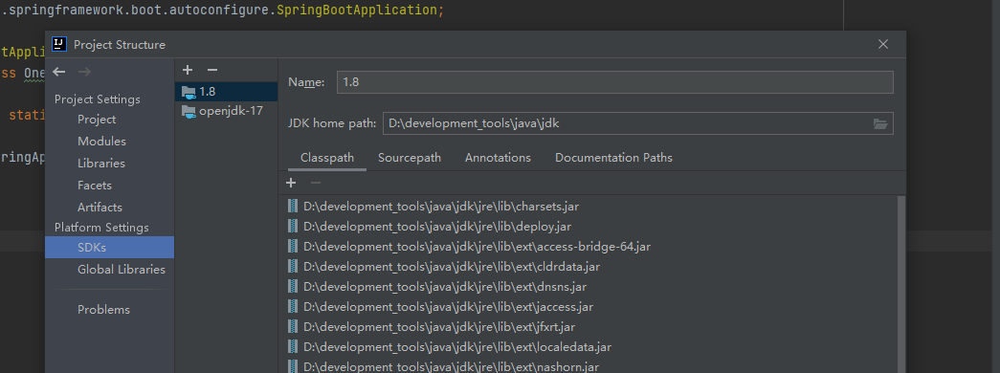

备注：针对每次新建工程采用同样配置，请在 File->New Projects Setp->Settings for New Projects->Project Settings

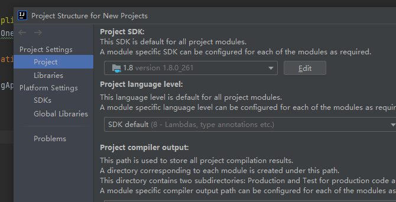

## **b）配置Maven**
打开File->Structure->Platform Settings->Build

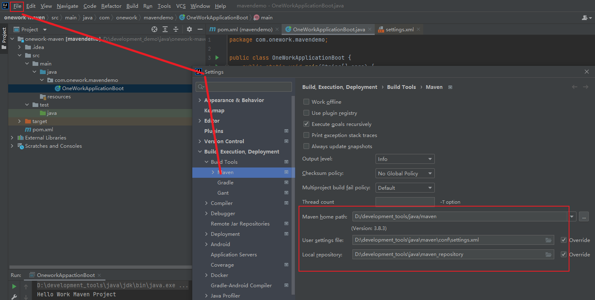


# 三、IDEA快捷键
> Ctrl+Alt+L，格式化代码

> Ctrl+Shift+Alt+U，打开pom.xml，然后快捷键，查看POM依赖关系

# 四、IDEA 设置文件头部注释
打开idea设置面板：

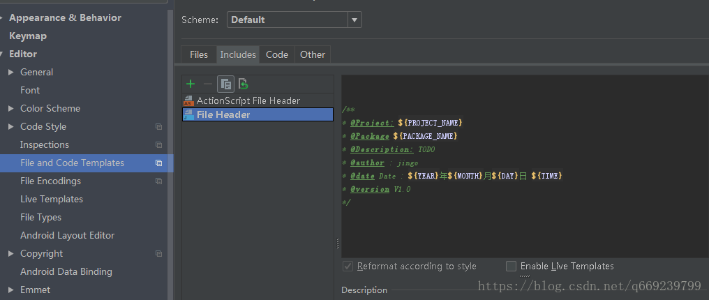

将以下代码复制模板内容中：

```java
/**
* @Project: ${PROJECT_NAME}
* @Package ${PACKAGE_NAME}
* @Description: TODO
* @author : jingo
* @date Date : ${YEAR}年${MONTH}月${DAY}日 ${TIME}
* @version V1.0
*/

```
# 五、IDEA 自动注释
## **a）设置类的自动注释**
点击`File`里的`Settings`打开配置面板，选择`Editor`下的 `File and Code Templates` 设置类的自动注释。

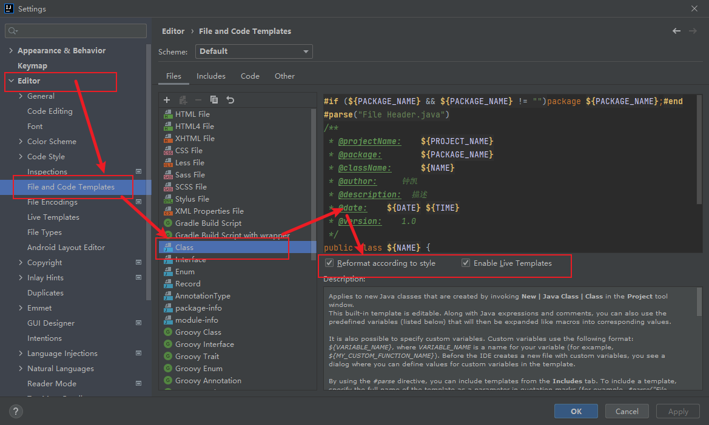

  将以下代码粘贴至模板中，勾选下方2个多选框，点击`Apply`和`OK`关掉即设置成功 

```java
#if (${PACKAGE_NAME} && ${PACKAGE_NAME} != "")package ${PACKAGE_NAME};#end
#parse("File Header.java")
/**
 * @projectName:    ${PROJECT_NAME} 
 * @package:        ${PACKAGE_NAME}
 * @className:      ${NAME}
 * @author:     钟凯
 * @description:  描述  
 * @date:    ${DATE} ${TIME}
 * @version:    1.0
 */ 
public class ${NAME} {
}
```
## **b）设置方法注释**
点击`File`里的`Settings`打开配置面板，选择`Editor`下的 Live Templates，点击右侧`Template Group`，创建自定义组模板，创建方法注释

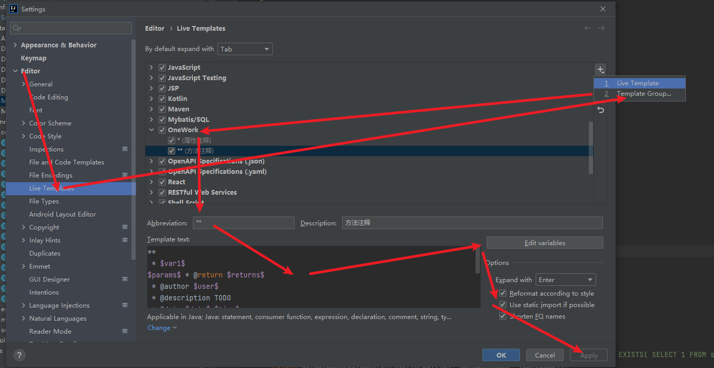

**注释模板：**

```java
**
 * $var1$
$params$ * @return $returns$ 
 * @author $user$
 * @description TODO
 * @date $date$ $time$
*/
```
**参数脚本：**

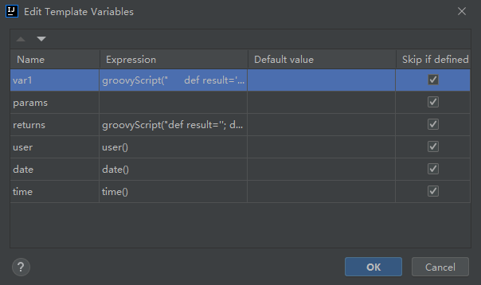

* **var1**参数`var1`的作用是为了获取方法的参数信息，同时保证格式对齐，网上的脚本很多都出现了错误，这个脚本是尝试之后可以保证正确的；

```java
groovyScript("     def result='';     def params=\"${_1}\".replaceAll('[\\\\[|\\\\]|\\\\s]', '').split(',').toList();     for(i = 0; i < params.size(); i++) {         if(i!=0)result+= ' * ';         result+='@param ' + params[i] + ': ' + ((i < (params.size() - 1)) ? '\\n' + '\\t' : '');     };     return result", methodParameters())

```
* **returns**参数`returns`是为了获取返回值的类型，这个下拉框里也有，但是下拉框里的会给出全部信息，给人感觉不直观，所以这里也利用的是脚本进行获取。

```java
groovyScript("def result=''; def params=\"${_1}\".replaceAll('[\\\\[|\\\\]|\\\\s]', '').split('<').toList(); for(i = 0; i < params.size(); i++) {if(i!=0){result+='<';};  def p1=params[i].split(',').toList();  for(i2 = 0; i2 < p1.size(); i2++) { def p2=p1[i2].split('\\\\.').toList();  result+=p2[p2.size()-1]; if(i2!=p1.size()-1){result+=','}  } ;  };  return result", methodReturnType())

```
## **c）使用方法**
首先新建一个方法，然后在方法的上方输入`/**`，按回车`Enter`，即可自动生成注释信息，生成的效果如下图，可以看到生成的注释信息格式整齐，可以自己手动添加参数信息和修改方法描述信息。

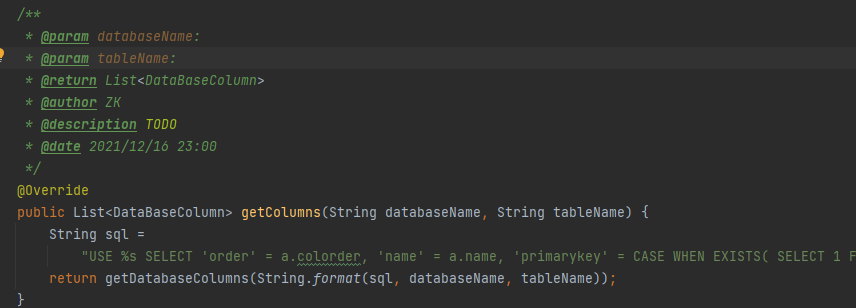

# 六、IDEA设置阿里P3C代码规范
## **a）安装 Alibaba Java Coding Guidelines 代码规范检查插件**
github官方教程：[https://github.com/alibaba/p3c/tree/master/idea-plugin](https://github.com/alibaba/p3c/tree/master/idea-plugin)

IDEA Plugin下载地址：[https://plugins.jetbrains.com/plugin/10046-alibaba-java-coding-guidelines](https://plugins.jetbrains.com/plugin/10046-alibaba-java-coding-guidelines)

**在线安装：**

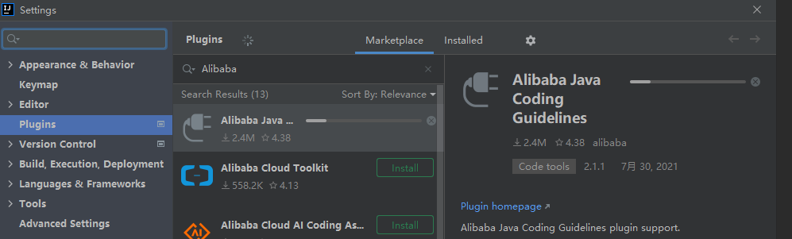

**本地导入：**

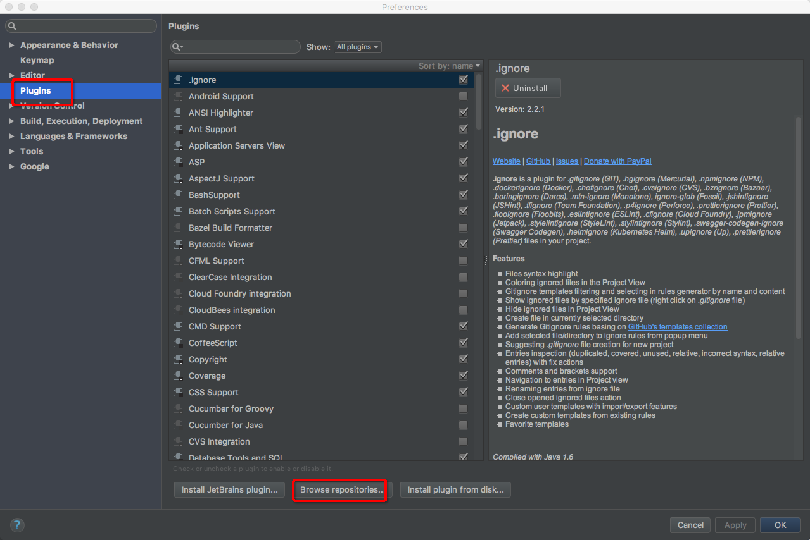

## b）IDEA 导入p3c-formatter 格式化代码
p3c配置下载地址：[https://github.com/alibaba/p3c/tree/master/p3c-formatter](https://github.com/alibaba/p3c/tree/master/p3c-formatter)

* 导入 `P3C-CodeStyle` 配置

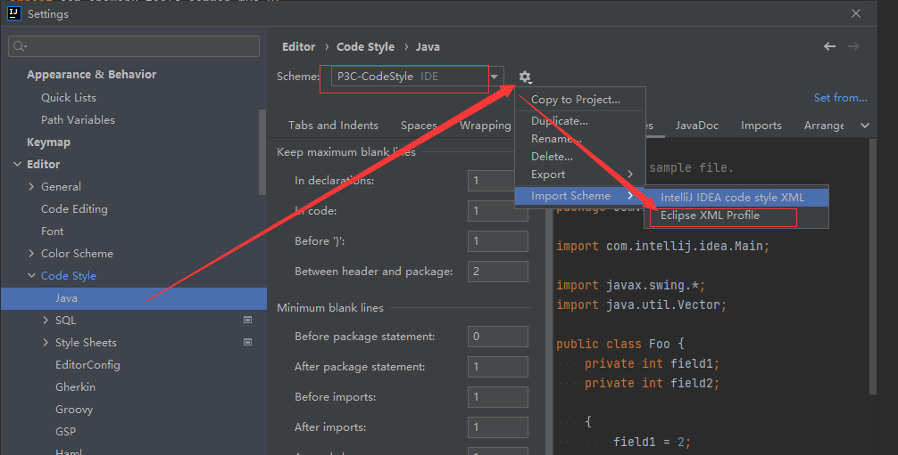

* 安装插件 `eclipse-code-formatter` 导入配置文件

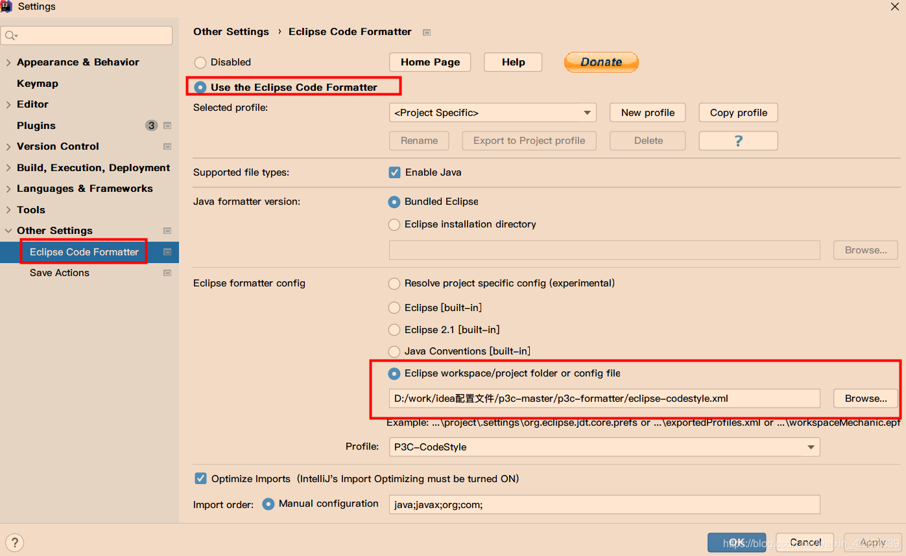

# 七、IDEA 插件推荐
## a）Save Actions
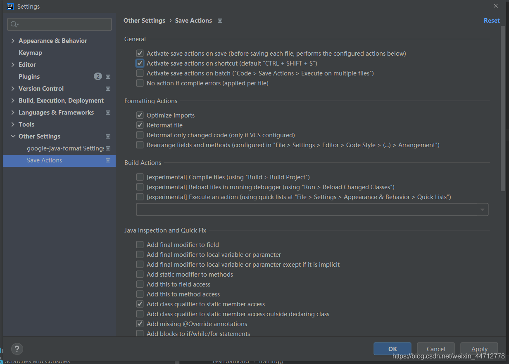

设置详解

### General 基本设置
* Activate save actions on save(before saving each file,performs the configured actions below)
保存时自动格式化
* Activate save actions on shortcut
使用快捷键保存时自动格式化
使用场景:收到一份格式很乱的文件，可以使用这个快捷键自动格式化
* Activate save actions on batch(Code>Save Actions>Execute on multiple files)
保存时批量格式化

### Formatting Actions 格式化触发设置
* Optimize imports
优化导入（没有用到的类自动删去import，这个一般要勾选）
* Reformat file
重新格式化文件（只要保存文件就会自动格式化）
* Reformat only change code
仅仅当代码变化时重新格式化
以上两个设置是互斥的，意思是，要么代码变化时候触发，要么文件变化时触发
我一般勾选上面那个，觉得好用一点
* Rerrange fields and methods(configured in “File>Setting>Editor>Code Style>(…)>Arragement”)
重新调整字段和方法的范围
不知道什么意思，没用过

### Java Inspection and Quick Fix 具体格式化设置
* Add final modifier to field
给字段添加final修饰符
* Add final modifier to local variable or parameter
向局部变量或参数添加final修饰符
* Add final modifier to local variable or parameter except if it is implicit
向非隐式的局部变量或参数添加final修饰符
* Add static modifier to methods
给方法添加static修饰符
* Add this to field access
字段的使用加上“this”指针
* Add this to method access
方法使用加上this
* Add class qualifier to static member access
静态成员访问添加类限定符
* Add class qualifier to static member access outside declaring class
声明类外的静态成员访问添加类限定符
* Add missing @Override annotions
添加漏写的@Override注解
* Add blocks to if/while/for statements
给if/while/for语句添加大括号
* Remove blocks from if/while/for statements
给if/while/for语句移除大括号
* Remove unnessary this to field and method
给字段或者方法去掉不必要的“this”
* \-Remove final from private method
私有方法去掉final关键字
* Remove explicit generic type for diamond
删除显式泛型类型的尖括号
* Remove unused suppress warning annotation
移除没用的Suppress警告
* Remove unnecessary semicolon
删除不必要的分号
* Change visibility of field or method to lower access
更改字段或方法的可见性以降低访问权限

## b）Translation
官网地址：[https://yiiguxing.github.io/TranslationPlugin/index.html](https://yiiguxing.github.io/TranslationPlugin/index.html)

### 显示翻译对话框
打开翻译对话框。默认显示在工具栏上。默认快捷键:

* Windows - Ctrl + Shift + X
* Mac OS - Control + Meta + O

### 取词并翻译
如果有已选择的文本，优先从选择的文本内取词，否则默认以最大范围自动取词（该取词模式可在Settings中配置）。默认显示在编辑器右键菜单上，默认快捷键:

* Windows - Ctrl + Shift + Y
* Mac OS - Control + Meta + U

## c）MybatisX
MybatisX 是一款基于 IDEA 的快速开发插件，为效率而生。

安装方法：打开 IDEA，进入 File -> Settings -> Plugins -> Browse Repositories，输入 `mybatisx` 搜索并安装。

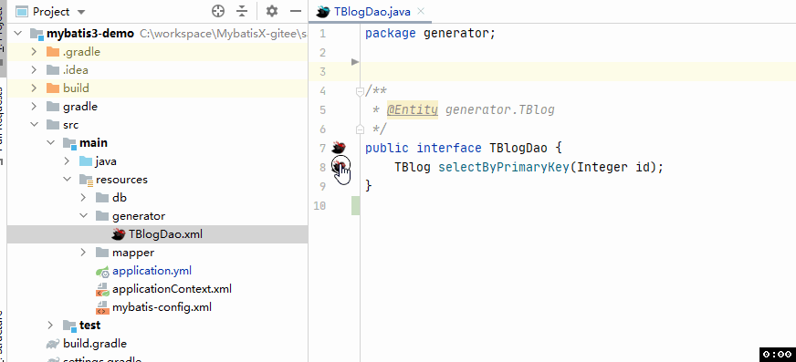

# 八、IDEA 热部署
在 Spring Boot 项目进行热部署测试之前，需要先在项目的 `pom.xm` 件中添加 `spring-boot-devtools` 热部署依赖启动器

```xml
 <dependency>
            <groupId>org.springframework.boot</groupId>
            <artifactId>spring-boot-devtools</artifactId>
            <!-- 防止将依赖传递到其他模块中 -->
            <optional>true</optional>
            <!-- 只在运行时起作用，打包时不打进去（防止线上执行打包后的程序，启动文件监听线程File Watcher，耗费大量的内存资源） -->
            <scope>runtime</scope>
        </dependency>
```
选择 IDEA 工具界面的【File > Settings】选项，打开 Build下的Compiler面板设置页面

在右侧勾选 Build project automatically 选项将项目设置为自动编译，单击【 Apply 】→【 OK 】按钮保存设置

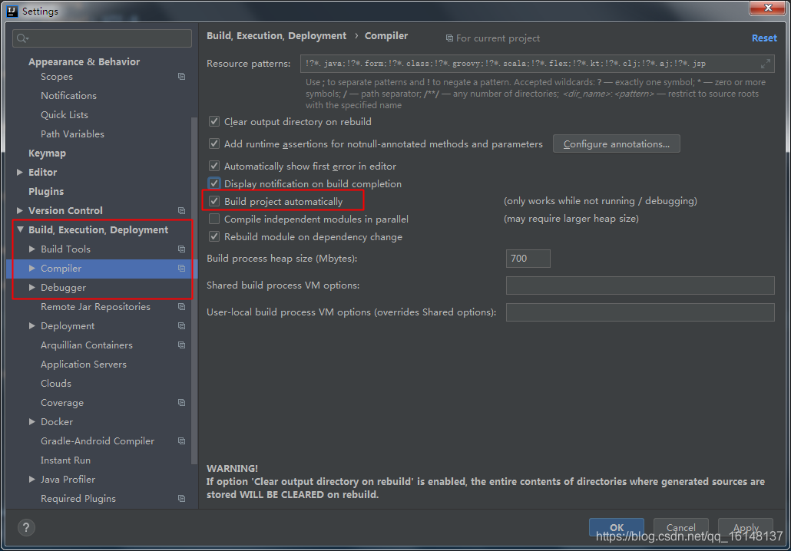

允许运行时重新自动构建

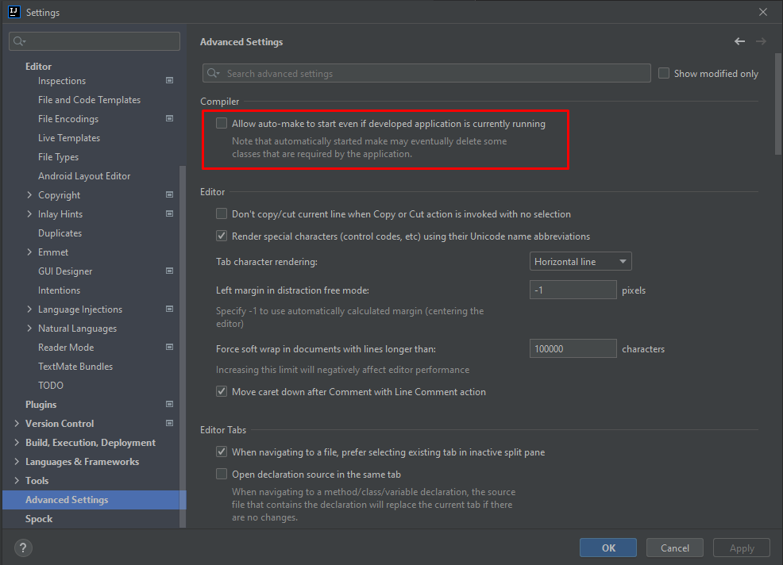

> TIP：最后重启 IDEA，Spring Boot 的热部署太慢，不会立即重启编译运行。

# 九、IDEA 调试
Debug调试的功能主要对应着图一中4和5两组按钮：

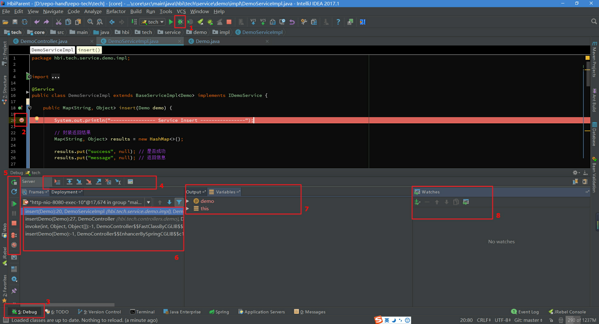


## a）首先说第一组按钮，共8个按钮，从左到右依次如下：
* **Show Execution Point (Alt + F10)**

如果你的光标在其它行或其它页面，点击这个按钮可跳转到当前代码执行的行。

* **Step Over (F8)**

步过，一行一行地往下走，如果这一行上有方法不会进入方法。

* **Step Into (F7)**

步入，如果当前行有方法，可以进入方法内部，一般用于进入自定义方法内，不会进入官方类库的方法，如第25行的put方法。

* **Force Step Into (Alt + Shift + F7)**

强制步入，能进入任何方法，查看底层源码的时候可以用这个进入官方类库的方法。

* **Step Out (Shift + F8)**

步出，从步入的方法内退出到方法调用处，此时方法已执行完毕，只是还没有完成赋值。

* **Drop Frame (默认无)**

回退断点，后面章节详细说明。

* **Run to Cursor (Alt + F9)**

运行到光标处，你可以将光标定位到你需要查看的那一行，然后使用这个功能，代码会运行至光标行，而不需要打断点。

* **Evaluate Expression (Alt + F8)**

计算表达式，后面章节详细说明。

# 十、常见问题
## （1）IDEA 启动项目报错 Error running 'XXXApplication': No jdk for module 'XXX'
按理说jdk都是在**File->Project Structure**里面设置就可以了，而且现在检查了也是没有问题

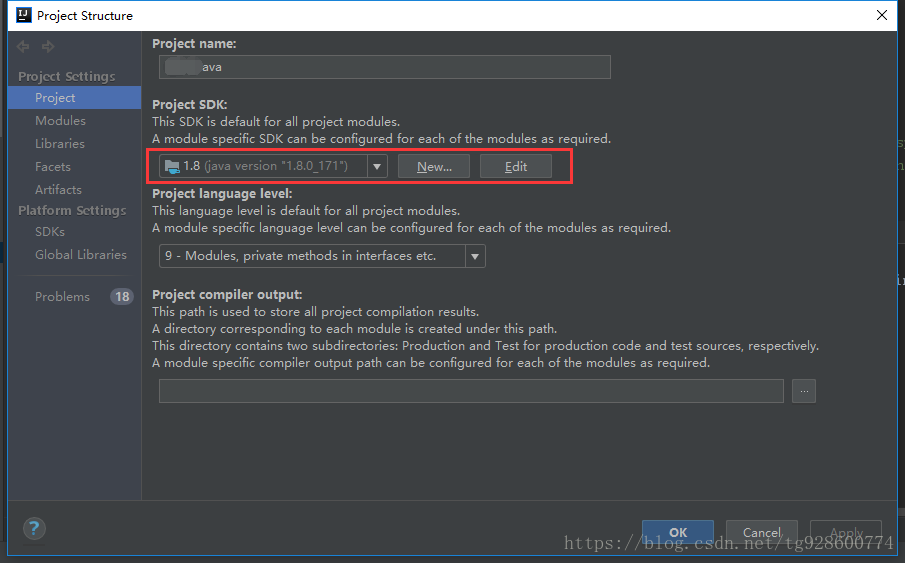

后来几经折腾，通过直接搜索Settings里面的jdk，发现还有这么一个地方

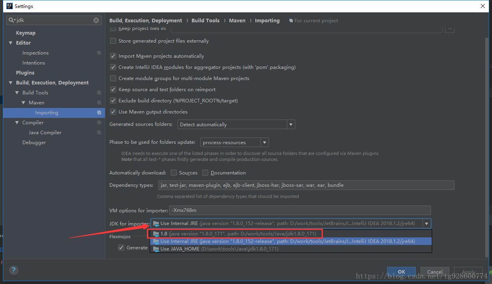

## （2）TestEngine with ID 'junit-jupiter' failed to discover tests
尝试办法：

* **在IDEA中执行File->InvalidateCaches/Restart...  （不行）**

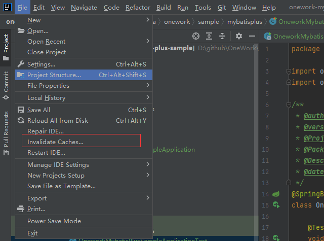

* 在CMD中执行以下命令： （不行）

```bash
mvn clean verify -Dspring.profiles.active=integration-test
```
* 执行maven package 命令 （可行）

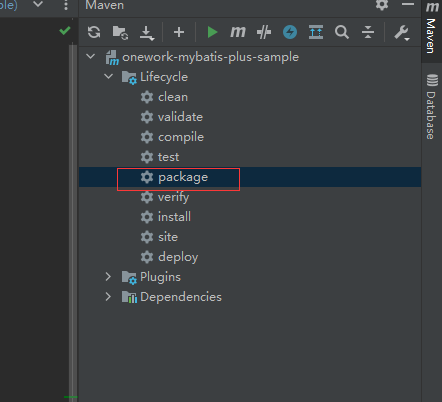

## （3）设置IDEA代码部分格式化
* 设置IDEA 开启局部格式化设置

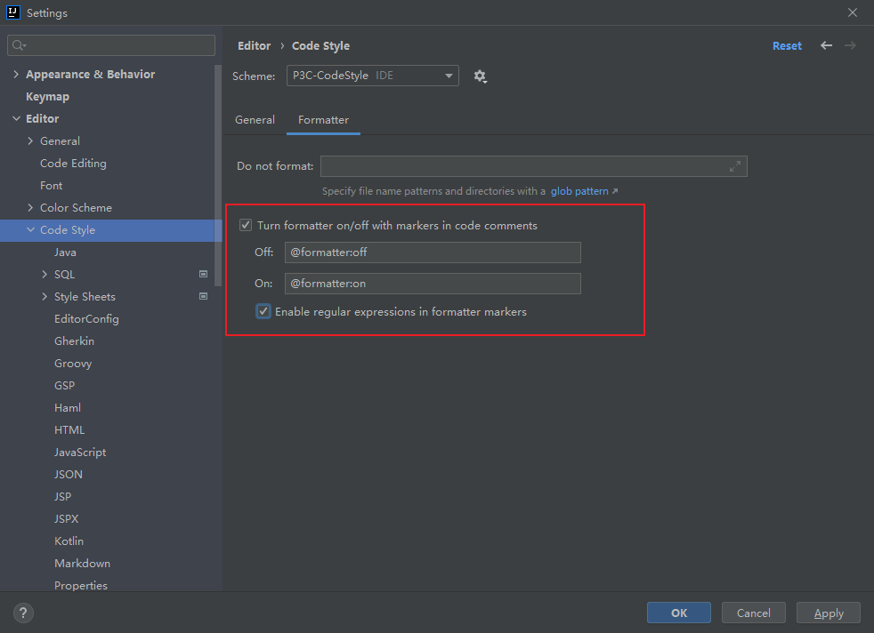

* 设置不需要格式化的内容

在代码所在的类前面加 `// @formatter:off `结尾加上`// @formatter:on`

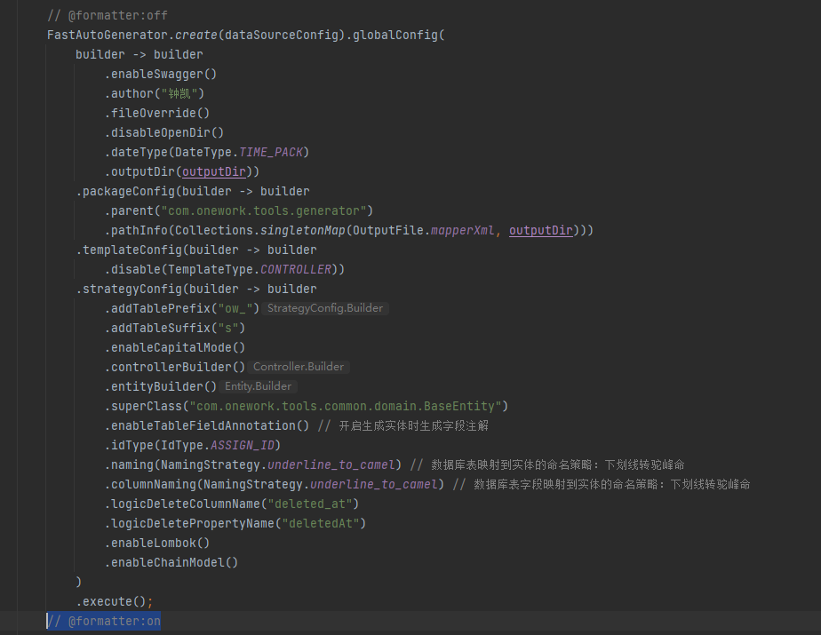

## （4）idea 运行 junit 接收用户输入
打开编辑VM参数的面板

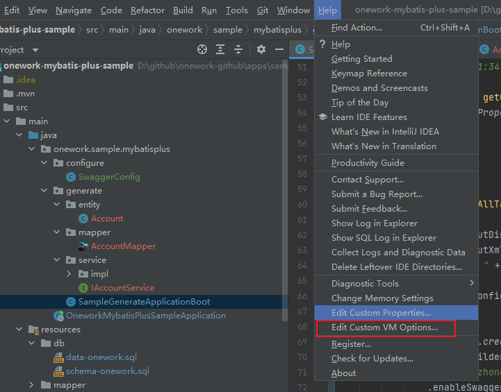

配置以下参数：

```Plain Text

# 允许 junit 使用屏幕输入
-Deditable.java.test.console=true
```
效果：

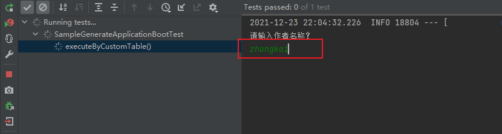

## （5）idea 中如何查询某接口所有实现
接口下右键`Diagrams`->`Show Diagram`，选中接口右键`Show Implementations`

\*提示：点击\*\*\*\*Show Implementations后\*\*\**，列出的实现类可以进行多选*

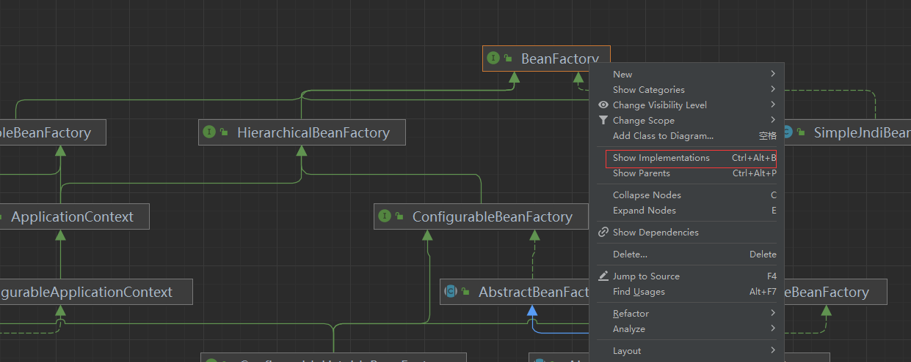

## （6）设置class或者mothod的注解换行显示
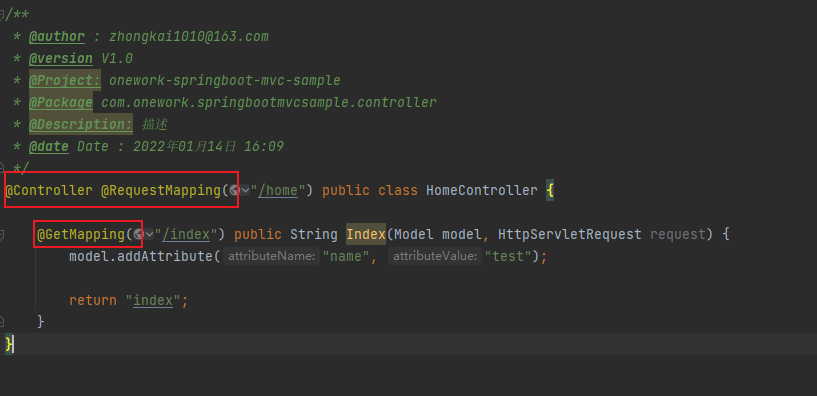

> annotation显示同行，目前需要换行进行显示

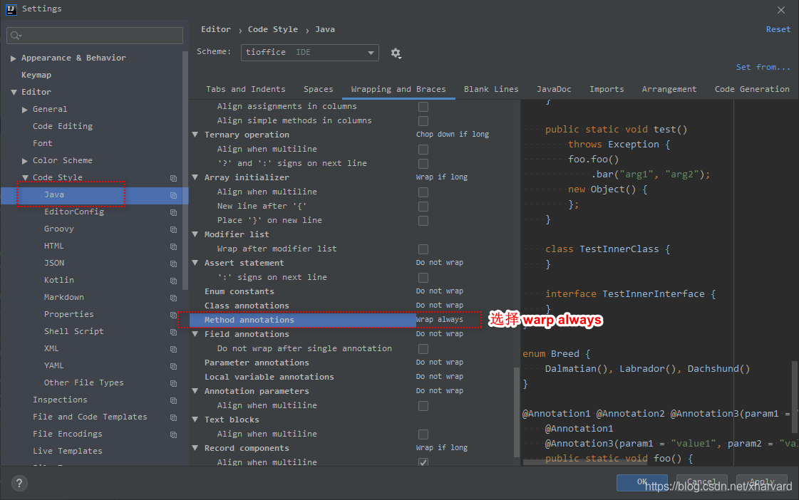

