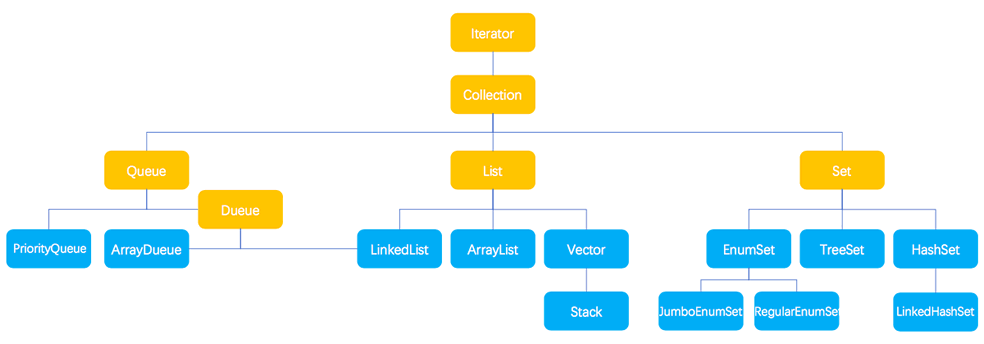
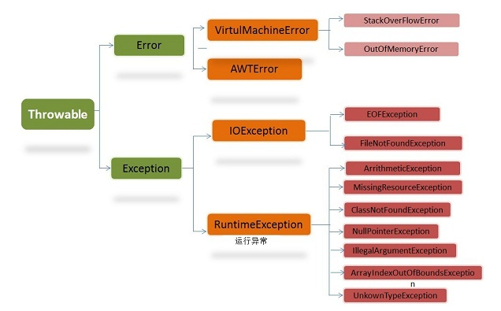

# Java 基础知识
# 一、数据类型
Java两种数据类型分类

（1）基本数据类型，分为boolean、byte、int、char、long、short、double、float；
（2）引用数据类型 ，分为数组、类、接口。

### a）基本数据类型
**基本数据类型**： boolean，char，byte，short，int，long，float，double 

**封装类类型**：Boolean，Character，Byte，Short，Integer，Long，Float，Double

### b） 数组
Arrays 类是一个工具类，其中包含了数组操作的很多方法。这个 Arrays 类里均为 static 修饰的方法（static 修饰的方法可以直接通过类名调用），可以直接通过 Arrays.xxx(xxx) 的形式调用方法。

### c） 字符串
* Java字符串拼接（连接）

```java
public static void main(String[] args) {
    String info = "三国演义、";
    info = info.concat("西游记、");
    info = info.concat("水浒传、");
    info = info.concat("红楼梦");
    System.out.println(info);
    String cn = "中国";
    System.out.println(cn.concat("北京").concat("海淀区").concat("人民公园"));
}
```
* Java字符串大小写转换

```java
String str="abcdef 我 ghijklmn";
System.out.println(str.toLowerCase());    // 输出：abcdef 我 ghijklmn
System.out.println(str.toUpperCase());    // 输出：ABCDEF 我 GHIJKLMN
```
* Java字符串的替换

```java
public static void main(String[] args) {
    String words = "hello java,hello php";
    System.out.println("原始字符串是'"+words+"'");
    System.out.println("replace(\"l\",\"D\")结果："+words.replace("l","D"));
    System.out.println("replace(\"hello\",\"你好\")结果："+words.replace("hello","你好 "));
    words = "hr's dog";
    System.out.println("原始字符串是'"+words+"'");
    System.out.println("replace(\"r's\",\"is\")结果："+words.replace("r's","is"));
}
```
输出结果如下所示：

```Plain Text
原始字符串是'hello java,hello php'
replace("l","D")结果：heDDo java,heDDo php
replace("hello","你好")结果：你好 java,你好 php
原始字符串是'hr's dog'
replace("r's","is")结果：his dog
```
* Java字符串格式化
在 Java 中格式化字符串最常用的方法就是 String.format()，如果有一个 Java 版本的 printf，它会像下面这样：

```java
String output = String.format("%s = %d", "joe", 35);
```
|说明符|适用于|输出|
| ----- | ----- | ----- |
|%a|浮点数 (除了BigDecimal)|浮点数的十六进制输出|
|%b|任何类型|如果为非空则为“true”，为空则为“false”|
|%c|字符|Unicode字符|
|%d|证书(包括byte, short, int, long, bigint)|十进制整数|
|%e|浮点数|科学计数的十进制数|
|%f|浮点数|十进制数|
|%g|浮点数|十进制数，根据值和精度可能以科学计数法显示|
|%h|任何类型|通过hashCode()方法输出的16进制数|
|%n|无|平台相关的换行符|
|%o|整数(包括byte, short, int, long, bigint)|八进制数|
|%s|任何类型|字符串|
|%t|日期/时间 (包含long, Calendar, Date 和TemporalAccessor)|%t是日期/时间转换的前缀。后面还需要跟其他的标识，请参考下面的日期/时间转换。|
|%x|整数(包含byte, short, int, long, bigint)|十六进制字符串|

### d）集合
Java 集合类型分为 Collection 和 Map，它们是 Java 集合的根接口，这两个接口又包含了一些子接口或实现类。图 1 和图 2 分别为 Collection 和 Map 的子接口及其实现类。

* **Collection接口基本结构：**



* **Map接口基本结构**


**Java集合接口的作用**

|接口名称|作    用|
| ----- | ----- |
|Iterator 接口|集合的输出接口，主要用于遍历输出（即迭代访问）Collection 集合中的元素，Iterator 对象被称之为迭代器。迭代器接口是集合接口的父接口，实现类实现 Collection 时就必须实现 Iterator 接口。|
|Collection 接口|是 List、Set 和 Queue 的父接口，是存放一组单值的最大接口。所谓的单值是指集合中的每个元素都是一个对象。一般很少直接使用此接口直接操作。|
|Queue 接口|Queue 是 Java 提供的队列实现，有点类似于 List。|
|Dueue 接口|是 Queue 的一个子接口，为双向队列。|
|List 接口|是最常用的接口。是有序集合，允许有相同的元素。使用 List 能够精确地控制每个元素插入的位置，用户能够使用索引（元素在 List 中的位置，类似于数组下标）来访问 List 中的元素，与数组类似。|
|Set 接口|不能包含重复的元素。|
|Map 接口|是存放一对值的最大接口，即接口中的每个元素都是一对，以 key➡value 的形式保存。|

**Java集合实现类的作用：**

|类名称|作用|
| ----- | ----- |
|HashSet|为优化査询速度而设计的 Set。它是基于 HashMap 实现的，HashSet 底层使用 HashMap 来保存所有元素，实现比较简单|
|TreeSet|实现了 Set 接口，是一个有序的 Set，这样就能从 Set 里面提取一个有序序列|
|ArrayList|一个用数组实现的 List，能进行快速的随机访问，效率高而且实现了可变大小的数组|
|ArrayDueue|是一个基于数组实现的双端队列，按“先进先出”的方式操作集合元素|
|LinkedList|对顺序访问进行了优化，但随机访问的速度相对较慢。此外它还有 addFirst()、addLast()、getFirst()、getLast()、removeFirst() 和 removeLast() 等方法，能把它当成栈（Stack）或队列（Queue）来用|
|HsahMap|按哈希算法来存取键对象|
|TreeMap|可以对键对象进行排序|

### e）枚举
Java 枚举是一个特殊的类，一般表示一组常量，比如一年的 4 个季节，一个年的 12 个月份，一个星期的 7 天，方向有东南西北等。

Java 枚举类使用 enum 关键字来定义，各个常量使用逗号 , 来分割。

```java
enum Color 
{ 
    RED, GREEN, BLUE; 
} 
```
# 二、Java 修饰符
## a) 访问控制修饰符
Java中，可以使用访问控制符来保护对类、变量、方法和构造方法的访问。Java 支持 4 种不同的访问权限。

* **default **(即默认，什么也不写）: 在同一包内可见，不使用任何修饰符。使用对象：类、接口、变量、方法。
* **private **: 在同一类内可见。使用对象：变量、方法。 注意：不能修饰类（外部类）
* **public **: 对所有类可见。使用对象：类、接口、变量、方法
* **protected **: 对同一包内的类和所有子类可见。使用对象：变量、方法。 注意：不能修饰类（外部类）。

## b) 非访问修饰符
* **static 修饰符**
* **final 修饰符**
* **final 方法**
父类中的 final 方法可以被子类继承，但是不能被子类重写。
声明 final 方法的主要目的是防止该方法的内容被修改。
如下所示，使用 final 修饰符声明方法。

```java
public class Test{
    public final void changeName(){
       // 方法体
    }
}
```
* **abstract 修饰符**
**抽象类：**
抽象类不能用来实例化对象，声明抽象类的唯一目的是为了将来对该类进行扩充。

一个类不能同时被 abstract 和 final 修饰。如果一个类包含抽象方法，那么该类一定要声明为抽象类，否则将出现编译错误。
**抽象方法:**
抽象方法是一种没有任何实现的方法，该方法的具体实现由子类提供。
抽象方法不能被声明成 final 和 static。任何继承抽象类的子类必须实现父类的所有抽象方法，除非该子类也是抽象类。
如果一个类包含若干个抽象方法，那么该类必须声明为抽象类。抽象类可以不包含抽象方法。
抽象方法的声明以分号结尾，例如：public abstract sample();
* **synchronized 修饰符**

synchronized 关键字声明的方法同一时间只能被一个线程访问。synchronized 修饰符可以应用于四个访问修饰符。

```java
public synchronized void showDetails(){
.......
}
```
* **transient 修饰符**
* **volatile 修饰符**

# 三、Java注释
Java 支持三种注释方式。前两种分别是 **//** 和 \*\*/\* \*/\*\*，第三种被称作说明注释，它以 **/\*\*** 开始，以 \*\*\*/\*\*结束。

说明注释允许你在程序中嵌入关于程序的信息。你可以使用 javadoc 工具软件来生成信息，并输出到HTML文件中。

说明注释，使你更加方便的记录你的程序信息。

|@author|标识一个类的作者|@author description|
| ----- | ----- | ----- |
|@deprecated|指名一个过期的类或成员|@deprecated description|
|{@docRoot}|指明当前文档根目录的路径|Directory Path|
|@exception|标志一个类抛出的异常|@exception exception-name explanation|
|{@inheritDoc}|从直接父类继承的注释|Inherits a comment from the immediate surperclass.|
|{@link}|插入一个到另一个主题的链接|{@link name text}|
|{@linkplain}|插入一个到另一个主题的链接，但是该链接显示纯文本字体|Inserts an in-line link to another topic.|
|@param|说明一个方法的参数|@param parameter-name explanation|
|@return|说明返回值类型|@return explanation|
|@see|指定一个到另一个主题的链接|@see anchor|
|@serial|说明一个序列化属性|@serial description|
|@serialData|说明通过writeObject( ) 和 writeExternal( )方法写的数据|@serialData description|
|@serialField|说明一个ObjectStreamField组件|@serialField name type description|
|@since|标记当引入一个特定的变化时|@since release|
|@throws|和 @exception标签一样.|The @throws tag has the same meaning as the @exception tag.|
|{@value}|显示常量的值，该常量必须是static属性。|Displays the value of a constant, which must be a static field.|
|@version|指定类的版本|@version info|

# 四、Java运算符
## （一）instanceof 
instanceof 是 Java 的一个二元操作符，类似于 ==，>，< 等操作符。

instanceof 是 Java 的保留关键字。它的作用是测试它左边的对象是否是它右边的类的实例，返回 boolean 的数据类型。

以下实例创建了 displayObjectClass() 方法来演示 Java instanceof 关键字用法：

```java
/*
 author by runoob.com
 Main.java
 */
import java.util.ArrayList;
import java.util.Vector;
 
public class Main {
 
public static void main(String[] args) {
   Object testObject = new ArrayList();
      displayObjectClass(testObject);
   }
   public static void displayObjectClass(Object o) {
      if (o instanceof Vector)
      System.out.println("对象是 java.util.Vector 类的实例");
      else if (o instanceof ArrayList)
      System.out.println("对象是 java.util.ArrayList 类的实例");
      else
      System.out.println("对象是 " + o.getClass() + " 类的实例");
   }
}
```
# 五、Java 异常
**定义**：异常就是有异于常态，和正常情况不一样，有错误出现。在java中，将程序执行过程中的不正常的情况称之为异常，开发过程中的语法错误和逻辑错误不是异常，发生异常时java会阻止当前方法或作用域的情况。

## a）异常的体系结构


## b）Throwable 异常和错误的超类
**Throwable 是java中所有异常和错误的超类,其两个子类为 Error(错误) 和 Exception(异常)**

* **Error**： 是程序中无法处理的错误，表示运行应用程序中出现了严重的错误。此类错误一般表示代码运行时JVM出现问题。通常有Virtual MachineError（虚拟机运行错误）、NoClassDefFoundError（类定义错误）等。比如说当jvm耗完可用内存时，将出现OutOfMemoryError。此类错误发生时，JVM将终止线程。非代码性错误。因此，当此类错误发生时，应用不应该去处理此类错误。
* **Exception**： 是程序本身可以捕获并且可以处理的异常。其中可分为运行时异常（RuntimeException）和非运行时异常，也叫做受检异常
   * 运行时异常(不受检异常)： RuntimeException类极其子类表示JVM在运行期间可能出现的错误。编译器不会检查此类异常，并且不要求处理异常，比如用空值对象的引用（NullPointerException）、数组下标越界（ArrayIndexOutBoundException）。此类异常属于不可查异常，一般是由程序逻辑错误引起的，在程序中可以选择捕获处理，也可以不处理。
   * 非运行时异常(受检异常)： Exception中除RuntimeException极其子类之外的异常。编译器会检查此类异常，如果程序中出现此类异常，比如说IOException，必须对该异常进行处理，要么使用try-catch捕获，要么使用throws语句抛出，否则编译不通过。

**从程序执行的过程来看编译时异常和运行时异常**

* 编译时异常：程序在编译时发生的异常（javac 源文件名.java）
* 运行时异常: 程序在运行时发生的异常（java 字节码文件名）

## c）throws/throw 关键字
```java
import java.io.*;
public class className
{
  public void deposit(double amount) throws RemoteException
  {
    // Method implementation
    throw new RemoteException();
  }
  //Remainder of class definition
}

import java.io.*;
public class className
{
   public void withdraw(double amount) throws RemoteException, InsufficientFundsException
   {
       // Method implementation
   }
   //Remainder of class definition
}
```
## d）Java 内置异常类
|**异常**|**描述**|
| ----- | ----- |
|ArithmeticException|当出现异常的运算条件时，抛出此异常。例如，一个整数"除以零"时，抛出此类的一个实例。|
|ArrayIndexOutOfBoundsException|用非法索引访问数组时抛出的异常。如果索引为负或大于等于数组大小，则该索引为非法索引。|
|ArrayStoreException|试图将错误类型的对象存储到一个对象数组时抛出的异常。|
|ClassCastException|当试图将对象强制转换为不是实例的子类时，抛出该异常。|
|IllegalArgumentException|抛出的异常表明向方法传递了一个不合法或不正确的参数。|
|IllegalMonitorStateException|抛出的异常表明某一线程已经试图等待对象的监视器，或者试图通知其他正在等待对象的监视器而本身没有指定监视器的线程。|
|IllegalStateException|在非法或不适当的时间调用方法时产生的信号。换句话说，即 Java 环境或 Java 应用程序没有处于请求操作所要求的适当状态下。|
|IllegalThreadStateException|线程没有处于请求操作所要求的适当状态时抛出的异常。|
|IndexOutOfBoundsException|指示某排序索引（例如对数组、字符串或向量的排序）超出范围时抛出。|
|NegativeArraySizeException|如果应用程序试图创建大小为负的数组，则抛出该异常。|
|NullPointerException|当应用程序试图在需要对象的地方使用 `null` 时，抛出该异常|
|NumberFormatException|当应用程序试图将字符串转换成一种数值类型，但该字符串不能转换为适当格式时，抛出该异常。|
|SecurityException|由安全管理器抛出的异常，指示存在安全侵犯。|
|StringIndexOutOfBoundsException|此异常由 `String` 方法抛出，指示索引或者为负，或者超出字符串的大小。|
|UnsupportedOperationException|当不支持请求的操作时，抛出该异常。|


# 六、Java 对象
## （一）extends（继承）
* **extends关键字**
extends 是继承某个类, 继承之后可以使用父类的方法, 也可以重写父类的方法;

```java
public class Animal { 
    private String name;   
    private int id; 
    public Animal(String myName, String myid) { 
        //初始化属性值
    } 
    public void eat() {  //吃东西方法的具体实现  } 
    public void sleep() { //睡觉方法的具体实现  } 
} 
 
public class Penguin  extends  Animal{ 
}
```
* implements关键字
implements 是实现多个接口, 接口的方法一般为空的, 必须重写才能使用

```java
public interface A {
    public void eat();
    public void sleep();
}
 
public interface B {
    public void show();
}
 
public class C implements A,B {
}
```
* super 与 this 关键字

```java
class Animal {
  void eat() {
    System.out.println("animal : eat");
  }
}
 
class Dog extends Animal {
  void eat() {
    System.out.println("dog : eat");
  }
  void eatTest() {
    this.eat();   // this 调用自己的方法
    super.eat();  // super 调用父类方法
  }
}
 
public class Test {
  public static void main(String[] args) {
    Animal a = new Animal();
    a.eat();
    Dog d = new Dog();
    d.eatTest();
  }
}
```
输出结果为：

```Plain Text
animal : eat
dog : eat
animal : eat
```
* final关键字
final 关键字声明类可以把类定义为不能继承的，即最终类；或者用于修饰方法，该方法不能被子类重写：

```java
final class 类名 {//类体}
```
## （二）abstract（抽象类）
包含抽象方法的类称为抽象类，但并不意味着抽象类中只能有抽象方法，它和普通类一样，同样可以拥有成员变量和普通的成员方法。注意，抽象类和普通类的主要有三点区别：

1）抽象方法必须为public或者protected（因为如果为private，则不能被子类继承，子类便无法实现该方法），缺省情况下默认为public。

2）抽象类不能用来创建对象；

3）如果一个类继承于一个抽象类，则子类必须实现父类的抽象方法。如果子类没有实现父类的抽象方法，则必须将子类也定义为为abstract类。

在其他方面，抽象类和普通的类并没有区别。

## （三）泛型
泛型有三种使用方式，分别为：泛型类、泛型接口、泛型方法

泛型类：

```java
//此处T可以随便写为任意标识，常见的如T、E、K、V等形式的参数常用于表示泛型
//在实例化泛型类时，必须指定T的具体类型
public class Generic<T>{ 
    //key这个成员变量的类型为T,T的类型由外部指定  
    private T key;

    public Generic(T key) { //泛型构造方法形参key的类型也为T，T的类型由外部指定
        this.key = key;
    }

    public T getKey(){ //泛型方法getKey的返回值类型为T，T的类型由外部指定
        return key;
    }
}
```
泛型接口：

```java
//定义一个泛型接口
public interface Generator<T> {
    public T next();
}
```
泛型方法：

```java
/**
 * 泛型方法的基本介绍
 * @param tClass 传入的泛型实参
 * @return T 返回值为T类型
 * 说明：
 *     1）public 与 返回值中间<T>非常重要，可以理解为声明此方法为泛型方法。
 *     2）只有声明了<T>的方法才是泛型方法，泛型类中的使用了泛型的成员方法并不是泛型方法。
 *     3）<T>表明该方法将使用泛型类型T，此时才可以在方法中使用泛型类型T。
 *     4）与泛型类的定义一样，此处T可以随便写为任意标识，常见的如T、E、K、V等形式的参数常用于表示泛型。
 */
public <T> T genericMethod(Class<T> tClass)throws InstantiationException ,
  IllegalAccessException{
        T instance = tClass.newInstance();
        return instance;
}
```
泛型通配符：

* E - Element (在集合中使用，因为集合中存放的是元素)
* T - Type（Java 类）
* K - Key（键）
* V - Value（值）
* N - Number（数值类型）
* ？ - 表示不确定的 java 类型

## （四）反射中的Class<?>
* getName()：获得类的完整名字。 getFields()：获得类的public类型的属性。
* getDeclaredFields()：获得类的所有属性。
* getMethods()：获得类的public类型的方法。
* getDeclaredMethods()：获得类的所有方法。
* getMethod(String name, Class\[\] parameterTypes)：获得类的特定方法，name参数指定方法的名字，parameterTypes参数指定方法的参数类型。
* getConstrutors()：获得类的public类型的构造方法。
* getConstrutor(Class\[\] parameterTypes)：获得类的特定构造方法，parameterTypes参数指定构造方法的参数类型。
* newInstance()：通过类的不带参数的构造方法创建这个类的一个对象。

## （五）Proxy 代理类
## （六）常用包
### a）java.lang.\*
提供利用 Java 编程语言进行程序设计的基础类。最重要的类是 Object（它是类层次结构的根）和 Class（它的实例表示正在运行的应用程序中的类）。

### b）java.util.\*
包含集合框架、遗留的 collection 类、事件模型、日期和时间设施、国际化和各种实用工具类（字符串标记生成器、随机数生成器和位数组、日期Date类、堆栈Stack类、向量Vector类等）。集合类、时间处理模式、日期时间工具等各类常用工具包

### c）java.io.\*
Java的核心库java.io提供了全面的IO接口。包括：文件读写、标准设备输出等。Java中IO是以流为基础进行输入输出的，所有数据被串行化写入输出流，或者从输入流读入。

### d）java.net.\*
并非所有系统都支持 IPv6 协议，而当 Java 网络连接堆栈尝试检测它并在可用时透明地使用它时，还可以利用系统属性禁用它。在 IPv6 不可用或被显式禁用的情况下，Inet6Address 对大多数网络连接操作都不再是有效参数。虽然可以保证在查找主机名时 java.net.InetAddress.getByName 之类的方法不返回 Inet6Address，但仍然可能通过传递字面值来创建此类对象。在此情况下，大多数方法在使用 Inet6Address 调用时都将抛出异常。

### e）java.sql.\*
提供使用 JavaTM 编程语言访问并处理存储在数据源（通常是一个关系数据库）中的数据的 API。此 API 包括一个框架，凭借此框架可以动态地安装不同驱动程序来访问不同数据源。

# 七、常用对象
## Environment 是一个提供访问环境变量的类**。**
## java读取resources目录下的文件
```java
/**
 MyBatisSampleApplicationBoot 类每在具体包中可以进行读取
*/
InputStream inputStream = MyBatisSampleApplicationBoot.class.getResourceAsStream("mybatis-config.xml")

/**
  运行环境中可以读取
*/
InputStream inputStream =
                Thread.currentThread().getContextClassLoader().getResourceAsStream("mybatis-config.xml");
```
## 读取当前运行环境参数
```java
System.out.println("Java运行时环境版本:"+System.getProperty("java.version"));
System.out.println("Java 运行时环境供应商:"+System.getProperty("java.vendor"));
System.out.println("Java 供应商的URL:"+System.getProperty("java.vendor.url"));
System.out.println("Java安装目录:"+System.getProperty("java.home"));
System.out.println("Java 虚拟机规范版本:"+System.getProperty("java.vm.specification.version"));
System.out.println("Java 类格式版本号:"+System.getProperty("java.class.version"));
System.out.println("Java类路径："+System.getProperty("java.class.path"));
System.out.println("加载库时搜索的路径列表:"+System.getProperty("java.library.path"));
System.out.println("默认的临时文件路径:"+System.getProperty("java.io.tmpdir"));
System.out.println("要使用的 JIT 编译器的名称:"+System.getProperty("java.compiler"));
System.out.println("一个或多个扩展目录的路径:"+System.getProperty("java.ext.dirs"));
System.out.println("操作系统的名称:"+System.getProperty("os.name"));
System.out.println("操作系统的架构:"+System.getProperty("os.arch"));
System.out.println("操作系统的版本:"+System.getProperty("os.version"));
System.out.println("文件分隔符（在 UNIX 系统中是“/”）:"+System.getProperty("file.separator"));
System.out.println("路径分隔符（在 UNIX 系统中是“:”）:"+System.getProperty("path.separator"));
System.out.println("行分隔符（在 UNIX 系统中是“/n”）:"+System.getProperty("line.separator"));
System.out.println("用户的账户名称:"+System.getProperty("user.name"));
System.out.println("用户的主目录:"+System.getProperty("user.home"));
System.out.println("用户的当前工作目录:"+System.getProperty("user.dir"));
System.out.println("当前的classpath的绝对路径的URI表示法:" + Thread.currentThread().getContextClassLoader().getResource(""));
System.out.println("得到的是当前的classpath的绝对URI路径:"+ Tfff.class.getResource("/"));
System.out.println("得到的是当前类Tfff.class文件的URI目录:"+Tfff.class.getResource(""));
```
# 十、、推荐工具
hutool：[https://www.javajike.com/book/hutool/](https://www.javajike.com/book/hutool/)