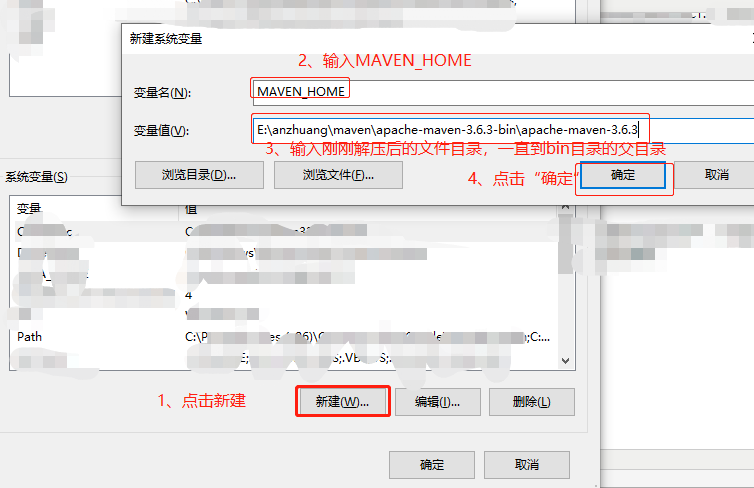
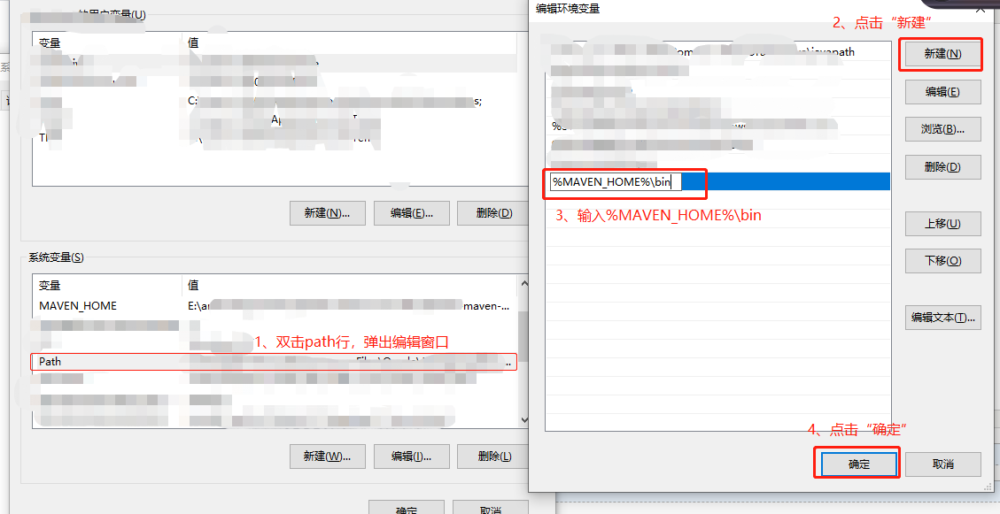
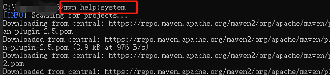
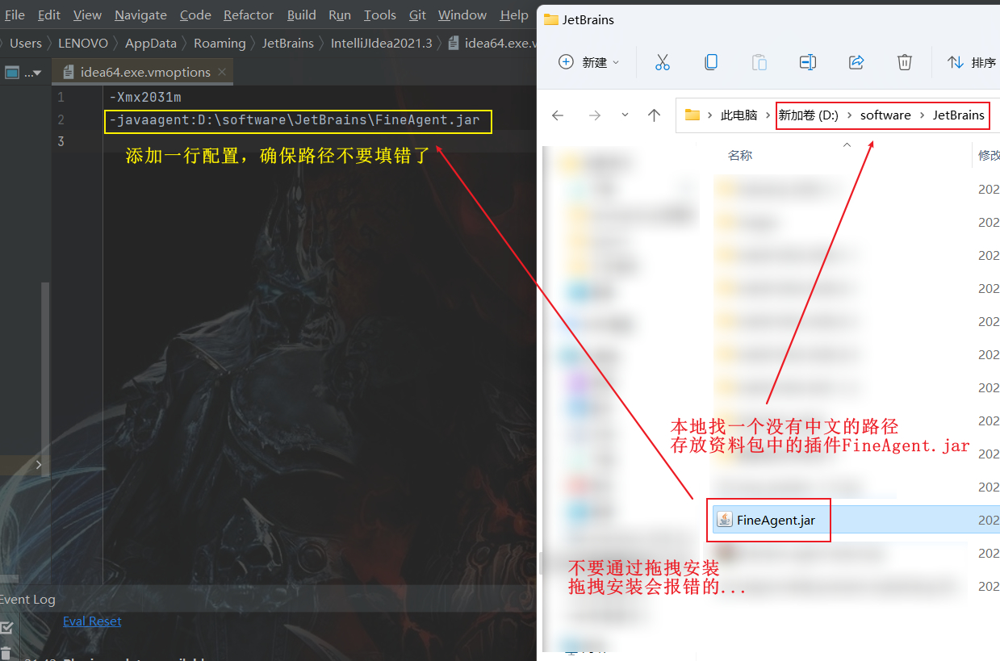
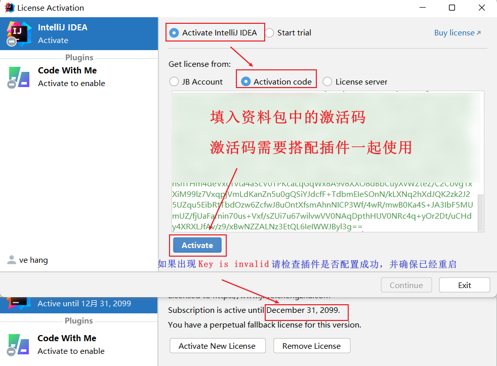
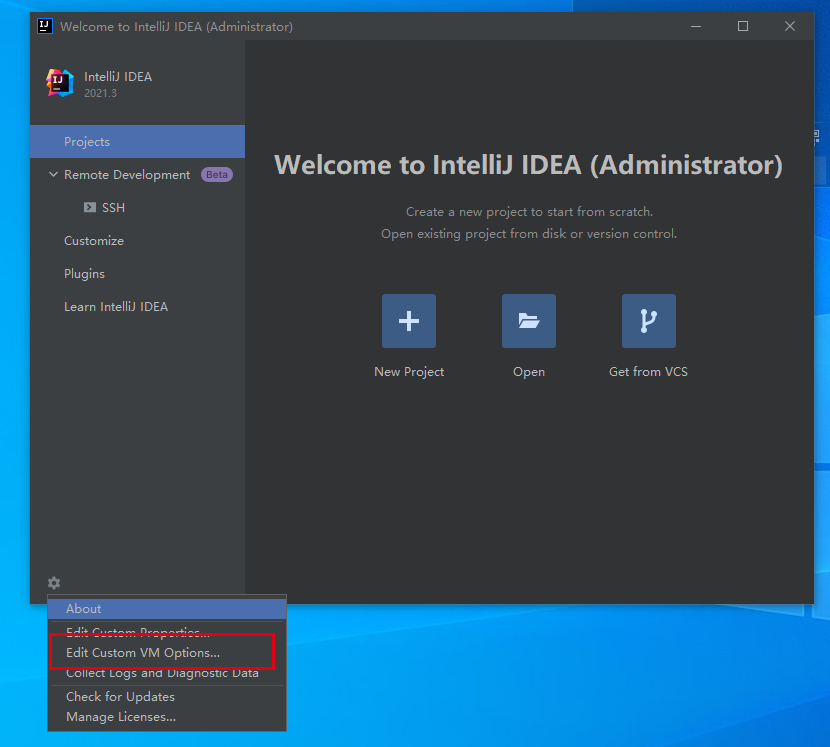

# Java 开发环境搭建
# 一、资源下载
**JDK 8**：[https://www.oracle.com/java/technologies/downloads/#java8-windows](https://www.oracle.com/java/technologies/downloads/#java8-windows)

# 二、Windows 安装JDK 8
# 四、Windows 设置环境变量
1\. 新建JAVA\_HOME（系统环境变量）

变量名：JAVA\_HOME

变量值：C:\\Program Files\\Java\\jdk（根据自己的安装目录填写）

2\. 新建CLASSPATH（系统环境变量）

变量名：CLASSPATH

变量值：.;%JAVA\_HOME%\\lib;%JAVA\_HOME%\\lib\\tools.jar（前面有一点，不过实测不加前面的点和分号也不影响）

3\. 修改PATH（系统环境变量）

在PATH变量里添加：%JAVA\_HOME%\\bin

若是win7则是：;%JAVA\_HOME%\\bin(前面多一个分号）

# 三、安装Maven
MAVEN\_HOME这个变量里面可以只存放maven相关的路径配置，方便日后管理。

 　　　双击path变量，新建一参数，输入%MAVEN\_HOME%\\bin后点击确定即可。

保存后控制台输入 mvn help:system

找到settings.xml中的localRepository配置，修改成刚刚创建的文件夹的目录。注意将E:\\repository移出注释！

# 四、安装 IDEA 开发工具

\-javaagent:D:\\software\\JetBrains\\FineAgent.jar

# 五、配置 IDEA 编译环境
# 六、推荐 IDEA 插件
**Alibaba Java Coding Guidelines**

**Translation**