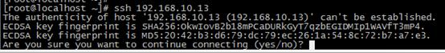

# Linux配置ssh
**一、ssh详解**

**1、什么是ssh**

简单来说，ssh是一种网络协议，用于计算机之间的加密登录。

    如果一个用户从本地计算机，使用ssh协议登录另一台远程计算机，我们就可以认为，这种登录是安全的，即使被中途截获，密码也不会泄露。

    需要指出的是，ssh只有一种协议，存在多种实现，既有商业实现，也有开源实现。

**2、基本用法**

（1）使用某个用户（例如user）登录远程主机host

命令：ssh user@host

（2）如果本地用户名和远程用户名一致，则登录时可以省略用户名

命令：ssh host

（3）ssh的默认端口是22，也就是说，你的登录请求会送进远程主机的22端口。使用-p参数，可以修改这个端口

命令：ssh –p 端口号 user@host

**3、中间人攻击**

SSH之所以能够保证安全，原因在于它采用了公钥加密。整个过程如下：

（1）远程主机收到用户的登录请求，把自己的公钥发给用户。

（2）用户使用这个公钥，将登录密码加密后，发送回来。

（3）远程主机用自己的私钥，解密登录密码，如果密码正确，就同意用户登录。

这个过程本身是安全的，但是实施的时候存在一个风险：如果有人截获了登录请求，然后冒充远程主机，将伪造的公钥发给用户，那么用户很难辨别真伪。因为不像https协议，SSH协议的公钥是没有证书中心（CA）公证的，也就是说，都是自己签发的。可以设想，如果攻击者插在用户与远程主机之间（比如在公共的wifi区域），用伪造的公钥，获取用户的登录密码。再用这个密码登录远程主机，那么SSH的安全机制就荡然无存了。这种风险就是著名的"中间人攻击"。

**4、ssh的安全验证**

SSH有自己的一套验证方式，可以阻拦大部分的攻击，当然如果有人想通过撞库来尝试密码的话，就只有设置防火墙或者做其它的安全措施了。

从客户端来看，SSH提供两种级别的安全验证。

（1）第一种级别（基于口令的安全验证）

只要你知道自己帐号和口令，就可以登录到远程主机。所有传输的数据都会被加密，但是不能保证你正在连接的服务器就是你想连接的服务器。可能会有别的服务器在冒充真正的服务器，也就是受到“中间人”这种方式的攻击。

（2）第二种级别（基于密匙的安全验证）

需要依靠密匙，也就是你必须为自己创建一对密匙，并把公用密匙放在需要访问的服务器上。如果你要连接到SSH服务器上，客户端软件就会向服务器发出请求，请求用你的密匙进行安全验证。服务器收到请求之后，先在该服务器上你的主目录下寻找你的公用密匙，然后把它和你发送过来的公用密匙进行比较。如果两个密匙一致，服务器就用公用密匙加密“质询”（challenge）并把它发送给客户端软件。客户端软件收到“质询”之后就可以用你的私人密匙解密再把它发送给服务器。

用这种方式，你必须知道自己密匙的口令。但是，与第一种级别相比，第二种级别不需要在网络上传送口令。第二种级别不仅加密所有传送的数据，而且“中间人”这种攻击方式也是不可能的（因为他没有你的私人密匙）。但是整个登录的过程可能需要10秒。

**5、口令登录**

（1）如果是第一次登录对方主机，系统会出现如下图的提示



这段话的意思是，无法确认host主机的真实性，只知道它的公钥指纹，问你还想继续连接吗？

所谓"公钥指纹"，是指公钥长度较长（这里采用RSA算法，长达1024位），很难比对，所以对其进行MD5计算，将它变成一个128位的指纹。上例中是20:42:b3:d6:79:dc:79:ec:26:1a:54:8c:72:b7:a7:e3，再进行比较，就容易多了。

很自然的一个问题就是，用户怎么知道远程主机的公钥指纹应该是多少？回答是没有好办法，远程主机必须在自己的网站上贴出公钥指纹，以便用户自行核对。

（2）假设经过风险衡量后，用户决定接受这个远程主机的公钥


（3）、系统会出现一句提示，表示192.168.10.13主机已经得到认可


（4）、输入密码（如果密码正确，就可以登录了）


说明：

当远程主机的公钥被接受以后，它就会被保存在文件\$HOME/.ssh/known\_hosts之中。下次再连接这台主机，系统就会认出它的公钥已经保存在本地了，从而跳过警告部分，直接提示输入密码。

每个SSH用户都有自己的known\_hosts文件，此外系统也有一个这样的文件，通常是/etc/ssh/ssh\_known\_hosts，保存一些对所有用户都可信赖的远程主机的公钥。

**6、公钥登录**

使用密码登录，每次都必须输入密码，非常麻烦。好在SSH还提供了公钥登录，可以省去输入密码的步骤。

所谓"公钥登录"，原理很简单，就是用户将自己的公钥储存在远程主机上。登录的时候，远程主机会向用户发送一段随机字符串，用户用自己的私钥加密后，再发回来。远程主机用事先储存的公钥进行解密，如果成功，就证明用户是可信的，直接允许登录shell，不再要求密码。

（1）这种方法要求用户必须提供自己的公钥。如果没有现成的，可以直接用ssh-keygen生成一个，如下图所示


说明：

运行上面的命令以后，系统会出现一系列提示，可以一路回车。其中有一个问题是，要不要对私钥设置口令（passphrase），如果担心私钥的安全，这里可以设置一个。

运行结束以后，在\$HOME/.ssh/目录下，会新生成两个文件：id\_rsa.pub和id\_rsa。id\_rsa.pub是公钥，id\_rsa是私钥。

（2）这时再输入下面的命令，将公钥传送到远程主机host上面

命令：ssh-copy-id 192.168.10.12


说明：

第一次是需要输入密码的，但之后ssh就不需要输密码了。

如果ssh-copy-id不行的话，就打开远程主机的/etc/ssh/sshd\_config这个文件，检查下面几行前面"#"注释是否取掉。

　　RSAAuthentication yes

　　PubkeyAuthentication yes

　　AuthorizedKeysFile .ssh/authorized\_keys

然后，重启远程主机的ssh服务。

**7、authorized\_keys文件**

远程主机将用户的公钥，保存在登录后的用户主目录的\$HOME/.ssh/authorized\_keys文件中。公钥就是一段字符串，只要把它追加在authorized\_keys文件的末尾就行了。

（1）这里不使用上面的ssh-copy-id命令，改用下面的命令，解释公钥的保存过程：　　ssh user@host 'mkdir -p .ssh && cat >> .ssh/authorized\_keys' < \~/.ssh/id\_rsa.pub

说明：

1）、"\$ ssh user@host"，表示登录远程主机；

2）、单引号中的mkdir .ssh && cat >> .ssh/authorized\_keys，表示登录后在远程shell上执行的命令；

3）、"\$ mkdir -p .ssh"的作用是，如果用户主目录中的.ssh目录不存在，就创建一个；

4）、'cat >> .ssh/authorized\_keys' < ~~/.ssh/id\_rsa.pub的作用是，将本地的公钥文件~~/.ssh/id\_rsa.pub，重定向追加到远程文件authorized\_keys的末尾。

5）、写入authorized\_keys文件后，公钥登录的设置就完成了。

（2）通过安装lrzsz服务实现

1）、安装lrzsz服务后，使用sz +公钥路径下载下来

2）、通过rz命令将下载下来的公钥上传到远程主机上，将公钥重定向追加到文件authorized\_keys的末尾

3）、写入authorized\_keys文件后，公钥登录的设置就完成了。

**二、ssh自定义安全设置**

**1、为了ssh登陆的时候加一层保护，可以修改默认端口。修改ssh服务配置文件/etc/ssh/sshd\_config**

port 2222

这样远程连接时加上端口

ssh 192.168.10.13 -p 2222

**2、ssh使用时加-l后面跟用户名，表示登陆到对方的这个用户下面。**

ssh -l user 192.168.10.13 -p 2222

等同于

ssh user@192.168.10.13 -p 2222

**3、限制ssh登陆的来源ip，白名单设置（hosts.allow优先级最高）**

1）、通过iptables设置ssh端口的白名单,如下设置只允许192.168.1.0/24网段的客户机可以远程连接本机

Iptables -A INPUT -s 192.168.1.0/24 -p tcp -m state --state NEW -m tcp --dport 2222 -j ACCEPT

或者

vim /etc/sysconfig/iptables

\-A INPUT -s 192.168.1.0/24 -p tcp -m state --state NEW -m tcp --dport 2222 -j ACCEPT

2）、通过/etc/hosts.allow里面进行限制(如下)，/etc/hosts.deny文件不要任何内容编辑，保持默认！

vim /etc/hosts.allow

sshd:192.168.1.\*,192.168.9.\*,124.65.197.154,61.148.60.42,103.10.86.7:allow

sshd:all:deny

**4、仅允许特定的用户通过SSH登陆**

如不允许root用户登录；

只允许几个指定的用户登录(比如wangshibo、guohuihui、liuxing用户)

禁止某些指定的用户登录（比如zhangda，liqin用户）

但是要注意：设置的这几个用户必须同时存在于本机和对方机器上

修改ssh服务配置文件/etc/ssh/sshd\_config

PermitRootLogin no //将yes修改为no

AllowUsers wangshibo guohuihui liuxing //这个参数AllowUsers如果不存在，需要手动创建，用户之间空格隔开；

DenyUsers zhagnda liqin //这个参数DenyUsers如果不存在，需要手动创建，用户之间空格隔开；

也可以设置仅允许某个组的成员通过ssh访问主机。

AllowGroups wheel ops

**5、取消密码验证，只用密钥对验证**

修改ssh服务配置文件/etc/ssh/sshd\_config

PasswordAuthentication no

PubkeyAuthentication yes

**6、给账号设置复杂的密码：将密码保存到文本进行复制和粘帖就可以了**

#rpm -ivh expect-5.43.0-5.1.i386.rpm| yum -y install expect

mkpasswd -l 128 -d 8 -C 15 -s 10                  //将下面密码保存到文本进行复制、粘贴即可

lVj.jg&sKrf0cvtgmydqo7qPotxzxen9mefy?ej!kcaX2gQrcu2ndftkeamllznx>iHikTagiVz0\$cMtqOcIypkpd,vvD\*kJhs3q@sb:CiCqgtqdqvse5lssfmranbtx

参数说明：

\-l 密码长度

\-d 多少个数字

\-C 大写字母个数

\-s 特殊符号的个数

**7、只允许通过指定的网络接口来访问SSH服务，(如果本服务器有多个IP的时候)**

仍然是修改/etc/ssh/sshd\_config，如下：

ListenAddress 192.168.1.15                //默认监听的是0.0.0.0

这样，就只允许远程机器通过ssh连接本机的192.168.1.15内网ip来进行登陆了。

**8、禁止空密码登录**

如果本机系统有些账号没有设置密码，而ssh配置文件里又没做限制，那么远程通过这个空密码账号就可以登陆了，这是及其不安全的，所以一定要禁止空密码登陆。修改/etc/ssh/sshd\_config，如下：

PermitEmptyPasswords no //这一项，默认就是禁用空密码登陆

**9、 ssh\_config和sshd\_config**

ssh\_config和sshd\_config都是ssh服务器的配置文件，二者区别在于，前者是针对客户端的配置文件，后者则是针对服务端的配置文件。两个配置文件都允许你通过设置不同的选项来改变客户端程序的运行方式。

**三、ssh配置文件详解**

**1、/etc/ssh/ssh\_config配置文件**

|1<br>2<br>3<br>4<br>5<br>6<br>7<br>8<br>9<br>10<br>11<br>12<br>13<br>14<br>15<br>16<br>17|选项参数                                      说明<br>Host *                                    选项“Host”只对能够匹配后面字串的计算机有效。“*”表示所有的计算机。<br>ForwardAgent no                           设置连接是否经过验证代理（如果存在）转发给远程计算机。<br>`ForwardX11 no                             设置X11连接是否被自动重定向到安全的通道和显示集（DISPLAY` `set``）`<br>RhostsAuthentication no                   设置是否使用基于rhosts的安全验证<br>RhostsRSAAuthentication no            设置是否使用用RSA算法的基于rhosts的安全验证<br>RSAAuthentication yes                     设置是否使用RSA算法进行安全验证<br>PasswordAuthentication yes            设置是否使用口令验证<br>FallBackToRsh no                      设置如果用ssh连接出现错误是否自动使用rsh<br>UseRsh no                             设置是否在这台计算机上使用“rlogin/rsh”<br>BatchMode no                              如果设为“yes”，passphrase/password（交互式输入口令）的提示将被禁止。当不能交互式输入口令的时候，这个选项对脚本文件和批处理任务十分有用<br>CheckHostIP yes                           设置ssh是否查看连接到服务器的主机的IP地址以防止DNS欺骗。建议设置为“yes”<br>StrictHostKeyChecking no              如果设置成“yes”，ssh就不会自动把计算机的密匙加入“$HOME/.ssh/known_hosts”文件，并且一旦计算机的密匙发生了变化，就拒绝连接<br>IdentityFile ~/.ssh/identity              设置从哪个文件读取用户的RSA安全验证标识<br>Port 22                                   设置连接到远程主机的端口<br>Cipher blowfish                           设置加密用的密码<br>EscapeChar ~                              设置escape字符|
| ----- | ----- |

**2、/etc/ssh/sshd\_config配置文件**

```Plain Text
参数选项                                                         说明
```
|1<br>2<br>3<br>4<br>5<br>6<br>7<br>8<br>9<br>10<br>11<br>12<br>13<br>14<br>15<br>16<br>17<br>18<br>19<br>20<br>21<br>22<br>23<br>24<br>25<br>26<br>27<br>28<br>29<br>30<br>31<br>32<br>33<br>34<br>35<br>36<br>37<br>38<br>39<br>40<br>41<br>42<br>43<br>44<br>45<br>46<br>47<br>48|Port 22                                                         SSH 预设使用 22 这个 port，您也可以使用多的 port ！<br>Protocol 2,1                                                    选择的 SSH 协议版本，可以是 1 也可以是 2 ，如果要同时支持两者，就必须要使用 2,1 这个分隔了！<br>ListenAddress 0.0.0.0                                           监听的主机适配卡！举个例子来说，如果您有两个 IP，分别是 192.168.0.100 及 192.168.2.20 ，那么只想要开放 192.168.0.100 时，就可以写如同下面的样式：<br>ListenAddress 192.168.0.100                                     只监听来自 192.168.0.100 这个 IP 的SSH联机。如果不使用设定的话，则预设所有接口均接受 SSH<br>`PidFile /``var``/run/sshd.pid                                       可以放置 SSHD 这个 PID 的档案！左列为默认值`<br>LoginGraceTime 600                                              当使用者连上 SSH server 之后，会出现输入密码的画面，在该画面中，在多久时间内没有成功连上 SSH server ，就断线！时间为秒！<br>Compression yes                                                 是否可以使用压缩指令？<br>HostKey /etc/ssh/ssh_host_key                                   SSH version 1 使用的私钥<br>HostKey /etc/ssh/ssh_host_rsa_key                               SSH version 2 使用的 RSA 私钥<br>HostKey /etc/ssh/ssh_host_dsa_key                               SSH version 2 使用的 DSA 私钥<br>KeyRegenerationInterval 3600                                    由前面联机的说明可以知道， version 1 会使用 server 的 Public Key ，每隔一段时间来重新建立一次！时间为秒！<br>ServerKeyBits 768                                               Server key 的长度！<br>SyslogFacility AUTH                                             当有人使用 SSH 登入系统的时候，SSH会记录信息<br>LogLevel INFO                                                   登录记录的等级---》全部<br>PermitRootLogin no                                              是否允许 root 登入！预设是允许的，但是建议设定成 no！<br>UserLogin no                                                    在 SSH 底下本来就不接受 login 这个程序的登入！<br>StrictModes yes                                                 当使用者的 host key 改变之后，Server 就不接受联机<br>RSAAuthentication yes                                           是否使用纯的 RSA 认证！？仅针对 version 1 ！<br>PubkeyAuthentication yes                                        是否允许 Public Key ？只有 version 2<br>AuthorizedKeysFile   .ssh/authorized_keys                       设定若要使用不需要密码登入的账号时，那么那个账号的存放档案所在档名！<br>RhostsAuthentication no                                         本机系统不使用 .rhosts ， .rhosts 不安全！<br>IgnoreRhosts yes                                                是否取消使用 ~/.ssh/.rhosts 来做为认证！<br>RhostsRSAAuthentication no                                      针对 version 1 ，使用 rhosts 档案在/etc/hosts.equiv配合 RSA 演算方式来进行认证！<br>HostbasedAuthentication no                                      这个项目与上面的项目类似，不过是给 version 2 使用的！<br>IgnoreUserKnownHosts no                                         是否忽略家目录内的 ~/.ssh/known_hosts 这个档案所记录的主机内容<br>PasswordAuthentication yes                                      密码验证当然是需要的！<br>PermitEmptyPasswords no                                         上面那一项如果设定为 yes 的话，这一项就最好设定为 no ，这个项目在是否允许以空的密码登入！<br>ChallengeResponseAuthentication yes                             挑战任何的密码认证！所以，任何 login.conf 规定的认证方式，均可适用！<br>PAMAuthenticationViaKbdInt yes                                  是否启用其它的 PAM 模块！启用这个模块将会导致 PasswordAuthentication 设定失效！<br>与Kerberos 有关的参数设定！底下不用设定<br>KerberosAuthentication no<br>KerberosOrLocalPasswd yes<br>KerberosTicketCleanup yes<br>KerberosTgtPassing no<br>有关在 X-Window 底下使用的相关设定<br>X11Forwarding yes<br>X11DisplayOffset 10<br>X11UseLocalhost yes<br>PrintMotd no                                                    登入后是否显示出一些信息呢？例如上次登入的时间、地点等，预设是 yes ，但是，如果为了安全，可以考虑改为 no ！<br>PrintLastLog yes                                                显示上次登入的信息！预设也是 yes<br>KeepAlive yes                                                   一般而言，如果设定这项目的话，那么 SSH Server 会传送KeepAlive 的讯息给 Client 端，以确保两者的联机正常！在这个情况下，任何一端死掉后， SSH 可以立刻知道！而不会有僵尸程序的发生！<br>UsePrivilegeSeparation yes                                      使用者的权限设定项目！<br>MaxStartups 10                                                  同时允许几个尚未登入的联机画面<br>DenyUsers *                                                     设定受抵挡的使用者名称<br>AllowUsers *                                                    设定允许的使用者名称|
| ----- | ----- |

**四、ssh练习**

**1、配置ssh只能使用key登录**

（1）、远程主机的配置过程（主机192.168.10.13）

①修改主机192.168.10.13的配置文件，使其支持使用ssh私钥登录

Vim /etc/ssh/sshd\_config

取消下面三行的注释，如图1所示

RSAAuthentication yes                ##设置是否使用RSA算法进行安全验证

PubkeyAuthentication yes             ##是否允许 Public Key ？只有 version 2

AuthorizedKeysFile      .ssh/authorized\_keys     ##设定若要使用不需要密码登入的账号时，那么那个账号的存放档案所在档名！


图1、取消相关注释

重启sshd服务即可

②关闭root用户使用密码登录

修改主机192.168.10.13的配置文件/etc/ssh/sshd\_config，将PasswordAuthentication 后面的yes改为no，如图2所示

PasswordAuthentication no   ##设置是否使用口令验证


图2、把yes改为no

重启sshd服务即可

（2）本机的配置过程（主机192.168.10.11）

①使用ssh-keygen生成公钥和私钥，如图3所示


图3、ssh-keygen生成公钥和私钥

②直接使用ssh口令登录来验证刚刚的配置是否成功

在主机192.168.10.11上，ssh 192.168.10.13我们可以发现ssh不进去了，如图4所示


图4、验证使用口令是否ssh成功

③将主机192.168.10.11的公钥上传到主机192.168.10.13上

a.安装lrzsz服务

Yum install –y lrzsz

b.使用sz命令下载公钥，如图5所示


图5、下载公钥

c.将公钥上传要主机192.168.10.13上，如图6所示


图6、上传公钥

d.将公钥追加到文件authorized\_keys里

\[root@localhost \~\]# cat id\_rsa.pub >> /root/.ssh/authorized\_keys

e.在主机192.168.10.11上验证是否能够成功ssh到主机192.168.10.13上，如图7所示


图7、成功ssh到主机192.168.10.13

**2、指定可以登录的主机和不可以登录的主机**

（1）方法一、修改文件/etc/hosts.allow和/etc/hosts.deny

①修改主机192.168.10.13的文件/etc/hosts.allow和/etc/hosts.deny

在文件/etc/hosts.allow添加一条允许主机192.168.10.11 ssh的记录，如图8所示


图8、允许主机192.168.10.11 ssh

在文件/etc/hosts.deny添加一条拒绝主机192.168.10.12 ssh的记录，如图9所示


图9、拒绝主机192.168.10.12 ssh

②验证

在主机192.168.10.11上验证成功ssh到主机192.168.10.13上，如图10所示


图10、主机192.168.10.11成功ssh到主机192.168.10.13

在主机192.168.10.12上验证不能ssh到主机192.168.10.13上，如图11所示


图11、主机192.168.10.12不能ssh到主机192.168.10.13

（2）方法二、修改文件/etc/ssh/sshd\_config

①修改文件/etc/ssh/sshd\_config，在最后面添加如图12所示的两行，然后重启sshd服务


图12、添加的内容

说明：

AllowUsers root@192.168.10.11     ##允许主机192.168.10.11 ssh登录

DenyUsers root@192.168.10.12      ##禁止主机192.168.10.12 ssh登录

②验证

在主机192.168.10.11上验证成功ssh到主机192.168.10.13上，如图13所示


图13、主机192.168.10.11成功ssh到主机192.168.10.13

在主机192.168.10.12上验证不能ssh到主机192.168.10.13上，如图14所示


图14、主机192.168.10.12不能ssh到主机192.168.10.13

③查看Linux日志中有关ssh登录成功和登录失败的日志

ssh的日志存放在文件/var/log/ secure里

例如：

查看ssh登录失败的日志，如图15所示


图15、ssh登录失败日志

查看通过RSA成功ssh的日志，如图16所示


图16、通过RSA成功ssh的日志

**五、在SecureCRT上配置公钥的方法**

在SecureCRT上配置公钥的方法：

1、首先生成公钥。

打开SecureCRT程序，点击菜单栏的“工具”-》“创建公钥”。按照步骤执行。其中一步比较重要就是选择公钥的格式。建议选择“OpenSSH”,否则在服务器端使用时需要转换为OpenSSH格式。如果选错了。重新生成一次就可以了。然后选择公钥私钥存放的地方。默认Identity是私钥，Identity.pub是公钥。

2、把Identity.pub文件上传到你要登陆的Linux服务器上。方法有很多，比如ssh（先不要配置为公钥登陆），ftp等。上传时选择ASCII方式。

3、在SecureCRT创建服务器连接。协议使用ssh。在“鉴权”方法中，取消勾选“密码”。选择“公钥”，然后点击右边的属性按钮，在对话框中。

使用全局公钥设置：表示所有连接都使用该公钥连接服务器。

使用会话公钥设置：可以分别为每个连接指定不同的公钥。

下面的路径就是指明私钥的具体路径。注意了，这里要指明私钥的路径。

保存连接就可以了。  

## [怎样重启ssh服务](https://www.cnblogs.com/aisowe/p/11886386.html)
尝试下面两个命令: 

```Plain Text
service sshd restart
```
```Plain Text
systemctl restart sshd.service
```