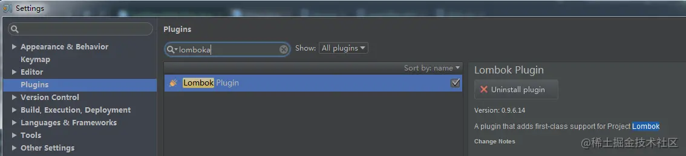
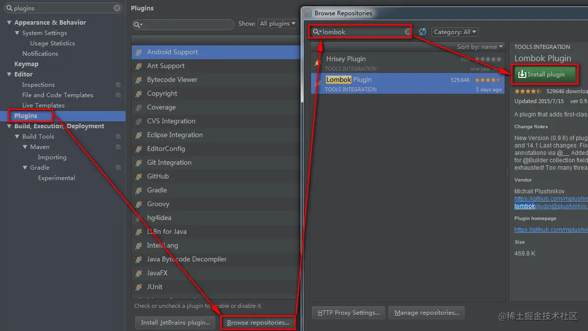
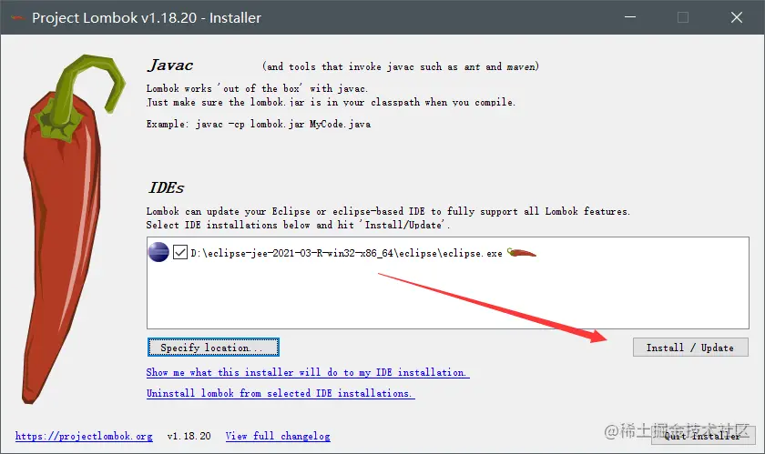

# Lombok 功能介绍
# **一、什么是Lombok **\['lɔmbɔk\]
Lombok 是一个 Java 库，可自动插入您的编辑器并构建工具，为您的 Java 增添趣味。永远不要再编写另一个 getter 或 equals 方法，通过一个注释，您的类就有一个功能齐全的构建器，自动化您的日志变量等等。

Lombok：[https://projectlombok.org/](https://projectlombok.org/)

# **二、Lombok 安装**
## * idea 通过IntelliJ的插件中心安装


## * idea 通过Install Plugin安装


* Eclipse 安装 Lombok 插件
官网下载 jar 包：[https://projectlombok.org/download](https://projectlombok.org/download)



Tip：最后需要注意的是，在使用lombok注解的时候记得要导入lombok.jar包到工程，如果使用的是Maven Project，要在pom.xml中添加依赖。

```java
<dependency>
    <groupId>org.projectlombok</groupId>
    <artifactId>lombok</artifactId>
    <version>${版本}</version>
</dependency>
```
# **三、Lombok的注解**
官方注解文档：[https://projectlombok.org/features/all](https://projectlombok.org/features/all)

## @Data
注解在类上；提供类所有属性的 getting 和 setting 方法，此外还提供了equals、canEqual、hashCode、toString 方法

示例：

```java
import lombok.Data;

@Data
public class MyTestBean {
    private Integer id;
    private String name;
    private String password;
}
```
使用：

```java
public class TestMyBean {
    public static void main(String[] args){
        MyTestBean m=new MyTestBean();
        m.setId(1);
        m.setName("zhangsan");
        m.setPassword("123456");
        System.out.println(m);
    }
}
```
## @NonNull
在个构造函数的参数加上@NonNull后，便会自动对该参数值进行判空。

示例：

```java

import lombok.NonNull;

public class NonNullExample extends Something {
  private String name;
  
  public NonNullExample(@NonNull Person person) {
    super("Hello");
    this.name = person.getName();
  }
}
```
编译后：

```java
import lombok.NonNull;

public class NonNullExample extends Something {
  private String name;
  
  public NonNullExample(@NonNull Person person) {
    super("Hello");
    if (person == null) {
      throw new NullPointerException("person is marked @NonNull but is null");
    }
    this.name = person.getName();
  }
}
```
## @Builder
@Builder注释为你的类生成相对略微复杂的构建器API。@Builder可以让你以下面显示的那样调用你的代码，来初始化你的实例对象：

```java
Person.builder()
.name("Adam Savage")
.city("San Francisco")
.job("Mythbusters")
.job("Unchained Reaction")
.build();
```
示例：

```java
@Builder
public class User {
    private final Integer code = 200;
    private String username;
    private String password;
}
```
编译后：

```java
public class User {
    private String username;
    private String password;
    User(String username, String password) {
        this.username = username; this.password = password;
    }
    public static User.UserBuilder builder() {
        return new User.UserBuilder();
    }

    public static class UserBuilder {
        private String username;
        private String password;
        UserBuilder() {}

        public User.UserBuilder username(String username) {
            this.username = username;
            return this;
        }
        public User.UserBuilder password(String password) {
            this.password = password;
            return this;
        }
        public User build() {
            return new User(this.username, this.password);
        }
        public String toString() {
            return "User.UserBuilder(username=" + this.username + ", password=" + this.password + ")";
        }
    }
}
```
## @AllArgsConstructor
会生成一个包含所有变量，同时如果变量使用了NotNull annotation ， 会进行是否为空的校验， 
全部参数的构造函数的自动生成，该注解的作用域也是只有在实体类上，参数的顺序与属性定义的顺序一致

```java
@AllArgsConstructor
public class User {
    private String username;
    private String password;
}
```
生成代码：

```java

public class User {

    private String username;
    private String password;

    public User(String username, String password) {
        this.username = username;
        this.password = password;
    }
}
```
## @NoArgsConstructor
无参构造函数

## @RequiredArgsConstructor
会生成一个包含常量（final），和标识了@NotNull的变量 的构造方法。

## @Log注解API
```java
@CommonsLog
Creates private static final org.apache.commons.logging.Log log = org.apache.commons.logging.LogFactory.getLog(LogExample.class);
@JBossLog
Creates private static final org.jboss.logging.Logger log = org.jboss.logging.Logger.getLogger(LogExample.class);
@Log
Creates private static final java.util.logging.Logger log = java.util.logging.Logger.getLogger(LogExample.class.getName());
@Log4j
Creates private static final org.apache.log4j.Logger log = org.apache.log4j.Logger.getLogger(LogExample.class);
@Log4j2
Creates private static final org.apache.logging.log4j.Logger log = org.apache.logging.log4j.LogManager.getLogger(LogExample.class);
@Slf4j
Creates private static final org.slf4j.Logger log = org.slf4j.LoggerFactory.getLogger(LogExample.class);
@XSlf4j
Creates private static final org.slf4j.ext.XLogger log = org.slf4j.ext.XLoggerFactory.getXLogger(LogExample.class);
```
