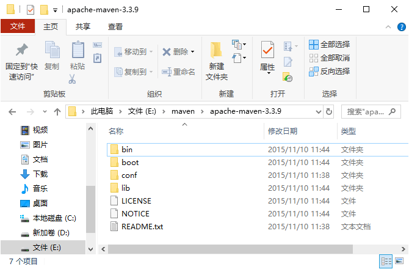
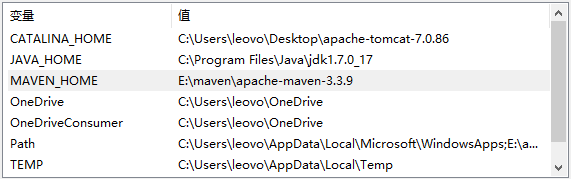
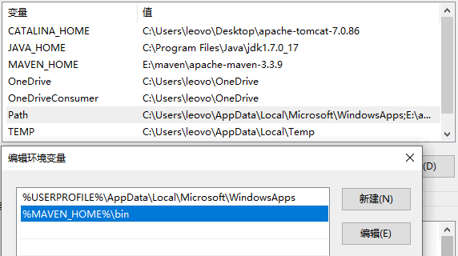
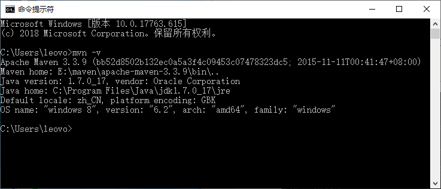
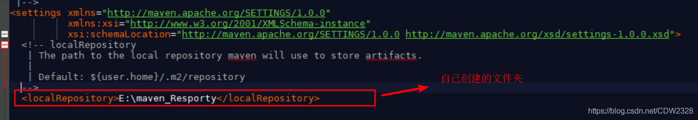

# Maven基础知识与使用总结
# 一、Maven介绍
Apache Maven：[https://maven.apache.org/what-is-maven.html](https://maven.apache.org/what-is-maven.html)

Apache Maven是一个软件项目管理和综合工具。基于项目对象模型（POM）的概念，Maven可以从一个中心资料片管理项目构建，报告和文件。 

Maven主要目标是提供给开发人员：

* 项目是可重复使用，易维护，更容易理解的一个综合模型。
* 插件或交互的工具，这种声明性的模式。

Maven项目的结构和内容在一个XML文件中声明，pom.xml 项目对象模型（POM），这是整个Maven系统的基本单元。有关详细信息，请参阅[Maven POM](https://maven.apache.org/pom.html)的部分。

中心仓库：[https://mvnrepository.com/](https://mvnrepository.com/)

sonatype：[https://search.maven.org/](https://search.maven.org/)

其他参考资料：

[https://www.liaoxuefeng.com/wiki/1252599548343744/1255945359327200](https://www.liaoxuefeng.com/wiki/1252599548343744/1255945359327200)

[http://c.biancheng.net/maven/](http://c.biancheng.net/maven/)

pom文件详解：[https://blog.csdn.net/weixin\_38569499/article/details/91456988](https://blog.csdn.net/weixin_38569499/article/details/91456988)

# 二、Maven安装
由于maven依赖jdk的运行，需要先在本地配置jdk的环境变量，然后在配置maven环境变量，本文暂就不叙述。

## a）下载maven文件
JDK 环境安装好之后，接下来正式安装配置 Maven。

下载地址：[https://maven.apache.org/download.cgi](https://maven.apache.org/download.cgi)

解压后：



## b）配置maven环境变量
安装好后，接下来对 Maven 进行配置。配置内容同 JDK 的配置内容一样，也是两部分：一部分是在系统环境变量或者用户环境变量中配置一个 MAVEN\_HOME；另一部分也是将 Maven 里面的 bin 目录添加到 Path 环境变量。

* **配置 MAVEN\_HOME**



* **追加 Path**



* **测试安装是否成功**
打开一个 CMD 窗口，输入“mvn-v”命令运行



## c）配置maven本地仓库
实际上我们可以将本地仓库理解“缓存”，目的是存放jar包。开发项目时项目首先会从本地仓库中获取 jar 包，当无法获取指定 jar 包的时候，本地仓库会从 远程仓库（或 中央仓库） 中下载 jar 包，并“缓存”到本地仓库中以备将来使用。

默认路径在我们C盘目录下。这里不建议放到C盘，那么如何修改这个默认配置呢。
打开maven安装目录\\conf\\setting.xml文件。我自己的路径：E:\\maven\_3.6.1\\apache-maven-3.6.1\\conf

某个jar包一旦被Maven下载过，即可永久地安全缓存在本地。



最后检查一下配置是否正确。输入命令：`mvn help:system`

## d）配置maven国内仓库源
Maven是当前流行的项目管理工具，但官方的库在国外经常连不上，连上也下载速度很慢。

在maven的配置文件  **settings.xml**  中添加

```xml
<mirror>
    <id>alimaven</id>
    <mirrorOf>central</mirrorOf>
    <name>aliyun maven</name>
    <url>http://maven.aliyun.com/nexus/content/repositories/central/</url>
</mirror>
```
# 三、Maven基本介绍
## a）Maven坐标详解
一个完整的坐标信息，由 groupId、artifactId、version、packaging、classifier 组成，如下是一个简单的坐标定义。

```xml
<dependencies>
    <dependency>
        <groupid>junit</groupid>
        <artifactid>junit</artifactid>
        <version>3.8.1</version>
        <scope>test</scope>
    </dependency>
</dependencies>
```
**groupId** ：属于组织的名称，类似Java的包名；

**artifactId** : 该jar包自身的名称，类似Java的类名；

**version** : 该jar包的版本。

通过上述3个变量，即可唯一确定某个jar包。Maven通过对jar包进行PGP签名确保任何一个jar包一经发布就无法修改。修改已发布jar包的唯一方法是发布一个新版本。

*注：只有以**-SNAPSHOT**结尾的版本号会被Maven视为开发版本，开发版本每次都会重复下载，这种SNAPSHOT版本只能用于内部私有的Maven repo，公开发布的版本不允许出现SNAPSHOT。*

## b）Maven 构建生命周期
|生命周期阶段|描述|
| ----- | ----- |
|validate（校验）|校验项目是否正确并且所有必要的信息可以完成项目的构建过程。|
|initialize（初始化）|初始化构建状态，比如设置属性值。|
|generate-sources（生成源代码）|生成包含在编译阶段中的任何源代码。|
|process-sources（处理源代码）|处理源代码，比如说，过滤任意值。|
|generate-resources（生成资源文件）|生成将会包含在项目包中的资源文件。|
|process-resources （处理资源文件）|复制和处理资源到目标目录，为打包阶段最好准备。|
|compile（编译）|编译项目的源代码。|
|process-classes（处理类文件）|处理编译生成的文件，比如说对Java class文件做字节码改善优化。|
|generate-test-sources（生成测试源代码）|生成包含在编译阶段中的任何测试源代码。|
|process-test-sources（处理测试源代码）|处理测试源代码，比如说，过滤任意值。|
|generate-test-resources（生成测试资源文件）|为测试创建资源文件。|
|process-test-resources（处理测试资源文件）|复制和处理测试资源到目标目录。|
|test-compile（编译测试源码）|编译测试源代码到测试目标目录.|
|process-test-classes（处理测试类文件）|处理测试源码编译生成的文件。|
|test（测试）|使用合适的单元测试框架运行测试（Juint是其中之一）。|
|prepare-package（准备打包）|在实际打包之前，执行任何的必要的操作为打包做准备。|
|package（打包）|将编译后的代码打包成可分发格式的文件，比如JAR、WAR或者EAR文件。|
|pre-integration-test（集成测试前）|在执行集成测试前进行必要的动作。比如说，搭建需要的环境。|
|integration-test（集成测试）|处理和部署项目到可以运行集成测试环境中。|
|post-integration-test（集成测试后）|在执行集成测试完成后进行必要的动作。比如说，清理集成测试环境。|
|verify （验证）|运行任意的检查来验证项目包有效且达到质量标准。|
|install（安装）|安装项目包到本地仓库，这样项目包可以用作其他本地项目的依赖。|
|deploy（部署）|将最终的项目包复制到远程仓库中与其他开发者和项目共享。|

## b）版本管理介绍
通常情况下，Maven 的版本号约定中包括如下几个部分：

**<主版本号>.<次版本号>.<增量版本号>.<里程碑版本号>**

* **主版本号**：主版本号表示该项目的重大升级。例如：Maven1 到 Maven2；
* **次版本号**：表示在该主版本下，较大范围的升级或变化。例如：Maven-3.0 到 Maven-3.1；
* **增量版本号**：增量版本通常是用来修复bug的版本。例如：Maven-3.1.1；
* **里程碑版本号**：用来标记里程碑版本。例如：Maven-3.0-alpha-3。

## c）Maven依赖管理
**packaging** ：定义Maven项目打包的方式，使用构件的什么包。首先，打包方式通常与所生成构件的文件扩展名对应，如上例中没有packaging，则默认为jar包，最终的文件名为junit-3.8.1.jar。也可以打包成war等。

**classifier**: 该元素用来帮助定义构建输出的一些附件。附属构件与主构件对应，如上例中的主构件为junit-3.8.1.jar,该项目可能还会通过一些插件生成如junit-3.8.1-javadoc.jar,junit-3.8.1-sources.jar, 这样附属构件也就拥有了自己唯一的坐标。

上述5个元素中，groupId、artifactId、version是必须定义的，packaging是可选的（默认为jar），而classfier是不能直接定义的，需要结合插件使用。

Maven定义了几种依赖关系，分别是`compile`、`test`、`runtime`和`provided`：

|scope|说明|示例|
| ----- | ----- | ----- |
|compile|编译时需要用到该jar包（默认）|commons-logging|
|test|编译Test时需要用到该jar包|junit|
|runtime|编译时不需要，但运行时需要用到|mysql|
|provided|编译时需要用到，但运行时由JDK或某个服务器提供|servlet-api|

## d）Maven命令 
如果我们运行`mvn package`，Maven就会执行`default`生命周期，它会从开始一直运行到`package`这个phase为止：

* validate
* ...
* package

如果我们运行`mvn compile`，Maven也会执行`default`生命周期，但这次它只会运行到`compile`，即以下几个phase：

* validate
* ...
* compile

Maven另一个常用的生命周期是`clean`，它会执行3个phase：

* pre-clean
* clean （注意这个clean不是lifecycle而是phase）
* post-clean

在实际开发过程中，经常使用的命令有：

`mvn clean`：清理所有生成的class和jar；

`mvn clean compile`：先清理，再执行到`compile`；

`mvn clean test`：先清理，再执行到`test`，因为执行`test`前必须执行`compile`，所以这里不必指定`compile`；

`mvn clean package`：先清理，再执行到`package`。

# 四、Maven的pom.xml文件
## （1）根元素和必要配置
```xml
<project xmlns = "http://maven.apache.org/POM/4.0.0"
    xmlns:xsi = "http://www.w3.org/2001/XMLSchema-instance"
    xsi:schemaLocation = "http://maven.apache.org/POM/4.0.0
    http://maven.apache.org/xsd/maven-4.0.0.xsd">
    <!-- 模型版本 -->
    <modelVersion>4.0.0</modelVersion>
    <!-- 公司或者组织的唯一标志，也是打包成jar包路径的依据 -->
    <!-- 例如com.companyname.project-group，maven打包jar包的路径：/com/companyname/project-group -->
    <groupId>com.companyname.project-group</groupId>
    <!-- 项目的唯一ID，一个groupId下面可能多个项目，就是靠artifactId来区分的 -->
    <artifactId>project</artifactId>
    <!-- 项目当前版本，格式为:主版本.次版本.增量版本-限定版本号 -->
    <version>1.0</version>
    <!--项目产生的构件类型，包括jar、war、ear、pom等 -->
    <packaging>jar</packaging>
</project>
```
* project：整个pom配置文件的根元素，所有的配置都是写在project元素里面的；
* modelVersion：指定了当前POM模型的版本，对于Maven2及Maven 3来说，它只能是4.0.0；
* groupId：这是项目组的标识。它在一个组织或者项目中通常是唯一的。
* artifactId：这是项目的标识，通常是工程的名称。它在一个项目组（group）下是唯一的。
* version：这是项目的版本号，用来区分同一个artifact的不同版本。
* packaging：这是项目产生的构件类型，即项目通过maven打包的输出文件的后缀名，包括jar、war、ear、pom等。
## （2）父项目和parent元素
```xml
<project xmlns = "http://maven.apache.org/POM/4.0.0"
    xmlns:xsi = "http://www.w3.org/2001/XMLSchema-instance"
    xsi:schemaLocation = "http://maven.apache.org/POM/4.0.0
    http://maven.apache.org/xsd/maven-4.0.0.xsd">
<!--父项目的坐标，坐标包括group ID，artifact ID和version。 -->
    <!--如果项目中没有规定某个元素的值，那么父项目中的对应值即为项目的默认值 -->
    <parent>
        <!--被继承的父项目的构件标识符 -->
        <artifactId>com.companyname.project-group</artifactId>
        <!--被继承的父项目的全球唯一标识符 -->
        <groupId>base-project</groupId>
        <!--被继承的父项目的版本 -->
        <version>1.0.1-RELEASE</version>
        <!-- 父项目的pom.xml文件的相对路径,默认值是../pom.xml。 -->
        <!-- 寻找父项目的pom：构建当前项目的地方--)relativePath指定的位置--)本地仓库--)远程仓库 -->
        <relativePath>../pom.xml</relativePath>
    </parent>
</project>

```
所有的pom都继承自一个父pom（Super POM）。父pom包含了一些可以被继承的默认设置，如果项目的pom中没有设置这些元素，就会使用父pom中设置。例如，Super POM中配置了默认仓库http://repo1.maven.org/maven2，这样哪怕项目的pom中没有配置仓库，也可以去这个默认仓库中去下载依赖。实际上，maven pom文件约定大于配置的原则，就是通过在Super POM中预定义了一些配置信息来实现的。

## （3）生成文档相关的元素
```xml
  <!--项目的名称, Maven生成文档使用 -->
    <name>project-maven</name>
 
    <!--项目主页的URL, Maven生成文档使用 -->
    <url>http://123.a.b/nsnxs</url>
 
    <!-- 项目的详细描述, Maven生成文档使用。当这个元素能够用HTML格式描述时，不鼓励使用纯文本描述 -->
    <!--如果你需要修改生成的web站点的索引页面，你应该修改你自己的索引页文件，而不是调整这里的文档 -->
    <description>Description of this maven project</description>
```
备注：maven可以通过mvn site命令生成项目的相关文档。

和生成文档相关的元素，包括name，url，和description。

name：项目名称，maven生成文档会使用项目名；

url：项目主页的地址，maven生成文档的时候使用。

description：项目描述。如果可以使用HTML格式进行描述的时候，不推荐使用纯文本的描述。

## （4）编译POM的配置
groupId

artifactId

version

extensions，是否加载该插件的扩展，默认false

inherited，该插件的configuration中的配置是否可以被（继承该POM的其他Maven项目）继承，默认true

configuration，该插件所需要的特殊配置，在父子项目之间可以覆盖或合并

dependencies，该插件所特有的依赖类库

executions，该插件的某个goal（一个插件中可能包含多个goal）的执行方式。一个execution有如下设置：

id，唯一标识

goals，要执行的插件的goal（可以有多个），如<goal>run</goal>

phase，插件的goal要嵌入到Maven的phase中执行，如verify

inherited，该execution是否可被子项目继承

configuration，该execution的其他配置参数

## （5）排除依赖
将spring boot框架tomcat服务换jetty服务

# 五、构建Maven工程
## a）IDEA 构建Maven工程


## b）Maven工程目录
一个使用Maven管理的普通的Java项目，它的目录结构默认如下：

```Plain Text
a-maven-project
├── pom.xml
├── src
│   ├── main
│   │   ├── java
│   │   └── resources
│   └── test
│       ├── java
│       └── resources
└── target 
```
## c）Maven工程目录说明
|\${basedir}|	存放pom.xml和所有的子目录|
| ----- | ----- |
|\${basedir}/src/main/java	|项目的java源代码|
|\${basedir}/src/main/resources	|项目的资源，比如说property文件，springmvc.xml|
|\${basedir}/src/test/java	|项目的测试类，比如说Junit代码|
|\${basedir}/src/test/resources	|测试用的资源|
|\${basedir}/src/main/scripts	|项目脚本源码的目录|
|\${basedir}/src/main/webapp/WEB-INF	|web应用文件目录，web项目的信息，比如存放web.xml、本地图片、jsp视图页面|
|\${basedir}/target|	打包输出目录|
|\${basedir}/target/classes|	编译输出目录|
|\${basedir}/target/site|	生成文档的目录，可以通过index.html查看项目的文档|
|\${basedir}/target/test-classes|	测试编译输出目录|
|Test.java	|Maven只会自动运行符合该命名规则的测试类|
|\~/.m2/repository	M|aven默认的本地仓库目录位置|

# 六、Maven 实战
## a）Maven 的聚合与继承
[https://www.cnblogs.com/bolingcavalry/p/15820840.html](https://www.cnblogs.com/bolingcavalry/p/15820840.html)

## b）Maven 私服搭建
## c）Maven 编写插件
# 十、常见问题
## （1）idea maven 下载源码出现：Cannot download sources Sources not found for: xxx
```Plain Text
mvn dependency:resolve -Dclassifier=sources
```
