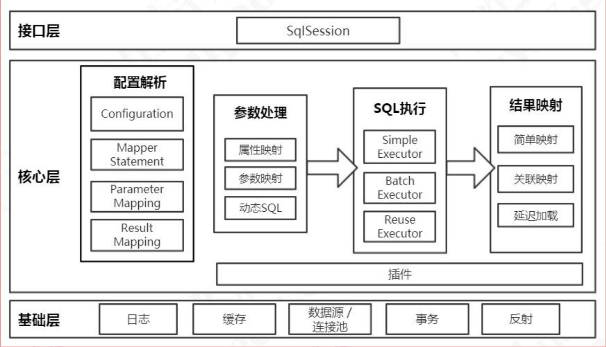
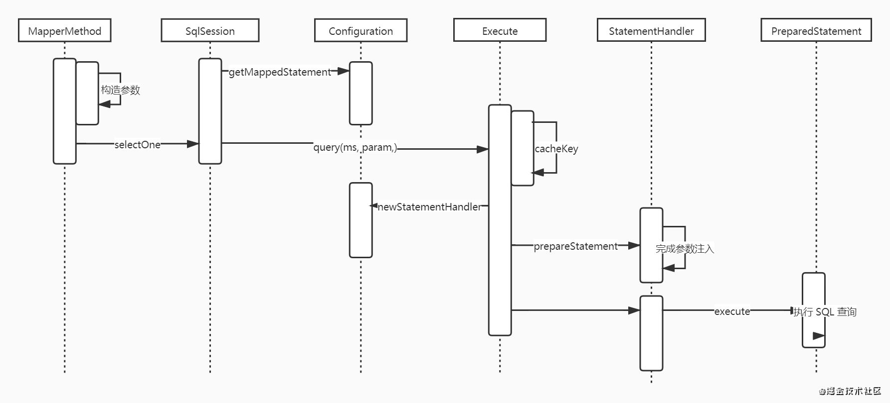
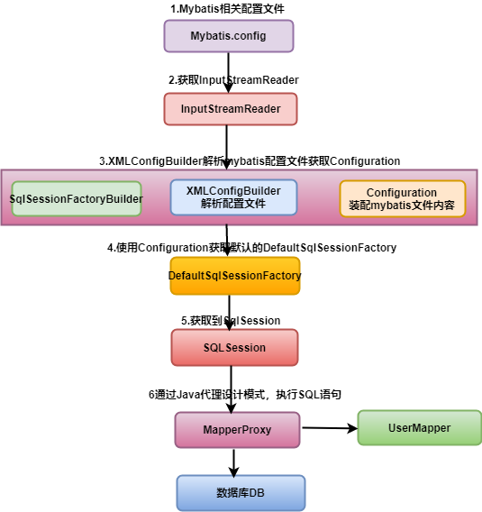
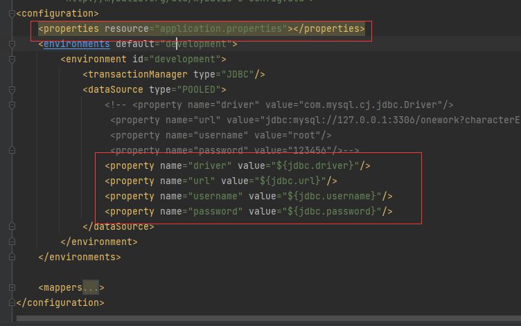
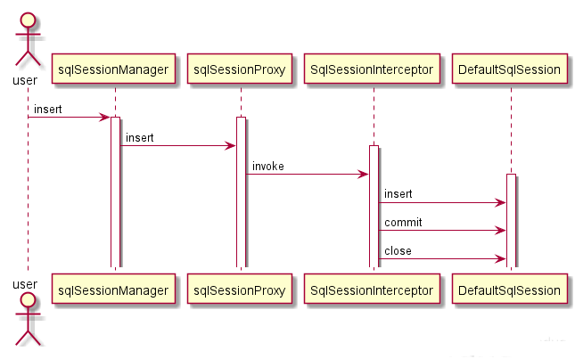

# MyBatis 介绍与总结
# 一、参考资料
文档地址：[https://mybatis.org/mybatis-3/](https://mybatis.org/mybatis-3/)

中文文档地址：[https://mybatis.org/mybatis-3/zh/getting-started.html](https://mybatis.org/mybatis-3/zh/index.html)

Spring-Mybatis：[http://mybatis.org/spring/zh/index.html](http://mybatis.org/spring/zh/index.html)

参考资料：

[https://blog.csdn.net/tiankong\_12345/article/details/90813101](https://blog.csdn.net/tiankong_12345/article/details/90813101) （程序结构）

[https://www.cnblogs.com/hemou/articles/14344471.html](https://www.cnblogs.com/hemou/articles/14344471.html) （SqlSession 的具体实现类）

# 二、MyBatis 介绍
MyBatis 是一款优秀的持久层框架，它支持自定义 SQL、存储过程以及高级映射。MyBatis 免除了几乎所有的 JDBC 代码以及设置参数和获取结果集的工作。MyBatis 可以通过简单的 XML 或注解来配置和映射原始类型、接口和 Java POJO（Plain Old Java Objects，普通老式 Java 对象）为数据库中的记录。

MyBatis 的整体架构分为三层， 分别是基础支持层、核心处理层和接口层：



## a）基础支持层(各个模块的功能)
|反射模块|该模块对Java 原生的反射进行了良好的封装，提供了更加简洁易用的API ，方便上层使调用，并且对反射操作进行了一系列优化，例如缓存了类的元数据，提高了反射操作的性能。|
| ----- | ----- |
|类型转换模块|别名机制， 该机制是类型转换模块的主要功能之一。<br>实现JDBC 类型与Java 类型之间的转换，该功能在为SQL 语句绑定实参以及映射查询结果集时都会涉及。|
|日志模块|提供详细的日志输出信息;<br>能够集成多种日志框架，其日志模块的一个主要功能就是集成第三方日志框架。|
|资源加载模块|对类加载器进行封装，确定类加载器的使用顺序，并提供了加载类文件以及其他资源文件的功能。|
|解析器模块|对XPath 进行封装，为MyBatis 初始化时解析mybatis-config.xml 配置文件以及映射配置文件提供支持;<br>为处理动态SQL 语句中的占位符提供支持。|
|数据源模块|身提供了相应的数据源实现;<br>提供了与第三方数据源集成的接口.|
|事务管理|MyBatis 对数据库中的事务进行了抽象,其自身提供了相应的事务接口和简单实现。|
|缓存模块|My Batis 中提供了一级缓存和二级缓存，而这两级缓存都是依赖于基础支持层中的缓存模块实现的。<br>MyBatis 中自带的这两级缓存与MyBatis 以及整个应用是运行在同一个JVM中的，共享同一块堆内存。<br>如果这两级缓存中的数据量较大， 则可能影响系统中其他功能的运行，所以当需要缓存大量数据时，优先考虑<br>使用Redis 、Memcache 等缓存产品。|
|Binding 模块|MyBatis 通过Binding 模块将用户自定义的Mapper 接口与映射配置文件关联起来，系统可以通过调用自定义Mapper 接口中的方法执行相应的SQL 语句完成数据库操作，尽早发现拼写错误。<br>开发人员无须编写自定义Mapper 接口的实现， MyBatis 会自动为其创建动态代理对象。|

## b）核心处理层
|配置解析|在MyBatis 初始化过程中，会加载mybatis-config.xml 配置文件、映射配置文件以及Mapper 接口中的注解信息，解析后的配置信息会形成相应的对象并保存到Configuration 对象中。<br>之后，利用该Configuration 对象创建Sq!SessionFactory 对象。<br>待MyBatis 初始化之后，开发人员可以通过初始化得到Sq!SessionFactory 创建SqlSession 对象并完成数据库操作。|
| ----- | ----- |
|SOL 解析与scripting 模块|MyBatis 实现动态SQL 语句的功能，提供了多种动态SQL 语句对应的节点，例如，＜ where＞节点、＜ if>节点、＜ foreach＞节点等。通过这些节点的组合使用， 开发人员可以写出几乎满足所有需求的动态SQL 语句。<br>My Batis 中的scripting 模块会根据用户传入的实参，解析映射文件中定义的动态SQL节点，并形成数据库可执行的SQL 语句。之后会处理SQL 语句中的占位符，绑定用户传入的实参。|
|SOL 执行|SQL 语句的执行涉及多个组件，其中比较重要的是Executor 、StatementHandler 、ParameterHandler 和ResultSetHandler。<br>Executor 主要负责维护一级缓存和二级缓存，并提供事务管理的相关操作，它会将数据库相关操作委托给StatementHandler 完成。<br>StatementHandler 首先通过ParameterHandler 完成SQL 语句的实参绑定；<br>然后通过java.sql.Statement 对象执行SQL 语句并得到结果集；<br>最后通过ResultSetHandler 完成结果集的映射，得到结果对象并返回。|
|插件|通过添加用户自定义插件的方式对MyBatis 进行扩展。|

MyBatis 执行一条SQL 语句的大致过程：



## c）接口层
核心是SqlSession 接口，该接口中定义了MyBatis 暴露给应用程序调用的API ，也就是上层应用与MyBatis 交互的桥梁。接口层在接收到调用请求时，会调用核心处理层的相应模块来完成具体的数据库操作。

# 三、作用域（Scope）和生命周期



## a）SqlSessionFactoryBuilder
这个类可以被实例化、使用和丢弃，一旦创建了 SqlSessionFactory，就不再需要它了。 因此 SqlSessionFactoryBuilder 实例的最佳作用域是方法作用域（也就是局部方法变量）。 你可以重用 SqlSessionFactoryBuilder 来创建多个 SqlSessionFactory 实例，但最好还是不要一直保留着它，以保证所有的 XML 解析资源可以被释放给更重要的事情。

## b）SqlSessionFactory
SqlSessionFactory 一旦被创建就应该在应用的运行期间一直存在，没有任何理由丢弃它或重新创建另一个实例。 使用 SqlSessionFactory 的最佳实践是在应用运行期间不要重复创建多次，多次重建 SqlSessionFactory 被视为一种代码“坏习惯”。因此 SqlSessionFactory 的最佳作用域是应用作用域。 有很多方法可以做到，最简单的就是使用单例模式或者静态单例模式。

## c）SqlSession
每个线程都应该有它自己的 SqlSession 实例。SqlSession 的实例不是线程安全的，因此是不能被共享的，所以它的最佳的作用域是请求或方法作用域。 绝对不能将 SqlSession 实例的引用放在一个类的静态域，甚至一个类的实例变量也不行。 也绝不能将 SqlSession 实例的引用放在任何类型的托管作用域中，比如 Servlet 框架中的 HttpSession。 如果你现在正在使用一种 Web 框架，考虑将 SqlSession 放在一个和 HTTP 请求相似的作用域中。 换句话说，每次收到 HTTP 请求，就可以打开一个 SqlSession，返回一个响应后，就关闭它。 这个关闭操作很重要，为了确保每次都能执行关闭操作，你应该把这个关闭操作放到 finally 块中。 下面的示例就是一个确保 SqlSession 关闭的标准模式：

```java
try (SqlSession session = sqlSessionFactory.openSession()) {
  // 你的应用逻辑代码
}
```
在所有代码中都遵循这种使用模式，可以保证所有数据库资源都能被正确地关闭。

# 四、Xml配置
MyBatis 的配置文件包含MyBatis 行为的设置和属性信息。 配置文档的顶层结构如下：

* configuration（配置）
   * [properties（属性）](https://mybatis.org/mybatis-3/zh/configuration.html#properties)
   * [settings（设置）](https://mybatis.org/mybatis-3/zh/configuration.html#settings)
   * [typeAliases（类型别名）](https://mybatis.org/mybatis-3/zh/configuration.html#typeAliases)
   * [typeHandlers（类型处理器）](https://mybatis.org/mybatis-3/zh/configuration.html#typeHandlers)
   * [objectFactory（对象工厂）](https://mybatis.org/mybatis-3/zh/configuration.html#objectFactory)
   * [plugins（插件）](https://mybatis.org/mybatis-3/zh/configuration.html#plugins)
   * [environments（环境配置）](https://mybatis.org/mybatis-3/zh/configuration.html#environments)
      * environment（环境变量）
         * transactionManager（事务管理器）
         * dataSource（数据源）
   * [databaseIdProvider（数据库厂商标识）](https://mybatis.org/mybatis-3/zh/configuration.html#databaseIdProvider)
   * [mappers（映射器）](https://mybatis.org/mybatis-3/zh/configuration.html#mappers)

## a）通过外部资源文件方式配置JDBC
  在 mybatis-config.xml 文件加入`<properties resource="application.properties"></properties>`

  `application.properties` 文件加入：

```Plain Text
jdbc.driver=com.mysql.cj.jdbc.Driver
jdbc.url=jdbc:mysql://127.0.0.1:3306/onework?characterEncoding=utf8&useSSL=false&serverTimezone=UTC&rewriteBatchedStatements=true
jdbc.username=root
jdbc.password=123456
```
按照下图进行配置：



## b）类型别名（typeAliases）
类型别名可为 Java 类型设置一个缩写名字。 它仅用于 XML 配置，意在降低冗余的全限定类名书写。例如：

```xml
<typeAliases>
  <typeAlias alias="DatabaseConnection" type="com.onework.sample.mybaits.entity.DatabaseConnection"/>
</typeAliases>
```
在Mapper.xml中resultType进行可以进行`DatabaseConnection`别名的映射

```xml
<mapper namespace="com.onework.sample.mybaits.mapper.DatabaseConnectionMapper">
    <select id="getDatabaseConnection" parameterType="string" resultType="DatabaseConnection">
         select * from ow_database_connections where uid = #{uid}
    </select>
</mapper>
```
## c）settings 配置
|设置名|描述|有效值|默认值|
| ----- | ----- | ----- | ----- |
|cacheEnabled|全局地开启或关闭配置文件中的所有映射器已经配置的任何缓存。|true|false|
|lazyLoadingEnabled|延迟加载的全局开关。当开启时，所有关联对象都会延迟加载。 特定关联关系中可通过设置 fetchType属性来覆盖该项的开关状态。|true|false|
|aggressiveLazyLoading|当开启时，任何方法的调用都会加载该对象的所有属性。 否则，每个属性会按需加载（参考 lazyLoadTriggerMethods)。|true|false|
|multipleResultSetsEnabled|是否允许单一语句返回多结果集（需要驱动支持）。|true|false|
|useColumnLabel|使用列标签代替列名。不同的驱动在这方面会有不同的表现，具体可参考相关驱动文档或通过测试这两种不同的模式来观察所用驱动的结果。|true|false|
|useGeneratedKeys|允许 JDBC 支持自动生成主键，需要驱动支持。 如果设置为 true 则这个设置强制使用自动生成主键，尽管一些驱动不能支持但仍可正常工作（比如 Derby）。|true|false|
|autoMappingBehavior|指定 MyBatis 应如何自动映射列到字段或属性。 NONE 表示取消自动映射；PARTIAL 只会自动映射没有定义嵌套结果集映射的结果集。 FULL 会自动映射任意复杂的结果集（无论是否嵌套）。|NONE, PARTIAL, FULL|PARTIAL|
|autoMappingUnknownColumnBehavior|指定发现自动映射目标未知列（或者未知属性类型）的行为。<br><br>* NONE: 不做任何反应<br>* WARNING: 输出提醒日志 ('org.apache.ibatis.session.AutoMappingUnknownColumnBehavior'的日志等级必须设置为 WARN)<br>* FAILING: 映射失败 (抛出 SqlSessionException)|NONE, WARNING, FAILING|NONE|
|defaultExecutorType|配置默认的执行器。SIMPLE 就是普通的执行器；REUSE 执行器会重用预处理语句（prepared statements）； BATCH 执行器将重用语句并执行批量更新。|SIMPLE REUSE BATCH|SIMPLE|
|defaultStatementTimeout|设置超时时间，它决定驱动等待数据库响应的秒数。|任意正整数|未设置 (null)|
|defaultFetchSize|为驱动的结果集获取数量（fetchSize）设置一个提示值。此参数只可以在查询设置中被覆盖。|任意正整数|未设置 (null)|
|safeRowBoundsEnabled|允许在嵌套语句中使用分页（RowBounds）。如果允许使用则设置为 false。|true|false|
|safeResultHandlerEnabled|允许在嵌套语句中使用分页（ResultHandler）。如果允许使用则设置为 false。|true|false|
|mapUnderscoreToCamelCase|是否开启自动驼峰命名规则（camel case）映射，即从经典数据库列名 A\_COLUMN 到经典 Java 属性名 aColumn 的类似映射。|true|false|
|localCacheScope|MyBatis 利用本地缓存机制（Local Cache）防止循环引用（circular references）和加速重复嵌套查询。 默认值为 SESSION，这种情况下会缓存一个会话中执行的所有查询。 若设置值为 STATEMENT，本地会话仅用在语句执行上，对相同 SqlSession 的不同调用将不会共享数据。|SESSION|STATEMENT|
|jdbcTypeForNull|当没有为参数提供特定的 JDBC 类型时，为空值指定 JDBC 类型。 某些驱动需要指定列的 JDBC 类型，多数情况直接用一般类型即可，比如 NULL、VARCHAR 或 OTHER。|JdbcType 常量，常用值：NULL, VARCHAR 或 OTHER。|OTHER|
|lazyLoadTriggerMethods|指定哪个对象的方法触发一次延迟加载。|用逗号分隔的方法列表。|equals,clone,hashCode,toString|
|defaultScriptingLanguage|指定动态 SQL 生成的默认语言。|一个类型别名或完全限定类名。|org.apache.ibatis.scripting.xmltags.XMLLanguageDriver|
|defaultEnumTypeHandler|指定 Enum 使用的默认 TypeHandler 。（新增于 3.4.5）|一个类型别名或完全限定类名。|org.apache.ibatis.type.EnumTypeHandler|
|callSettersOnNulls|指定当结果集中值为 null 的时候是否调用映射对象的 setter（map 对象时为 put）方法，这在依赖于 Map.keySet() 或 null 值初始化的时候比较有用。注意基本类型（int、boolean 等）是不能设置成 null 的。|true|false|
|returnInstanceForEmptyRow|当返回行的所有列都是空时，MyBatis默认返回 null。 当开启这个设置时，MyBatis会返回一个空实例。 请注意，它也适用于嵌套的结果集 （如集合或关联）。（新增于 3.4.2）|true|false|
|logPrefix|指定 MyBatis 增加到日志名称的前缀。|任何字符串|未设置|
|logImpl|指定 MyBatis 所用日志的具体实现，未指定时将自动查找。|SLF4J|LOG4J|
|proxyFactory|指定 Mybatis 创建具有延迟加载能力的对象所用到的代理工具。|CGLIB|JAVASSIST|
|vfsImpl|指定 VFS 的实现|自定义 VFS 的实现的类全限定名，以逗号分隔。|未设置|
|useActualParamName|允许使用方法签名中的名称作为语句参数名称。 为了使用该特性，你的项目必须采用 Java 8 编译，并且加上 -parameters 选项。（新增于 3.4.1）|true|false|
|configurationFactory|指定一个提供 Configuration 实例的类。 这个被返回的 Configuration 实例用来加载被反序列化对象的延迟加载属性值。 这个类必须包含一个签名为static Configuration getConfiguration() 的方法。（新增于 3.2.3）|类型别名或者全类名.|未设置|

# 五、XML映射文件
## a）select元素
|属性|描述|
| ----- | ----- |
|id|在命名空间中唯一的标识符，可以被用来引用这条语句。|
|parameterType|将会传入这条语句的参数类的完全限定名或别名。这个属性是可选的，因为 MyBatis 可以通过 TypeHandler 推断出具体传入语句的参数，默认值为 unset。|
|~~parameterMap~~|~~这是引用外部 parameterMap 的已经被废弃的方法。使用内联参数映射和 parameterType 属性。~~|
|resultType|从这条语句中返回的期望类型的类的完全限定名或别名。注意如果是集合情形，那应该是集合可以包含的类型，而不能是集合本身。使用 resultType 或 resultMap，但不能同时使用。|
|resultMap|外部 resultMap 的命名引用。结果集的映射是 MyBatis 最强大的特性，对其有一个很好的理解的话，许多复杂映射的情形都能迎刃而解。使用 resultMap 或 resultType，但不能同时使用。|
|flushCache|将其设置为 true，任何时候只要语句被调用，都会导致本地缓存和二级缓存都会被清空，默认值：false。|
|useCache|将其设置为 true，将会导致本条语句的结果被二级缓存，默认值：对 select 元素为 true。|
|timeout|这个设置是在抛出异常之前，驱动程序等待数据库返回请求结果的秒数。默认值为 unset（依赖驱动）。|
|fetchSize|这是尝试影响驱动程序每次批量返回的结果行数和这个设置值相等。默认值为 unset（依赖驱动）。|
|statementType|STATEMENT，PREPARED 或 CALLABLE 的一个。这会让 MyBatis 分别使用 Statement，PreparedStatement 或 CallableStatement，默认值：PREPARED。|
|resultSetType|FORWARD\_ONLY，SCROLL\_SENSITIVE 或 SCROLL\_INSENSITIVE 中的一个，默认值为 unset （依赖驱动）。|
|databaseId|如果配置了 databaseIdProvider，MyBatis 会加载所有的不带 databaseId 或匹配当前 databaseId 的语句；如果带或者不带的语句都有，则不带的会被忽略。|
|resultOrdered|这个设置仅针对嵌套结果 select 语句适用：如果为 true，就是假设包含了嵌套结果集或是分组了，这样的话当返回一个主结果行的时候，就不会发生有对前面结果集的引用的情况。这就使得在获取嵌套的结果集的时候不至于导致内存不够用。默认值：false。|
|resultSets|这个设置仅对多结果集的情况适用，它将列出语句执行后返回的结果集并每个结果集给一个名称，名称是逗号分隔的。|

## b）insert, update 和 delete 元素
|属性|描述|
| ----- | ----- |
|id|命名空间中的唯一标识符，可被用来代表这条语句。|
|parameterType|将要传入语句的参数的完全限定类名或别名。这个属性是可选的，因为 MyBatis 可以通过 TypeHandler 推断出具体传入语句的参数，默认值为 unset。|
|~~parameterMap~~|~~这是引用外部 parameterMap 的已经被废弃的方法。使用内联参数映射和 parameterType 属性。~~|
|flushCache|将其设置为 true，任何时候只要语句被调用，都会导致本地缓存和二级缓存都会被清空，默认值：true（对应插入、更新和删除语句）。|
|timeout|这个设置是在抛出异常之前，驱动程序等待数据库返回请求结果的秒数。默认值为 unset（依赖驱动）。|
|statementType|STATEMENT，PREPARED 或 CALLABLE 的一个。这会让 MyBatis 分别使用 Statement，PreparedStatement 或 CallableStatement，默认值：PREPARED。|
|useGeneratedKeys|（仅对 insert 和 update 有用）这会令 MyBatis 使用 JDBC 的 getGeneratedKeys 方法来取出由数据库内部生成的主键（比如：像 MySQL 和 SQL Server 这样的关系数据库管理系统的自动递增字段），默认值：false。|
|keyProperty|（仅对 insert 和 update 有用）唯一标记一个属性，MyBatis 会通过 getGeneratedKeys 的返回值或者通过 insert 语句的 selectKey 子元素设置它的键值，默认：unset。如果希望得到多个生成的列，也可以是逗号分隔的属性名称列表。|
|keyColumn|（仅对 insert 和 update 有用）通过生成的键值设置表中的列名，这个设置仅在某些数据库（像 PostgreSQL）是必须的，当主键列不是表中的第一列的时候需要设置。如果希望得到多个生成的列，也可以是逗号分隔的属性名称列表。|
|databaseId|如果配置了 databaseIdProvider，MyBatis 会加载所有的不带 databaseId 或匹配当前 databaseId 的语句；如果带或者不带的语句都有，则不带的会被忽略。|

# 六、SqlSession 的具体实现类
## a）DefaultSqlSession
DefaultSqlSession 是SqlSession的默认实现。

当我们单独使用Mybatis时，我们通常使用DefaultSqlSession 来执行SQL，操作数据库。

但是DefaultSqlSession存在两个不足。

1. 我们需要自己手动关闭sqlsesion，我们知道，人总是不可靠的。忘关sqlsession 是有很大概率发生的
2. 线程安全问题：DefaultSqlSession是线程不安全的Sqlsession 。也就是说DefaultSqlSession不能是单例，

## b）SqlSessionManager
SqlSessionManager是DefaultSqlSession 的升级版，不如说SqlSessionManager是DefaultSqlSession代理版（或者封装版）

```java
String resource = "mybatis-config.xml";
// 读取配置文件
InputStream inputStream = Resources.getResourceAsStream(resource);
SqlSessionManager sqlSessionManager =SqlSessionManager.newInstance(inputStream);

//获取一个SqlSession
SqlSession session = sqlSessionManager.openSession();
//SqlSessionManager 类的openSession
public SqlSession openSession() {
    return sqlSessionFactory.openSession();
}
```
1. **解决自动关闭问题**

使用JDK动态代理技术，动态生成代理对象sqlSessionProxy ，并用内部类SqlSessionInterceptor来对SqlSession的执行方法进行增强。

```java
private SqlSessionManager(SqlSessionFactory sqlSessionFactory) {
    this.sqlSessionFactory = sqlSessionFactory;
    //使用JDK代理技术，生成一个代理对象
    this.sqlSessionProxy = (SqlSession) Proxy.newProxyInstance(
        SqlSessionFactory.class.getClassLoader(),
        new Class[]{SqlSession.class},
        new SqlSessionInterceptor());
}
```
当执行insert()方法时，sqlSessionManager内部是调用sqlsessionProxy代理对象的insert方法。之后执行增强器的SqlSessionInterceptor#invoke方法。

```java
@Override
public Object invoke(Object proxy, Method method, Object[] args) throws Throwable {
    final SqlSession sqlSession = SqlSessionManager.this.localSqlSession.get();
    if (sqlSession != null) {// 当使用线程本地变量
        try {
            return method.invoke(sqlSession, args);
        } catch (Throwable t) {
            throw ExceptionUtil.unwrapThrowable(t);
        }
    } else {//不使用线程本地变量。
        //从sqlSessionFactory获取一个DefaultSqlSession
        final SqlSession autoSqlSession = openSession();
        try {
            final Object result = method.invoke(autoSqlSession, args);
            autoSqlSession.commit();//提交
            return result;
        } catch (Throwable t) {
            autoSqlSession.rollback();//回滚
            throw ExceptionUtil.unwrapThrowable(t);
        } finally {
            autoSqlSession.close();//关闭sqlsession
        }
    }
}
```
invoke方法内部，调用openSession() 从sqlSessionFactory中获取一个DefaultSqlSession，执行对应的方法，并在`finally`中执行关闭sqlsession

最后的执行时序：



sqlSessionManager.insert() 的背后依然是DefaultSqlSession.insert 。并且帮助我们close 了DefaultSqlSession。

开发人员再也不必担心，忘记关闭DefaultSqlSession 了。

2. **解决线程安全问题**

解决线程安全问题，sqlSessionManager 还有另一个方式，那就是使用线程本地变量，不同于每次执行CURD操作都重新获取一个DefaultSqlSession 。 线程本地变量这种方式是一个线程内使用同一个请求，这就大大节省了创建DefaultSqlSession 的时间，并且是线程安全的。

使用：

```java
sqlSessionManager.startManagedSession();//绑定Session到线程本地变量
sqlSessionManager.insert()
```
当startManagedSession()开始线程本地变量时，会从sqlSessionFactory获取一个session 放入到线程本地localSqlSession中，绑定到当前线程。

当我们执行sqlSessionManager.insert方法时，执行到增强器的invoke方法时，会从localSqlSession获取绑定到当前线程的sqlsession

```java
@Override
public Object invoke(Object proxy, Method method, Object[] args) throws Throwable {
    //从线程本地变量里获取
    final SqlSession sqlSession = SqlSessionManager.this.localSqlSession.get();
    if (sqlSession != null) {
        try {
            return method.invoke(sqlSession, args);
        } catch (Throwable t) {
            throw ExceptionUtil.unwrapThrowable(t);
        }
    }
}
```
## c）SqlSessionTemplate
SqlSessionTemplate 是Mybatis与Spring 整合时的线程安全sqlsession .

来看其构造方法

```java
   public SqlSessionTemplate(SqlSessionFactory sqlSessionFactory, ExecutorType executorType,
          PersistenceExceptionTranslator exceptionTranslator) {

        this.sqlSessionFactory = sqlSessionFactory;
        this.executorType = executorType;
        this.exceptionTranslator = exceptionTranslator;
        this.sqlSessionProxy = (SqlSession) newProxyInstance(
            SqlSessionFactory.class.getClassLoader(),
            new Class[] { SqlSession.class },
            new SqlSessionInterceptor());
      }
```
# 七、动态 SQL
动态 SQL 是 MyBatis 的强大特性之一。如果你使用过 JDBC 或其它类似的框架，你应该能理解根据不同条件拼接 SQL 语句有多痛苦，例如拼接时要确保不能忘记添加必要的空格，还要注意去掉列表最后一个列名的逗号。利用动态 SQL，可以彻底摆脱这种痛苦。

## a）if
使用动态 SQL 最常见情景是根据条件包含 where 子句的一部分。比如：

```xml
<select id="findActiveBlogWithTitleLike"
     resultType="Blog">
  SELECT * FROM BLOG
  WHERE state = ‘ACTIVE’
  <if test="title != null">
    AND title like #{title}
  </if>
</select>
```
## b）choose、when、otherwisetrim (where, set)
有时候，我们不想使用所有的条件，而只是想从多个条件中选择一个使用。针对这种情况，MyBatis 提供了 choose 元素，它有点像 Java 中的 switch 语句。

```xml
<select id="findActiveBlogLike"
     resultType="Blog">
  SELECT * FROM BLOG WHERE state = ‘ACTIVE’
  <choose>
    <when test="title != null">
      AND title like #{title}
    </when>
    <when test="author != null and author.name != null">
      AND author_name like #{author.name}
    </when>
    <otherwise>
      AND featured = 1
    </otherwise>
  </choose>
</select>
```
## c）trim、where、set
```xml
<select id="findActiveBlogLike"
     resultType="Blog">
  SELECT * FROM BLOG
  <where>
    <if test="state != null">
         state = #{state}
    </if>
    <if test="title != null">
        AND title like #{title}
    </if>
    <if test="author != null and author.name != null">
        AND author_name like #{author.name}
    </if>
  </where>
</select>
```
## d）foreach
动态 SQL 的另一个常见使用场景是对集合进行遍历（尤其是在构建 IN 条件语句的时候）。比如：

```xml
<select id="selectPostIn" resultType="domain.blog.Post">
  SELECT *
  FROM POST P
  WHERE ID in
  <foreach item="item" index="index" collection="list"
      open="(" separator="," close=")">
        #{item}
  </foreach>
</select>
```
# 八、MyBatis 的 注解
|注解|使用对象|相对应的 XML|描述|
| ----- | ----- | ----- | ----- |
|@CacheNamespace|类| |为给定的命名空间（比如类）配置缓存。属性有：`implemetation`, `eviction`, `flushInterval`, `size`, `readWrite`, `blocking` 和`properties`。|
|@Property|N/A| |指定参数值或占位值（placeholder）（能被 `mybatis-config.xml`内的配置属性覆盖）。属性有：`name`, `value`。（仅在MyBatis 3.4.2以上版本生效）|
|@CacheNamespaceRef|类| |参照另外一个命名空间的缓存来使用。属性有：`value`, `name`。如果你使用了这个注解，你应设置 `value` 或者 `name` 属性的其中一个。`value` 属性用于指定 Java 类型而指定命名空间（命名空间名就是指定的 Java 类型的全限定名），`name` 属性（这个属性仅在MyBatis 3.4.2以上版本生效）直接指定了命名空间的名字。|
|@ConstructorArgs|方法| |收集一组结果传递给一个结果对象的构造方法。属性有：`value`，它是形式参数数组。|
|@Arg|N/A|\`\`|单参数构造方法，是 ConstructorArgs 集合的一部分。属性有：`id`, `column`, `javaType`, `jdbcType`, `typeHandler`, `select` 和 `resultMap`。id 属性是布尔值，来标识用于比较的属性，和`<idArg>` XML 元素相似。|
|@TypeDiscriminator|方法| |一组实例值被用来决定结果映射的表现。属性有：`column`, `javaType`, `jdbcType`, `typeHandler` 和 `cases`。cases 属性是实例数组。|
|@Case|N/A| |单独实例的值和它对应的映射。属性有：`value`, `type`, `results`。results 属性是结果数组，因此这个注解和实际的 `ResultMap` 很相似，由下面的 `Results` 注解指定。|
|@Results|方法| |结果映射的列表，包含了一个特别结果列如何被映射到属性或字段的详情。属性有：`value`, `id`。value 属性是 `Result` 注解的数组。这个 id 的属性是结果映射的名称。|
|@Result|N/A|\`\`|在列和属性或字段之间的单独结果映射。属性有：`id`, `column`, `javaType`, `jdbcType`, `typeHandler`, `one`, `many`。id 属性是一个布尔值，来标识应该被用于比较（和在 XML 映射中的`<id>`相似）的属性。one 属性是单独的联系，和 `<association>` 相似，而 many 属性是对集合而言的，和`<collection>`相似。它们这样命名是为了避免名称冲突。|
|@One|N/A| |复杂类型的单独属性值映射。属性有：`select`，已映射语句（也就是映射器方法）的全限定名，它可以加载合适类型的实例。`fetchType`会覆盖全局的配置参数 `lazyLoadingEnabled`。**注意** 联合映射在注解 API中是不支持的。这是因为 Java 注解的限制,不允许循环引用。|
|@Many|N/A| |映射到复杂类型的集合属性。属性有：`select`，已映射语句（也就是映射器方法）的全限定名，它可以加载合适类型的实例的集合，`fetchType` 会覆盖全局的配置参数 `lazyLoadingEnabled`。**注意** 联合映射在注解 API中是不支持的。这是因为 Java 注解的限制，不允许循环引用|
|@MapKey|方法| |这是一个用在返回值为 Map 的方法上的注解。它能够将存放对象的 List 转化为 key 值为对象的某一属性的 Map。属性有： `value`，填入的是对象的属性名，作为 Map 的 key 值。|
|@Options|方法|映射语句的属性|这个注解提供访问大范围的交换和配置选项的入口，它们通常在映射语句上作为属性出现。`Options` 注解提供了通俗易懂的方式来访问它们，而不是让每条语句注解变复杂。属性有：`useCache=true`, `flushCache=FlushCachePolicy.DEFAULT`, `resultSetType=DEFAULT`, `statementType=PREPARED`, `fetchSize=-1`, `timeout=-1`, `useGeneratedKeys=false`, `keyProperty=""`, `keyColumn=""`, `resultSets=""`。值得一提的是， Java 注解无法指定 `null` 值。因此，一旦你使用了 `Options` 注解，你的语句就会被上述属性的默认值所影响。要注意避免默认值带来的预期以外的行为。 注意： `keyColumn` 属性只在某些数据库中有效（如 Oracle、PostgreSQL等）。请在插入语句一节查看更多关于 `keyColumn` 和 `keyProperty` 两者的有效值详情。|
|`@Insert``@Update`<br>`@Delete``@Select`|方法|`<insert>``<update>`<br>`<delete>``<select>`|这四个注解分别代表将会被执行的 SQL 语句。它们用字符串数组（或单个字符串）作为参数。如果传递的是字符串数组，字符串之间先会被填充一个空格再连接成单个完整的字符串。这有效避免了以 Java 代码构建 SQL 语句时的“丢失空格”的问题。然而，你也可以提前手动连接好字符串。属性有：`value`，填入的值是用来组成单个 SQL 语句的字符串数组。|
|`@InsertProvider`<br>`@UpdateProvider`<br>`@DeleteProvider`<br>`@SelectProvider`|方法|`<insert>`<br>`<update>`<br>`<delete>`<br>`<select>`|允许构建动态 SQL。这些备选的 SQL 注解允许你指定类名和返回在运行时执行的 SQL 语句的方法。（自从MyBatis 3.4.6开始，你可以用 `CharSequence` 代替 `String` 来返回类型返回值了。）当执行映射语句的时候，MyBatis 会实例化类并执行方法，类和方法就是填入了注解的值。你可以把已经传递给映射方法了的对象作为参数，“Mapper interface type” 和 “Mapper method” and “Database ID” 会经过 `ProviderContext` （仅在MyBatis 3.4.5及以上支持）作为参数值。（MyBatis 3.4及以上的版本，支持多参数传入） 属性有： `value`, `type`, `method`。 `value` and `type` 属性需填入类(The `type` attribute is alias for `value`, you must be specify either one)。 `method` 需填入该类定义了的方法名 (Since 3.5.1, you can omit `method` attribute, the MyBatis will resolve a target method via the `ProviderMethodResolver` interface. If not resolve by it, the MyBatis use the reserved fallback method that named `provideSql`)。 **注意** 接下来的小节将会讨论类，能帮助你更轻松地构建动态 SQL。|
|@Param|参数|N/A|如果你的映射方法的形参有多个，这个注解使用在映射方法的参数上就能为它们取自定义名字。若不给出自定义名字，多参数（不包括 `RowBounds` 参数）则先以 “param” 作前缀，再加上它们的参数位置作为参数别名。例如 `#{param1}`, `#{param2}`，这个是默认值。如果注解是 `@Param("person")`，那么参数就会被命名为 `#{person}`。|
|@SelectKey|方法| |这个注解的功能与 `<selectKey>` 标签完全一致，用在已经被 `@Insert` 或 `@InsertProvider` 或 `@Update` 或 `@UpdateProvider` 注解了的方法上。若在未被上述四个注解的方法上作 `@SelectKey` 注解则视为无效。如果你指定了 `@SelectKey` 注解，那么 MyBatis 就会忽略掉由 `@Options` 注解所设置的生成主键或设置（configuration）属性。属性有：`statement` 填入将会被执行的 SQL 字符串数组，`keyProperty` 填入将会被更新的参数对象的属性的值，`before` 填入 `true` 或 `false` 以指明 SQL 语句应被在插入语句的之前还是之后执行。`resultType` 填入 `keyProperty` 的 Java 类型和用 `Statement`、 `PreparedStatement` 和 `CallableStatement` 中的 `STATEMENT`、 `PREPARED` 或 `CALLABLE` 中任一值填入 `statementType`。默认值是 `PREPARED`。|
|@ResultMap|方法|N/A|这个注解给 `@Select` 或者 `@SelectProvider` 提供在 XML 映射中的 `<resultMap>` 的id。这使得注解的 select 可以复用那些定义在 XML 中的 ResultMap。如果同一 select 注解中还存在 `@Results` 或者 `@ConstructorArgs`，那么这两个注解将被此注解覆盖。|
|@ResultType|方法|N/A|此注解在使用了结果处理器的情况下使用。在这种情况下，返回类型为 void，所以 Mybatis 必须有一种方式决定对象的类型，用于构造每行数据。如果有 XML 的结果映射，请使用 `@ResultMap` 注解。如果结果类型在 XML 的 `<select>` 节点中指定了，就不需要其他的注解了。其他情况下则使用此注解。比如，如果 @Select 注解在一个将使用结果处理器的方法上，那么返回类型必须是 void 并且这个注解（或者@ResultMap）必选。这个注解仅在方法返回类型是 void 的情况下生效。|
|@Flush|方法|N/A|如果使用了这个注解，定义在 Mapper 接口中的方法能够调用 `SqlSession#flushStatements()` 方法。（Mybatis 3.3及以上）|

# 九、MyBatis中的日志
Mybatis 通过使用内置的日志工厂提供日志功能。内置日志工厂将会把日志工作委托给下面的实现之一：

* SLF4J
* Apache Commons Logging
* Log4j 2
* Log4j
* JDK logging
可以通过在 MyBatis 配置文件 mybatis-config.xml 里面添加一项 setting 来选择其它日志实现。

```xml
<configuration>
  <settings>
    ...
    <setting name="logImpl" value="LOG4J"/>
    ...
  </settings>
</configuration>
```
# 十、常见问题（持续更新）