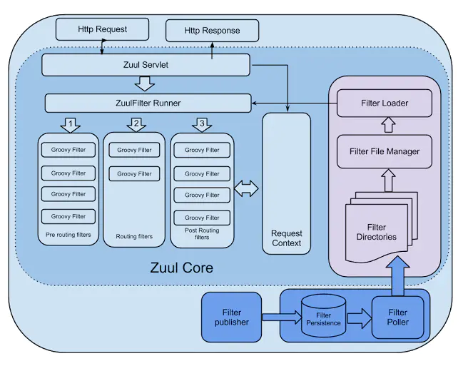

# Java 开发学习与总结
# 一、简要说明 

# 二、Java 开发组件
## [（1）Java基础知识](https://github.com/zhongkai1010/onework-document/blob/master/Java%20%E5%9F%BA%E7%A1%80%E7%9F%A5%E8%AF%86.md)
## [（2）Java开发环境](https://github.com/zhongkai1010/onework-document/blob/master/Java%20%E5%BC%80%E5%8F%91%E7%8E%AF%E5%A2%83%E6%90%AD%E5%BB%BA.md)
## [（3）Maven介绍与使用](https://github.com/zhongkai1010/onework-document/blob/master/Maven%E5%9F%BA%E7%A1%80%E7%9F%A5%E8%AF%86%E4%B8%8E%E4%BD%BF%E7%94%A8%E6%80%BB%E7%BB%93.md)
## [（4）MyBatis介绍与使用](https://github.com/zhongkai1010/onework-document/blob/master/MyBatis%20%E4%BB%8B%E7%BB%8D%E4%B8%8E%E6%80%BB%E7%BB%93.md)
## [（5）MyBaits Plus使用与代码生成器](https://github.com/zhongkai1010/onework-document/blob/master/mybaits%20plus%E7%9A%84%E4%BD%BF%E7%94%A8%E4%B8%8E%E4%BB%A3%E7%A0%81%E7%94%9F%E6%88%90%E5%99%A8%E6%89%A9%E5%B1%95.md)
## [（6）Spring Framework概要汇总](https://github.com/zhongkai1010/onework-document/blob/master/Spring%20Framework%20%E6%A6%82%E8%A6%81%E6%B1%87%E6%80%BB.md)
## [（7）Sping IOC](https://github.com/zhongkai1010/onework-document/blob/master/SpringFramework%E4%B9%8BIOC.md)
## [（8）Sping AOP](https://github.com/zhongkai1010/onework-document/blob/master/SpringFramework%E4%B9%8BAOP.md)
## [（9）Sping Mvc](https://github.com/zhongkai1010/onework-document/blob/master/Spring%20Boot%E4%B8%AD%E7%9A%84Web%E5%BA%94%E7%94%A8%E8%AF%B4%E6%98%8E%E5%92%8C%E4%BD%BF%E7%94%A8.md)
## [（10）Sping Boot](https://github.com/zhongkai1010/onework-document/blob/master/Spring%20Boot%20%E7%AE%80%E8%A6%81%E8%AF%B4%E6%98%8E%E4%B8%8E%E4%BD%BF%E7%94%A8%E6%80%BB%E7%BB%93.md)
## [（11）Sping Data](https://github.com/zhongkai1010/onework-document/blob/master/Spring%20Data%20%E7%AE%80%E8%A6%81%E8%AF%B4%E6%98%8E%E4%B8%8E%E4%BD%BF%E7%94%A8%E6%80%BB%E7%BB%93.md)
## [(12）Sping Security](https://github.com/zhongkai1010/onework-document/blob/master/Spring%20Security%20%E7%AE%80%E8%A6%81%E8%AF%B4%E6%98%8E%E4%B8%8E%E4%BD%BF%E7%94%A8%E6%80%BB%E7%BB%93.md)
# 三、Java 扩展知识
## [（1）IntelliJ IDEA 开发工具的使用](https://github.com/zhongkai1010/onework-document/blob/master/IntelliJ%20IDEA%20%E5%BC%80%E5%8F%91%E5%B7%A5%E5%85%B7%E7%9A%84%E4%BD%BF%E7%94%A8.md)
## [（2）Lombok 功能介绍](https://github.com/zhongkai1010/onework-document/blob/master/Lombok%20%E5%8A%9F%E8%83%BD%E4%BB%8B%E7%BB%8D.md)
# 四、Java 微服务体系
## （1）相关框架介绍
Spring Cloud

Spring Cloud Alibaba

## （2）服务注册与发现
**Eureka：**官方宣布2.x不再开源（闭源），之前的版本已经停止更新；也就说Eureka将来更多的技术提升已经没有了。所以，如果希望注册中心有更多强大功能的话，还需要另辟蹊径 。

**Zookeeper：**在企业级Zookeeper注册中心与 Dubbo组合比较多一些，kafka使用的也是，随着Eureka的停更，我们可以通过spring-cloud-starter-zookeeper-discovery这个启动器，将Zookeeper做为springcloud的注册中心。

**Consul：**go语言开发的，也是一个优秀的服务注册框架，使用量也比较多。

**Nacos：**来自于SpringCloudɵɹibaba，在企业中经过了百万级注册考验的，不但可以完美替换Eureka，还能做其他组件的替换，所以，Naocs也强烈建议使用。

## （3）分布式配置中心解决方案与应用
目前市面上用的比较多的配置中心有（时间顺序）

**Disconf**：2014年7月百度开源的配置管理中心，同样具备配置的管理能力，不过目前已经不维护了，最近的一次提交是4-5年前了。

**Spring Cloud Config**：2014年9月开源，Spring Cloud 生态组件，可以和Spring Cloud体系无缝整合。

**Apollo**：2016年5月，携程开源的配置管理中心，具备规范的权限、流程治理等特性。

**Nacos**：2018年6月，阿里开源的配置中心，也可以做DNS和RPC的服务发现

## （4）分布式服务调用
**Dubbo**：国内最早开源的 RPC 框架，由阿里巴巴公司开发并于 2011 年末对外开源，仅支持 Java 语言。

**Motan**：微博内部使用的 RPC 框架，于 2016 年对外开源，仅支持 Java 语言。

**Tars**：腾讯内部使用的 RPC 框架，于 2017 年对外开源，仅支持 C++ 语言。

**Spring Cloud**：国外 Pivotal 公司 2014 年对外开源的 RPC 框架，提供了丰富的生态组件。

**gRPC**：Google 于 2015 年对外开源的跨语言 RPC 框架，支持多种语言。

**Thrift**：最初是由 Facebook 开发的内部系统跨语言的 RPC 框架，2007 年贡献给了 Apache 基金，成为

**Apache**：开源项目之一，支持多种语言。

## （5）服务流量管理
**服务降级：**
**Hystrix**：官网不极力推荐，但是中国企业中还在大规模使用,对于限流和熔断降级虽然在1 .5版本官方还支持（版本稳定），
但现在官方已经开始推荐大家使用Resilience4j
**Resilience4J**：官网推荐使用，但是国内很少用这个。
**Sentienl**：来自于Spring Cloud Alibaba，在中国企业替换Hystrix的组件，国内强烈建议使用

## （6）分布式事务
# 五、常用中间件
## （1）Redis
Redis 是一个开源（BSD 许可）的内存**数据结构存储**，用作数据库、缓存和消息代理。Redis 提供数据结构，例如 [字符串](https://redis.io/topics/data-types-intro#strings)、[散列](https://redis.io/topics/data-types-intro#hashes)、[列表](https://redis.io/topics/data-types-intro#lists)、[集合](https://redis.io/topics/data-types-intro#sets)、带范围查询的[排序集合、](https://redis.io/topics/data-types-intro#sorted-sets)[位图](https://redis.io/topics/data-types-intro#bitmaps)、[超日志](https://redis.io/topics/data-types-intro#hyperloglogs)、[地理空间索引](https://redis.io/commands/geoadd)和[流](https://redis.io/topics/streams-intro)。Redis 内置了[复制](https://redis.io/topics/replication)、[Lua 脚本](https://redis.io/commands/eval)、[LRU 驱逐](https://redis.io/topics/lru-cache)、[事务](https://redis.io/topics/transactions)和不同级别的[磁盘持久性](https://redis.io/topics/persistence)，并通过以下方式提供高可用性[Redis Sentinel](https://redis.io/topics/sentinel)和[Redis Cluster](https://redis.io/topics/cluster-tutorial)的自动分区。

您可以 对这些类型运行**原子操作，例如**[附加到字符串](https://redis.io/commands/append)； [增加哈希值](https://redis.io/commands/hincrby)；[将元素推入列表](https://redis.io/commands/lpush)；[计算集交](https://redis.io/commands/sinter)[、](https://redis.io/commands/sunion)并 、[差](https://redis.io/commands/sdiff)；或[获取排序集中排名最高的成员](https://redis.io/commands/zrangebyscore)。

为了达到最佳性能，Redis 使用 **内存中的数据集**。根据您的用例，您可以通过定期[将数据集转储到磁盘](https://redis.io/topics/persistence#snapshotting) 或[将每个命令附加到基于磁盘的日志](https://redis.io/topics/persistence#append-only-file)来持久化数据。如果您只需要一个功能丰富的网络内存缓存，您也可以禁用持久性。

Redis 还支持[异步复制](https://redis.io/topics/replication)，具有非常快速的非阻塞首次同步、自动重新连接以及网络拆分上的部分重新同步。

其他功能包括：

* [交易](https://redis.io/topics/transactions)
* [发布/订阅](https://redis.io/topics/pubsub)
* [Lua 脚本](https://redis.io/commands/eval)
* [生命周期有限的密钥](https://redis.io/commands/expire)
* [LRU 驱逐密钥](https://redis.io/topics/lru-cache)
* [自动故障转移](https://redis.io/topics/sentinel)

[您可以从大多数编程语言](https://redis.io/clients)中使用 Redis 。

Redis 是用**ANSI C**编写的，可以在大多数 POSIX 系统（如 Linux、\*BSD 和 OS X）中运行，无需外部依赖。Linux 和 OS X 是 Redis 开发和测试最多的两个操作系统，我们**推荐使用 Linux 进行部署**。Redis 可以在 SmartOS 等 Solaris 派生系统中工作，但支持是\_尽最大努力\_。Windows 版本没有官方支持。
## （2）Kafka
[https://juejin.cn/post/6844903495670169607](https://juejin.cn/post/6844903495670169607) （真的，Kafka 入门一篇文章就够了）

Kafka 的特性（设计原则）

* `高吞吐、低延迟`：kakfa 最大的特点就是收发消息非常快，kafka 每秒可以处理几十万条消息，它的最低延迟只有几毫秒。
* `高伸缩性`： 每个主题(topic) 包含多个分区(partition)，主题中的分区可以分布在不同的主机(broker)中。
* `持久性、可靠性`： Kafka 能够允许数据的持久化存储，消息被持久化到磁盘，并支持数据备份防止数据丢失，Kafka 底层的数据存储是基于 Zookeeper 存储的，Zookeeper 我们知道它的数据能够持久存储。
* `容错性`： 允许集群中的节点失败，某个节点宕机，Kafka 集群能够正常工作
* `高并发`： 支持数千个客户端同时读写

Kafka 的使用场景

* 活动跟踪：Kafka 可以用来跟踪用户行为，比如我们经常回去淘宝购物，你打开淘宝的那一刻，你的登陆信息，登陆次数都会作为消息传输到 Kafka ，当你浏览购物的时候，你的浏览信息，你的搜索指数，你的购物爱好都会作为一个个消息传递给 Kafka ，这样就可以生成报告，可以做智能推荐，购买喜好等。
* 传递消息：Kafka 另外一个基本用途是传递消息，应用程序向用户发送通知就是通过传递消息来实现的，这些应用组件可以生成消息，而不需要关心消息的格式，也不需要关心消息是如何发送的。
* 度量指标：Kafka也经常用来记录运营监控数据。包括收集各种分布式应用的数据，生产各种操作的集中反馈，比如报警和报告。
* 日志记录：Kafka 的基本概念来源于提交日志，比如我们可以把数据库的更新发送到 Kafka 上，用来记录数据库的更新时间，通过kafka以统一接口服务的方式开放给各种consumer，例如hadoop、Hbase、Solr等。
* 流式处理：流式处理是有一个能够提供多种应用程序的领域。
* 限流削峰：Kafka 多用于互联网领域某一时刻请求特别多的情况下，可以把请求写入Kafka 中，避免直接请求后端程序导致服务崩溃。

## （3）Dubbo
Apache Dubbo 是一款微服务开发框架，它提供了 RPC通信 与 微服务治理 两大关键能力。这意味着，使用 Dubbo 开发的微服务，将具备相互之间的远程发现与通信能力， 同时利用 Dubbo 提供的丰富服务治理能力，可以实现诸如服务发现、负载均衡、流量调度等服务治理诉求。同时 Dubbo 是高度可扩展的，用户几乎可以在任意功能点去定制自己的实现，以改变框架的默认行为来满足自己的业务需求。

Dubbo3 基于 Dubbo2 演进而来，在保持原有核心功能特性的同时， Dubbo3 在易用性、超大规模微服务实践、云原生基础设施适配、安全设计等几大方向上进行了全面升级。 以下文档都将基于 Dubbo3 展开。

[服务发现](https://dubbo.apache.org/zh/docs/concepts/service-discovery/)

服务发现

[RPC 通信协议](https://dubbo.apache.org/zh/docs/concepts/rpc-protocol/)

描述 Dubbo3 支持的通信协议

[服务流量管理](https://dubbo.apache.org/zh/docs/concepts/traffic-management/)

通过 Dubbo 定义的路由规则，实现对流量分布的控制

[配置管理](https://dubbo.apache.org/zh/docs/concepts/configuration/)

描述 Dubbo 支持的配置，Dubbo 的动态配置能力。

[部署架构（注册中心 配置中心 元数据中心）](https://dubbo.apache.org/zh/docs/concepts/registry-configcenter-metadata/)

了解 Dubbo 的三大中心化组件，它们各自的职责、工作方式。

[如何扩展 Dubbo](https://dubbo.apache.org/zh/docs/concepts/extensibility/)

Dubbo 通过 SPI 机制提供了非常灵活的可扩展性

## （4）Zookeeper
顾名思义 zookeeper 就是动物园管理员，他是用来管 hadoop（大象）、Hive(蜜蜂)、pig(小 猪)的管理员， Apache Hbase 和 Apache Solr 的分布式集群都用到了 zookeeper；Zookeeper: 是一个分布式的、开源的程序协调服务，是 hadoop 项目下的一个子项目。他提供的主要功 能包括：配置管理、名字服务、分布式锁、集群管理。

配置管理

在我们的应用中除了代码外，还有一些就是各种配置。比如数据库连接等。一般我们都 是使用配置文件的方式，在代码中引入这些配置文件。当我们只有一种配置，只有一台服务 器，并且不经常修改的时候，使用配置文件是一个很好的做法，但是如果我们配置非常多， 有很多服务器都需要这个配置，这时使用配置文件就不是个好主意了。这个时候往往需要寻 找一种集中管理配置的方法，我们在这个集中的地方修改了配置，所有对这个配置感兴趣的 都可以获得变更。Zookeeper 就是这种服务，它使用 Zab 这种一致性协议来提供一致性。现 在有很多开源项目使用 Zookeeper 来维护配置，比如在 HBase 中，客户端就是连接一个 Zookeeper，获得必要的 HBase 集群的配置信息，然后才可以进一步操作。还有在开源的消 息队列 Kafka 中，也使用 Zookeeper来维护broker的信息。在 Alibaba开源的 SOA 框架Dubbo 中也广泛的使用 Zookeeper 管理一些配置来实现服务治理。

名字服务

名字服务这个就很好理解了。比如为了通过网络访问一个系统，我们得知道对方的 IP 地址，但是 IP 地址对人非常不友好，这个时候我们就需要使用域名来访问。但是计算机是 不能是域名的。怎么办呢？如果我们每台机器里都备有一份域名到 IP 地址的映射，这个倒 是能解决一部分问题，但是如果域名对应的 IP 发生变化了又该怎么办呢？于是我们有了 DNS 这个东西。我们只需要访问一个大家熟知的(known)的点，它就会告诉你这个域名对应 的 IP 是什么。在我们的应用中也会存在很多这类问题，特别是在我们的服务特别多的时候， 如果我们在本地保存服务的地址的时候将非常不方便，但是如果我们只需要访问一个大家都 熟知的访问点，这里提供统一的入口，那么维护起来将方便得多了。

分布式锁

其实在第一篇文章中已经介绍了 Zookeeper 是一个分布式协调服务。这样我们就可以利 用 Zookeeper 来协调多个分布式进程之间的活动。比如在一个分布式环境中，为了提高可靠 性，我们的集群的每台服务器上都部署着同样的服务。但是，一件事情如果集群中的每个服 务器都进行的话，那相互之间就要协调，编程起来将非常复杂。而如果我们只让一个服务进 行操作，那又存在单点。通常还有一种做法就是使用分布式锁，在某个时刻只让一个服务去

干活，当这台服务出问题的时候锁释放，立即 fail over 到另外的服务。这在很多分布式系统 中都是这么做，这种设计有一个更好听的名字叫 Leader Election(leader 选举)。比如 HBase 的 Master 就是采用这种机制。但要注意的是分布式锁跟同一个进程的锁还是有区别的，所 以使用的时候要比同一个进程里的锁更谨慎的使用。

集群管理

在分布式的集群中，经常会由于各种原因，比如硬件故障，软件故障，网络问题，有些 节点会进进出出。有新的节点加入进来，也有老的节点退出集群。这个时候，集群中其他机 器需要感知到这种变化，然后根据这种变化做出对应的决策。比如我们是一个分布式存储系 统，有一个中央控制节点负责存储的分配，当有新的存储进来的时候我们要根据现在集群目 前的状态来分配存储节点。这个时候我们就需要动态感知到集群目前的状态。还有，比如一 个分布式的 SOA 架构中，服务是一个集群提供的，当消费者访问某个服务时，就需要采用 某种机制发现现在有哪些节点可以提供该服务(这也称之为服务发现，比如 Alibaba 开源的 SOA 框架 Dubbo 就采用了 Zookeeper 作为服务发现的底层机制)。还有开源的 Kafka 队列就 采用了 Zookeeper 作为 Cosnumer 的上下线管理。

## （5）nacos
Nacos 致力于帮助您发现、配置和管理微服务。Nacos 提供了一组简单易用的特性集，帮助您快速实现动态服务发现、服务配置、服务元数据及流量管理。

Nacos 帮助您更敏捷和容易地构建、交付和管理微服务平台。 Nacos 是构建以“服务”为中心的现代应用架构 (例如微服务范式、云原生范式) 的服务基础设施。

Nacos 的关键特性包括:

* **服务发现和服务健康监测**

Nacos 支持基于 DNS 和基于 RPC 的服务发现。服务提供者使用 [原生SDK](https://nacos.io/zh-cn/docs/sdk.html)、[OpenAPI](https://nacos.io/zh-cn/docs/open-api.html)、或一个[独立的Agent TODO](https://nacos.io/zh-cn/docs/other-language.html)注册 Service 后，服务消费者可以使用[DNS TODO](https://nacos.io/zh-cn/docs/xx) 或[HTTP&API](https://nacos.io/zh-cn/docs/open-api.html)查找和发现服务。

Nacos 提供对服务的实时的健康检查，阻止向不健康的主机或服务实例发送请求。Nacos 支持传输层 (PING 或 TCP)和应用层 (如 HTTP、MySQL、用户自定义）的健康检查。 对于复杂的云环境和网络拓扑环境中（如 VPC、边缘网络等）服务的健康检查，Nacos 提供了 agent 上报模式和服务端主动检测2种健康检查模式。Nacos 还提供了统一的健康检查仪表盘，帮助您根据健康状态管理服务的可用性及流量。

* **动态配置服务**

动态配置服务可以让您以中心化、外部化和动态化的方式管理所有环境的应用配置和服务配置。

动态配置消除了配置变更时重新部署应用和服务的需要，让配置管理变得更加高效和敏捷。

配置中心化管理让实现无状态服务变得更简单，让服务按需弹性扩展变得更容易。

Nacos 提供了一个简洁易用的UI ([控制台样例 Demo](http://console.nacos.io/nacos/index.html)) 帮助您管理所有的服务和应用的配置。Nacos 还提供包括配置版本跟踪、金丝雀发布、一键回滚配置以及客户端配置更新状态跟踪在内的一系列开箱即用的配置管理特性，帮助您更安全地在生产环境中管理配置变更和降低配置变更带来的风险。

* **动态 DNS 服务**

动态 DNS 服务支持权重路由，让您更容易地实现中间层负载均衡、更灵活的路由策略、流量控制以及数据中心内网的简单DNS解析服务。动态DNS服务还能让您更容易地实现以 DNS 协议为基础的服务发现，以帮助您消除耦合到厂商私有服务发现 API 上的风险。

Nacos 提供了一些简单的 [DNS APIs TODO](https://nacos.io/zh-cn/docs/xx) 帮助您管理服务的关联域名和可用的 IP:PORT 列表.

* **服务及其元数据管理**

Nacos 能让您从微服务平台建设的视角管理数据中心的所有服务及元数据，包括管理服务的描述、生命周期、服务的静态依赖分析、服务的健康状态、服务的流量管理、路由及安全策略、服务的 SLA 以及最首要的 metrics 统计数据。

## （6）Zuul
Zuul能干什么?

zuul主要实现的功能就是API Gateway(api网关)的功能

作用：

1.易于监控。可在微服务网关收集监控数据并将其推送到外部系统进行分析。使用网关时客户端只与网关交互，降低客户端的调用逻辑的复杂度，同时网关也可以实现认证逻辑简化内部服务的之间相互调用的复杂度。
2.对不同客户端的支持及数据的聚合，如一个网站有web端，手机端，页面所需的数据有同有异，可以将数据整合或者裁剪，减少客户端的请求次数，比如BFF架构。
3.可以更好的对项目的微服务封装，可将项目的微服务统一封装在一个内网环境中，减少了客户端与各个微服务之间的交互次数。只通过网关提供服务，同时网关也可以对安全，认证，监控，防御单独强化。
4.易于认证。可在微服务网关上进行认证。然后再将请求转发到后端的微服务，而无须在每个微服务中进行认证。

架构图

`zuul`是一个网关和负载均衡器,在通过`ribbon`或者`feign`实现了客户端负载均衡之后,`zuul`在服务端实现负载均衡。`zuul`支持用任何`JVM`语言来编写规则和过滤条件。

服务网关是微服务架构中不可或缺的部分。通过服务网关统一向外系统提供`REST API`的过程中，除了具备服务路由、均衡负载功能之外，它还具备了权限控制等功能。
`Spring Cloud Netflix`中的`Zuul`就担任了这样的一个角色，为微服务架构提供了前门保护的作用，同时将权限控制这些较重的非业务逻辑内容迁移到服务路由层面，使得服务集群主体能够具备更高的可复用性和可测试性。

# 六、Java容器化部署
## （1）Docker
## （2）K8S
# 七、Java 大数据
## （1）ElasticSearch
Elasticsearch 是一个分布式、高扩展、高实时的搜索与[数据分析](https://baike.baidu.com/item/%E6%95%B0%E6%8D%AE%E5%88%86%E6%9E%90/6577123)引擎。它能很方便的使大量数据具有搜索、分析和探索的能力。充分利用Elasticsearch的水平伸缩性，能使数据在生产环境变得更有价值。Elasticsearch 的实现原理主要分为以下几个步骤，首先用户将数据提交到Elasticsearch 数据库中，再通过分词控制器去将对应的语句分词，将其权重和分词结果一并存入数据，当用户搜索数据时候，再根据权重将结果排名，打分，再将返回结果呈现给用户。

Elasticsearch是与名为Logstash的数据收集和日志解析引擎以及名为Kibana的分析和可视化平台一起开发的。这三个产品被设计成一个集成解决方案，称为“Elastic Stack”（以前称为“ELK stack”）。

Elasticsearch可以用于搜索各种文档。它提供可扩展的搜索，具有接近实时的搜索，并支持多租户。Elasticsearch是分布式的，这意味着索引可以被分成分片，每个分片可以有0个或多个副本。每个节点托管一个或多个分片，并充当协调器将操作委托给正确的分片。再平衡和路由是自动完成的。相关数据通常存储在同一个索引中，该索引由一个或多个主分片和零个或多个复制分片组成。一旦创建了索引，就不能更改主分片的数量。

Elasticsearch使用Lucene，并试图通过JSON和Java API提供其所有特性。它支持facetting和percolating，如果新文档与注册查询匹配，这对于通知非常有用。另一个特性称为“网关”，处理索引的长期持久性；例如，在服务器崩溃的情况下，可以从网关恢复索引。Elasticsearch支持实时GET请求，适合作为NoSQL数据存储，但缺少[分布式](https://baike.baidu.com/item/%E5%88%86%E5%B8%83%E5%BC%8F/7316617)事务。

## （2）Logstash
Logstash是一个开源数据收集引擎，具有实时管道功能。Logstash可以动态地将来自不同数据源的数据统一起来，并将数据标准化到你所选择的目的地。

## （3）Kibana
Kibana 是为 Elasticsearch设计的开源分析和可视化平台。你可以使用 Kibana 来搜索，查看存储在 Elasticsearch 索引中的数据并与之交互。你可以很容易实现高级的数据分析和可视化，以图表的形式展现出来。
使用前我们肯定需要先有Elasticsearch啦，安装使用Elasticsearch可以参考[Elasticsearch构建全文搜索系统](https://www.cnblogs.com/chenqionghe/p/12496827.html)

下面分别演示一下Kibana的安装、自定义索引，搜索，控制台调用es的api和可视化等操作，特别需要注意的是，控制台可以非常方便的来调用es的api，强烈推荐使用

## （3）Hadoop
Apache Hadoop软件库是一个框架，该框架允许使用简单的编程模型跨计算机集群对大型数据集进行分布式处理。它旨在从单个服务器扩展到数千台机器，每台机器都提供本地计算和存储。库本身不用于依靠硬件来提供高可用性，而是被设计用来检测和处理应用程序层的故障，因此可以在计算机集群的顶部提供高可用性服务，每台计算机都容易出现故障。

该项目包括以下模块：

* Hadoop Common：支持其他Hadoop模块的通用实用程序。
* Hadoop分布式文件系统（HDFS™）：一种分布式文件系统，可提供对应用程序数据的高吞吐量访问。
* Hadoop YARN：用于作业调度和群集资源管理的框架。
* Hadoop MapReduce：基于YARN的系统，用于并行处理大数据集。
* \*\*[Hadoop Ozone](https://hadoop.apache.org/ozone/)\*\*： \*\*[Hadoop](https://hadoop.apache.org/ozone/)\*\*的对象存储。

## （4）Spark
Apache Spark 是一个快速的，通用的集群计算系统。它对 Java，Scala，Python 和 R 提供了的高层 API，并有一个经优化的支持通用执行图计算的引擎。它还支持一组丰富的高级工具，包括用于 SQL 和结构化数据处理的 [Spark SQL](http://spark.apachecn.org/#/sql-programming-guide.html)，用于机器学习的 [MLlib](http://spark.apachecn.org/#/ml-guide.html)，用于图计算的 [GraphX](http://spark.apachecn.org/#/graphx-programming-guide.html) 和 [Spark Streaming](http://spark.apachecn.org/#/streaming-programming-guide.html)。

## （5）Hbase
HBase是一个分布式的、面向列的开源数据库，该技术来源于 Fay Chang 所撰写的Google论文“Bigtable：一个结构化数据的[分布式存储系统](https://baike.baidu.com/item/%E5%88%86%E5%B8%83%E5%BC%8F%E5%AD%98%E5%82%A8%E7%B3%BB%E7%BB%9F/6608875)”。就像Bigtable利用了Google文件系统（File System）所提供的分布式数据存储一样，HBase在Hadoop之上提供了类似于Bigtable的能力。HBase是Apache的Hadoop项目的子项目。HBase不同于一般的关系数据库，它是一个适合于非结构化数据存储的数据库。另一个不同的是HBase基于列的而不是基于行的模式。

# 八、基础协议
## （1）TCP/IP
## （2）TLS/SSL
## （3）MQTT
