# Redis缓存
# 一、Redis基本介绍
参考资料：[https://www.redis.net.cn/](https://www.redis.net.cn/)

Redis是现在最受欢迎的NoSQL数据库之一，Redis是一个使用ANSI C编写的开源、包含多种数据结构、支持网络、基于内存、可选持久性的键值对存储数据库，其具备如下特性：

* 基于内存运行，性能高效
* 支持分布式，理论上可以无限扩展
* key-value存储系统
* 开源的使用ANSI C语言编写、遵守BSD协议、支持网络、可基于内存亦可持久化的日志型、Key-Value数据库，并提供多种语言的API

相比于其他数据库类型，Redis具备的特点是：

* C/S通讯模型
* 单进程单线程模型
* 丰富的数据类型
* 操作具有原子性
* 持久化
* 高并发读写
* 支持lua脚本
# 二、Redis数据结构
参考资料：[https://zhuanlan.zhihu.com/p/148562122](https://zhuanlan.zhihu.com/p/148562122)

在Redis中有一个**「核心的对象」**叫做`redisObject` ，是用来表示所有的key和value的，用redisObject结构体来表示`String、Hash、List、Set、ZSet`五种数据类型。

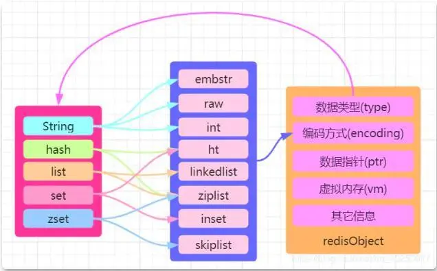

**Redis 支持的数据结构类型包括：**

|结构类型|结构存储的值|结构的读写能力|
| ----- | ----- | ----- |
|String|可以是字符串、整数或者浮点数|对整个字符串或者字符串的其中一部分执行操作；对象和浮点数执行自增(increment)或者自减(decrement)|
|List|一个链表，链表上的每个节点都包含了一个字符串|从链表的两端推入或者弹出元素；根据偏移量对链表进行修剪(trim)；读取单个或者多个元素；根据值来查找或者移除元素|
|Set|包含字符串的无序收集器(unorderedcollection)，并且被包含的每个字符串都是独一无二的、各不相同|添加、获取、移除单个元素；检查一个元素是否存在于某个集合中；计算交集、并集、差集；从集合里卖弄随机获取元素|
|Hash|包含键值对的无序散列表|添加、获取、移除单个键值对；获取所有键值对|
|Zset|字符串成员(member)与浮点数分值(score)之间的有序映射，元素的排列顺序由分值的大小决定|添加、获取、删除单个元素；根据分值范围(range)或者成员来获取元素|

# 三、Redis命令
参考地址：[https://www.redis.net.cn/order/](https://www.redis.net.cn/order/)

启动 redis 服务器，打开终端并输入命令 **redis-cli**，该命令会连接本地的 redis 服务

```bash
redis-cli
127.0.0.1:6379>
127.0.0.1:6379> ping
PONG
```
连接到本地的 redis 服务并执行 **PING** 命令，该命令用于检测 redis 服务是否启动。

如何连接到主机为 127.0.0.1，端口为 6379 ，密码为 mypass 的 redis 服务上

```bash
redis-cli -h 127.0.0.1 -p 6379 -a "mypass"
```
有时候会有中文乱码，要在 redis-cli 后面加上 --raw

```bash
redis-cli --raw
```
## （1）Redis 键(key)
Redis 键命令的基本语法如下：

```bash
redis 127.0.0.1:6379> COMMAND KEY_NAME
```
示例：

```bash
redis 127.0.0.1:6379> SET w3ckey redis
OK
redis 127.0.0.1:6379> DEL w3ckey
(integer) 1
```
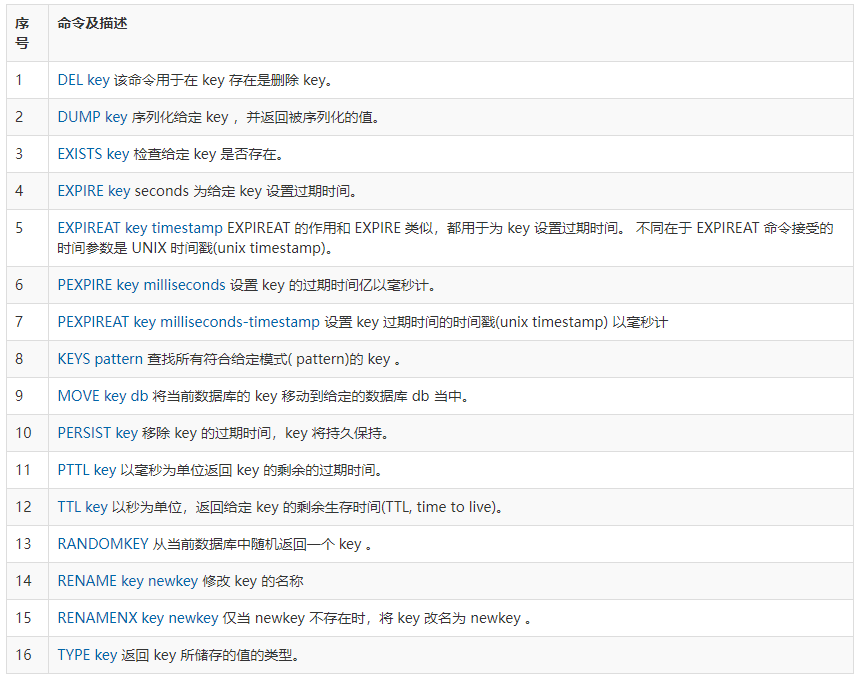
## （2）Redis 字符串(String)
```bash
redis 127.0.0.1:6379> SET w3ckey redis 
OK 
redis 127.0.0.1:6379> GET w3ckey 
"redis"
```
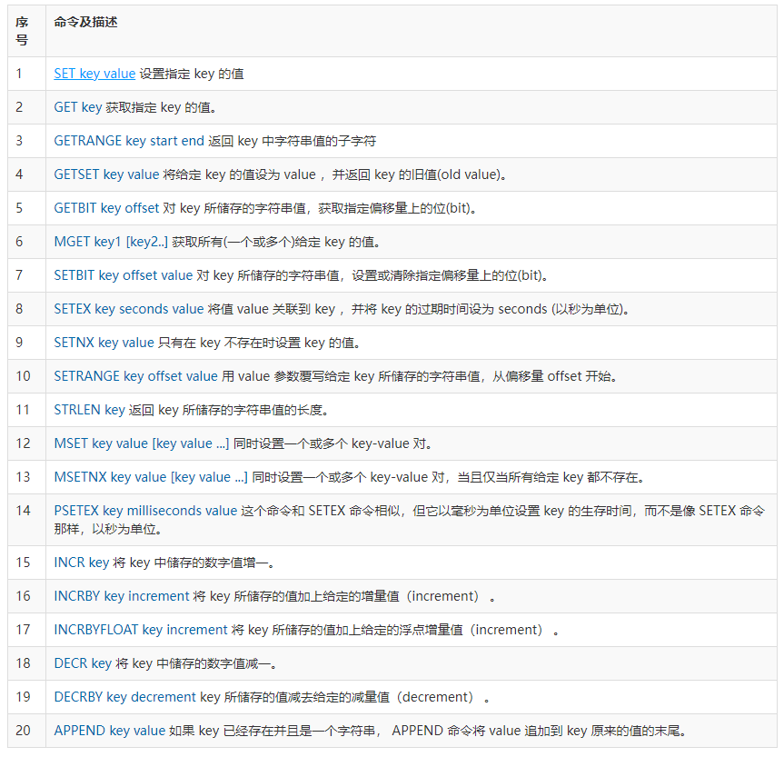
## （3）Redis 哈希(Hash)
```bash
redis 127.0.0.1:6379> HMSET w3ckey name "redis tutorial" description "redis basic commands for caching" likes 20 visitors 23000
OK
redis 127.0.0.1:6379> HGETALL w3ckey
 
1) "name"
2) "redis tutorial"
3) "description"
4) "redis basic commands for caching"
5) "likes"
6) "20"
7) "visitors"
8) "23000"
```

## （4）Redis 列表(List)
```bash
redis 127.0.0.1:6379> LPUSH w3ckey redis
(integer) 1
redis 127.0.0.1:6379> LPUSH w3ckey mongodb
(integer) 2
redis 127.0.0.1:6379> LPUSH w3ckey mysql
(integer) 3
redis 127.0.0.1:6379> LRANGE w3ckey 0 10
 
1) "mysql"
2) "mongodb"
3) "redis"
```
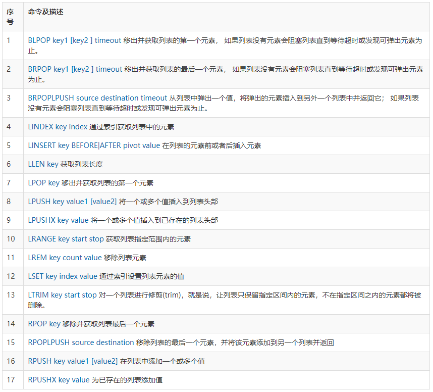
## （5）Redis 集合(Set)
```bash
redis 127.0.0.1:6379> SADD w3ckey redis
(integer) 1
redis 127.0.0.1:6379> SADD w3ckey mongodb
(integer) 1
redis 127.0.0.1:6379> SADD w3ckey mysql
(integer) 1
redis 127.0.0.1:6379> SADD w3ckey mysql
(integer) 0
redis 127.0.0.1:6379> SMEMBERS w3ckey
 
1) "mysql"
2) "mongodb"
3) "redis"
```
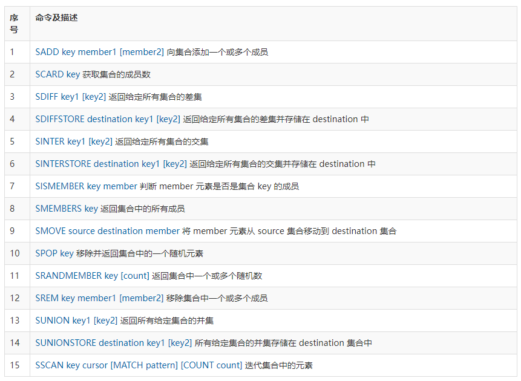
## （6）Redis 有序集合(sorted set)
```bash
redis 127.0.0.1:6379> ZADD w3ckey 1 redis
(integer) 1
redis 127.0.0.1:6379> ZADD w3ckey 2 mongodb
(integer) 1
redis 127.0.0.1:6379> ZADD w3ckey 3 mysql
(integer) 1
redis 127.0.0.1:6379> ZADD w3ckey 3 mysql
(integer) 0
redis 127.0.0.1:6379> ZADD w3ckey 4 mysql
(integer) 0
redis 127.0.0.1:6379> ZRANGE w3ckey 0 10 WITHSCORES
 
1) "redis"
2) "1"
3) "mongodb"
4) "2"
5) "mysql"
6) "4"
```
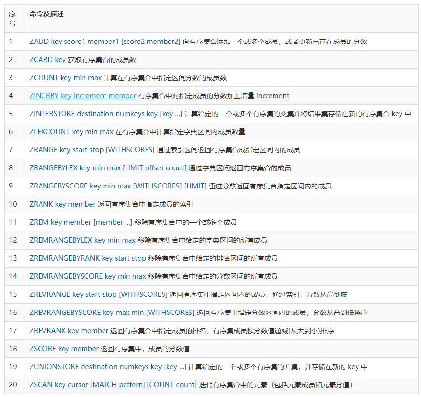
## （7）Redis 连接
```bash
redis 127.0.0.1:6379> AUTH "password"
OK
redis 127.0.0.1:6379> PING
PONG
```
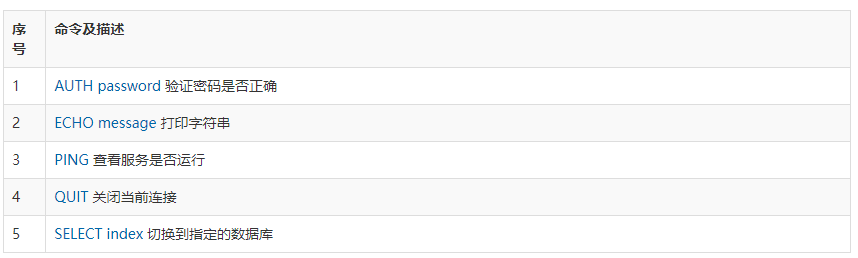
## （8）Redis 服务器
Redis 服务器命令主要是用于管理 redis 服务。

|序号|命令及描述|
| ----- | ----- |
|1|[BGREWRITEAOF](https://www.redis.net.cn/order/3654.html) 异步执行一个 AOF（AppendOnly File） 文件重写操作|
|2|[BGSAVE](https://www.redis.net.cn/order/3655.html) 在后台异步保存当前数据库的数据到磁盘|
|3|[CLIENT KILL \[ip:port\] \[ID client-id\]](https://www.redis.net.cn/order/3656.html) 关闭客户端连接|
|4|[CLIENT LIST](https://www.redis.net.cn/order/3657.html) 获取连接到服务器的客户端连接列表|
|5|[CLIENT GETNAME](https://www.redis.net.cn/order/3658.html) 获取连接的名称|
|6|[CLIENT PAUSE timeout](https://www.redis.net.cn/order/3659.html) 在指定时间内终止运行来自客户端的命令|
|7|[CLIENT SETNAME connection-name](https://www.redis.net.cn/order/3660.html) 设置当前连接的名称|
|8|[CLUSTER SLOTS](https://www.redis.net.cn/order/3661.html) 获取集群节点的映射数组|
|9|[COMMAND](https://www.redis.net.cn/order/3662.html) 获取 Redis 命令详情数组|
|10|[COMMAND COUNT](https://www.redis.net.cn/order/3663.html) 获取 Redis 命令总数|
|11|[COMMAND GETKEYS](https://www.redis.net.cn/order/3664.html) 获取给定命令的所有键|
|12|[TIME](https://www.redis.net.cn/order/3665.html) 返回当前服务器时间|
|13|[COMMAND INFO command-name \[command-name ...\]](https://www.redis.net.cn/order/3666.html) 获取指定 Redis 命令描述的数组|
|14|[CONFIG GET parameter](https://www.redis.net.cn/order/3667.html) 获取指定配置参数的值|
|15|[CONFIG REWRITE](https://www.redis.net.cn/order/3668.html) 对启动 Redis 服务器时所指定的 redis.conf 配置文件进行改写|
|16|[CONFIG SET parameter value](https://www.redis.net.cn/order/3669.html) 修改 redis 配置参数，无需重启|
|17|[CONFIG RESETSTAT](https://www.redis.net.cn/order/3670.html) 重置 INFO 命令中的某些统计数据|
|18|[DBSIZE](https://www.redis.net.cn/order/3671.html) 返回当前数据库的 key 的数量|
|19|[DEBUG OBJECT key](https://www.redis.net.cn/order/3672.html) 获取 key 的调试信息|
|20|[DEBUG SEGFAULT](https://www.redis.net.cn/order/3673.html) 让 Redis 服务崩溃|
|21|[FLUSHALL](https://www.redis.net.cn/order/3674.html) 删除所有数据库的所有key|
|22|[FLUSHDB](https://www.redis.net.cn/order/3675.html) 删除当前数据库的所有key|
|23|[INFO \[section\]](https://www.redis.net.cn/order/3676.html) 获取 Redis 服务器的各种信息和统计数值|
|24|[LASTSAVE](https://www.redis.net.cn/order/3677.html) 返回最近一次 Redis 成功将数据保存到磁盘上的时间，以 UNIX 时间戳格式表示|
|25|[MONITOR](https://www.redis.net.cn/order/3678.html) 实时打印出 Redis 服务器接收到的命令，调试用|
|26|[ROLE](https://www.redis.net.cn/order/3679.html) 返回主从实例所属的角色|
|27|[SAVE](https://www.redis.net.cn/order/3680.html) 异步保存数据到硬盘|
|28|[SHUTDOWN \[NOSAVE\] \[SAVE\]](https://www.redis.net.cn/order/3681.html) 异步保存数据到硬盘，并关闭服务器|
|29|[SLAVEOF host port](https://www.redis.net.cn/order/3682.html) 将当前服务器转变为指定服务器的从属服务器(slave server)|
|30|[SLOWLOG subcommand \[argument\]](https://www.redis.net.cn/order/3683.html) 管理 redis 的慢日志|
|31|[SYNC](https://www.redis.net.cn/order/3684.html) 用于复制功能(replication)的内部命令|
## （9）Redis 事务
Redis 事务可以一次执行多个命令， 并且带有以下两个重要的保证：

* 事务是一个单独的隔离操作：事务中的所有命令都会序列化、按顺序地执行。事务在执行的过程中，不会被其他客户端发送来的命令请求所打断。
* 事务是一个原子操作：事务中的命令要么全部被执行，要么全部都不执行。

一个事务从开始到执行会经历以下三个阶段：

* 开始事务。
* 命令入队。
* 执行事务。

```bash
redis 127.0.0.1:6379> MULTI
OK
 
redis 127.0.0.1:6379> SET book-name "Mastering C++ in 21 days"
QUEUED
 
redis 127.0.0.1:6379> GET book-name
QUEUED
 
redis 127.0.0.1:6379> SADD tag "C++" "Programming" "Mastering Series"
QUEUED
 
redis 127.0.0.1:6379> SMEMBERS tag
QUEUED
 
redis 127.0.0.1:6379> EXEC
1) OK
2) "Mastering C++ in 21 days"
3) (integer) 3
4) 1) "Mastering Series"
   2) "C++"
   3) "Programming"
```
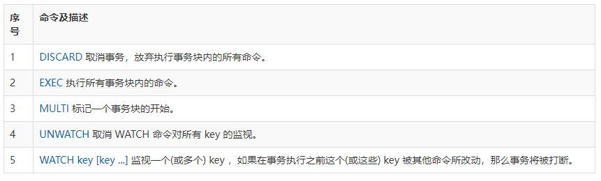
# 四、Redis配置（Configuration）
Redis 的配置文件位于 Redis 安装目录下，文件名为 redis.conf。

|配置|说明|
| ----- | ----- |
|daemonize no|Redis默认不是以守护进程的方式运行，可以通过该配置项修改，使用yes启用守护进程|
| pidfile /var/run/redis.pid|当Redis以守护进程方式运行时，Redis默认会把pid写入/var/run/redis.pid文件，可以通过pidfile指定|
| port 6379|指定Redis监听端口，默认端口为6379|
|bind 127.0.0.1|绑定的主机地址|
|timeout 300|当客户端闲置多长时间后关闭连接，如果指定为0，表示关闭该功能|
| loglevel verbose|指定日志记录级别，Redis总共支持四个级别：debug、verbose、notice、warning，默认为verbose|
|logfile stdout|日志记录方式，默认为标准输出，如果配置Redis为守护进程方式运行，而这里又配置为日志记录方式为标准输出，则日志将会发送给/dev/null|
|databases 16|设置数据库的数量，默认数据库为0，可以使用SELECT `<dbid>`命令在连接上指定数据库id|
|save `<seconds>` `<changes>`|指定在多长时间内，有多少次更新操作，就将数据同步到数据文件，可以多个条件配合<br>Redis默认配置文件中提供了三个条件：<br>**save 900 1**<br>**save 300 10**<br>**save 60 10000**<br>分别表示900秒（15分钟）内有1个更改，300秒（5分钟）内有10个更改以及60秒内有10000个更改。|
|rdbcompression yes|指定存储至本地数据库时是否压缩数据，默认为yes，Redis采用LZF压缩，如果为了节省CPU时间，可以关闭该选项，但会导致数据库文件变的巨大|
|dbfilename dump.rdb|指定本地数据库文件名，默认值为dump.rdb|
|dir ./|指定本地数据库存放目录|
|slaveof `<masterip>` `<masterport>`|设置当本机为slav服务时，设置master服务的IP地址及端口，在Redis启动时，它会自动从master进行数据同步|
|masterauth `<master-password>`|当master服务设置了密码保护时，slav服务连接master的密码|
| requirepass foobared|设置Redis连接密码，如果配置了连接密码，客户端在连接Redis时需要通过AUTH `<password>`命令提供密码，默认关闭|
|maxclients 128|设置同一时间最大客户端连接数，默认无限制，Redis可以同时打开的客户端连接数为Redis进程可以打开的最大文件描述符数，如果设置 maxclients 0，表示不作限制。当客户端连接数到达限制时，Redis会关闭新的连接并向客户端返回max number of clients reached错误信息|
|maxmemory `<bytes>`|指定Redis最大内存限制，Redis在启动时会把数据加载到内存中，达到最大内存后，Redis会先尝试清除已到期或即将到期的Key，当此方法处理 后，仍然到达最大内存设置，将无法再进行写入操作，但仍然可以进行读取操作。Redis新的vm机制，会把Key存放内存，Value会存放在swap区|
|appendonly no|指定是否在每次更新操作后进行日志记录，Redis在默认情况下是异步的把数据写入磁盘，如果不开启，可能会在断电时导致一段时间内的数据丢失。因为 redis本身同步数据文件是按上面save条件来同步的，所以有的数据会在一段时间内只存在于内存中。默认为no|
|appendfilename appendonly.aof|指定更新日志文件名，默认为appendonly.aof|
|appendfsync everysec|指定更新日志条件，共有3个可选值：     <br>**no**：表示等操作系统进行数据缓存同步到磁盘（快）    <br>**always**：表示每次更新操作后手动调用fsync()将数据写到磁盘（慢，安全）     <br>**everysec**：表示每秒同步一次（折衷，默认值）|
|vm-enabled no|指定是否启用虚拟内存机制，默认值为no，简单的介绍一下，VM机制将数据分页存放，由Redis将访问量较少的页即冷数据swap到磁盘上，访问多的页面由磁盘自动换出到内存中（在后面的文章我会仔细分析Redis的VM机制）|
|vm-swap-file /tmp/redis.swap|虚拟内存文件路径，默认值为/tmp/redis.swap，不可多个Redis实例共享|
|vm-max-memory 0|将所有大于vm-max-memory的数据存入虚拟内存,无论vm-max-memory设置多小,所有索引数据都是内存存储的(Redis的索引数据 就是keys),也就是说,当vm-max-memory设置为0的时候,其实是所有value都存在于磁盘。默认值为0|
|vm-page-size 32|Redis swap文件分成了很多的page，一个对象可以保存在多个page上面，但一个page上不能被多个对象共享，vm-page-size是要根据存储的 数据大小来设定的，作者建议如果存储很多小对象，page大小最好设置为32或者64bytes；如果存储很大大对象，则可以使用更大的page，如果不 确定，就使用默认值|
|vm-pages 134217728|设置swap文件中的page数量，由于页表（一种表示页面空闲或使用的bitmap）是在放在内存中的，，在磁盘上每8个pages将消耗1byte的内存。|
|vm-max-threads 4|设置访问swap文件的线程数,最好不要超过机器的核数,如果设置为0,那么所有对swap文件的操作都是串行的，可能会造成比较长时间的延迟。默认值为4|
|glueoutputbuf yes|设置在向客户端应答时，是否把较小的包合并为一个包发送，默认为开启|
| hash-max-zipmap-entries 64<br>hash-max-zipmap-value 512|指定在超过一定的数量或者最大的元素超过某一临界值时，采用一种特殊的哈希算法|
|activerehashing yes|指定是否激活重置哈希，默认为开启|
|include /path/to/local.conf|指定包含其它的配置文件，可以在同一主机上多个Redis实例之间使用同一份配置文件，而同时各个实例又拥有自己的特定配置文件|

# 五、Redis 发布/订阅（Pub/Sub）
Redis 发布订阅(pub/sub)是一种消息通信模式：发送者(pub)发送消息，订阅者(sub)接收消息。

Redis 客户端可以订阅任意数量的频道。

下图展示了频道 channel1 ， 以及订阅这个频道的三个客户端 —— client2 、 client5 和 client1 之间的关系：


当有新消息通过 PUBLISH 命令发送给频道 channel1 时， 这个消息就会被发送给订阅它的三个客户端：


## （1）示例
以下实例演示了发布订阅是如何工作的。在我们实例中我们创建了订阅频道名为 **redisChat**:

```bash
redis 127.0.0.1:6379> SUBSCRIBE redisChat
 
Reading messages... (press Ctrl-C to quit)
1) "subscribe"
2) "redisChat"
3) (integer) 1
```
现在，我们先重新开启个 redis 客户端，然后在同一个频道 redisChat 发布两次消息，订阅者就能接收到消息。

```bash
redis 127.0.0.1:6379> PUBLISH redisChat "Redis is a great caching technique"
 
(integer) 1
 
redis 127.0.0.1:6379> PUBLISH redisChat "Learn redis by w3cschool.cc"
 
(integer) 1
 
# 订阅者的客户端会显示如下消息
1) "message"
2) "redisChat"
3) "Redis is a great caching technique"
1) "message"
2) "redisChat"
3) "Learn redis by w3cschool.cc"
```
## （2）Redis 发布订阅命令
下表列出了 redis 发布订阅常用命令：

|序号|命令及描述|
| ----- | ----- |
|1|[PSUBSCRIBE pattern \[pattern ...\]](https://www.redis.net.cn/order/3632.html) 订阅一个或多个符合给定模式的频道。|
|2|[PUBSUB subcommand \[argument \[argument ...\]\]](https://www.redis.net.cn/order/3633.html) 查看订阅与发布系统状态。|
|3|[PUBLISH channel message](https://www.redis.net.cn/order/3634.html) 将信息发送到指定的频道。|
|4|[PUNSUBSCRIBE \[pattern \[pattern ...\]\]](https://www.redis.net.cn/order/3635.html) 退订所有给定模式的频道。|
|5|[SUBSCRIBE channel \[channel ...\]](https://www.redis.net.cn/order/3636.html) 订阅给定的一个或多个频道的信息。|
|6|[UNSUBSCRIBE \[channel \[channel ...\]\]](https://www.redis.net.cn/order/3637.html) 指退订给定的频道。|

# 六、Redis 复制（Replication）
参考文档：[https://www.cnblogs.com/kismetv/p/9236731.html](https://www.cnblogs.com/kismetv/p/9236731.html)

主从复制，是指将一台Redis服务器的数据，复制到其他的Redis服务器。前者称为主节点(master)，后者称为从节点(slave)；

数据的复制是单向的，只能由主节点到从节点。

默认情况下，每台Redis服务器都是主节点，且一个主节点可以有多个从节点(或没有从节点)，但一个从节点只能有一个主节点。

目前很多中小企业都没有使用到 Redis 的集群，但是至少都做了主从。有了主从，当 master 挂掉的时候，运维让从库过来接管，服务就可以继续，否则 master 需要经过数据恢复和重启的过程，这就可能会拖很长的时间，影响线上业务的持续服务。

Redis主从复制服务器架构图如下：

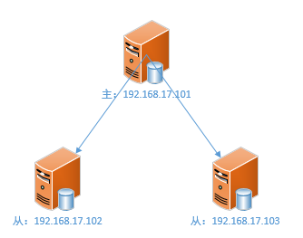

主从复制的作用主要包括：

* **数据冗余**：主从复制实现了数据的热备份，是持久化之外的一种数据冗余方式。
* **故障恢复**：当主节点出现问题时，可以由从节点提供服务，实现快速的故障恢复；实际上是一种服务的冗余。
* **负载均衡**：在主从复制的基础上，配合读写分离，可以由主节点提供写服务，由从节点提供读服务（即写Redis数据时应用连接主节点，读Redis数据时应用连接从节点），分担服务器负载；尤其是在写少读多的场景下，通过多个从节点分担读负载，可以大大提高Redis服务器的并发量。
* **高可用基石**：主从复制还是哨兵和集群能够实施的基础，因此说主从复制是Redis高可用的基础。

## （1）建立复制
需要注意，**主从复制的开启，完全是在从节点发起的；不需要我们在主节点做任何事情。**

从节点开启主从复制，有3种方式：

（1）配置文件

在从服务器的配置文件中加入：slaveof  

（2）启动命令

redis-server启动命令后加入 --slaveof  

（3）客户端命令

Redis服务器启动后，直接通过客户端执行命令：slaveof  ，则该Redis实例成为从节点。

上述3种方式是等效的，下面以客户端命令的方式为例，看一下当执行了slaveof后，Redis主节点和从节点的变化。

## （2）实例
**准备工作：启动两个节点**

方便起见，实验所使用的主从节点是在一台机器上的不同Redis实例，其中主节点监听6379端口，从节点监听6380端口；从节点监听的端口号可以在配置文件中修改：

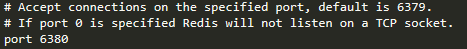

启动后可以看到：

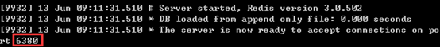

两个Redis节点启动后（分别称为6379节点和6380节点），默认都是主节点。

**建立复制**

此时在6380节点执行slaveof命令，使之变为从节点：

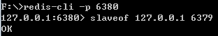

**观察效果**

下面验证一下，在主从复制建立后，主节点的数据会复制到从节点中。

（1）首先在从节点查询一个不存在的key：

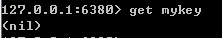

（2）然后在主节点中增加这个key：

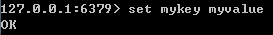

（3）此时在从节点中再次查询这个key，会发现主节点的操作已经同步至从节点：

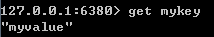

（4）然后在主节点删除这个key：

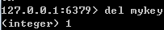

（5）此时在从节点中再次查询这个key，会发现主节点的操作已经同步至从节点：

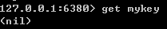

## （3）断开复制
通过slaveof  命令建立主从复制关系以后，可以通过slaveof no one断开。需要注意的是，从节点断开复制后，不会删除已有的数据，只是不再接受主节点新的数据变化。

从节点执行slaveof no one后，打印日志如下所示；可以看出断开复制后，从节点又变回为主节点。

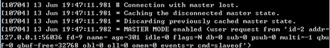

主节点打印日志如下：


# 七、Redis 持久化（Persistence）
redis 提供了两种持久化的方式，分别是**RDB**（Redis DataBase）和**AOF**（Append Only File）。

RDB，简而言之，就是在不同的时间点，将 redis 存储的数据生成快照并存储到磁盘等介质上；

## （1）RDB 持久化
执行 rdb 持久化时, Redis 会fork出一个子进程, 子进程将内存中数据写入到一个紧凑的文件中, 因此它保存的是某个时间点的完整数据。

如有需要，可以保存最近24小时的每小时备份文件，以及每个月每天的备份文件，便于遇到问题时恢复。

Redis 启动时会从 rdb 文件中恢复数据到内存， 因此恢复数据时只需将redis关闭后，将备份的rdb文件替换当前的rdb文件，再启动Redis即可。

**优点**

* rdb文件体积比较小， 适合备份及传输
* 性能会比 aof 好（aof 需要写入日志到文件中）
* rdb 恢复比 aof 要更快

**缺点**

* 服务器故障时会丢失最后一次备份之后的数据
* Redis 保存rdb时， fork子进程的这个操作期间, Redis服务会停止响应(一般是毫秒级)，但如果数据量大且cpu时间紧张，则停止响应的时间可能长达1秒

**相关配置参数**

```bash
################################ SNAPSHOTTING  ################################
# 快照配置
# 注释掉“save”这一行配置项就可以让保存数据库功能失效
# 设置sedis进行数据库镜像的频率。
# 900秒（15分钟）内至少1个key值改变（则进行数据库保存--持久化） 
# 300秒（5分钟）内至少10个key值改变（则进行数据库保存--持久化） 
# 60秒（1分钟）内至少10000个key值改变（则进行数据库保存--持久化）
save 900 1
save 300 10
save 60 10000

#当RDB持久化出现错误后，是否依然进行继续进行工作，yes：不能进行工作，no：可以继续进行工作，可以通过info中的rdb_last_bgsave_status了解RDB持久化是否有错误
stop-writes-on-bgsave-error yes

#使用压缩rdb文件，rdb文件压缩使用LZF压缩算法，yes：压缩，但是需要一些cpu的消耗。no：不压缩，需要更多的磁盘空间
rdbcompression yes

#是否校验rdb文件。从rdb格式的第五个版本开始，在rdb文件的末尾会带上CRC64的校验和。这跟有利于文件的容错性，但是在保存rdb文件的时候，会有大概10%的性能损耗，所以如果你追求高性能，可以关闭该配置。
rdbchecksum yes

#rdb文件的名称
dbfilename dump.rdb

#数据目录，数据库的写入会在这个目录。rdb、aof文件也会写在这个目录
dir /var/lib/redis
```
## （2）AOF 持久化
AOF 其实就是将客户端每一次操作记录追加到指定的aof（日志）文件中，在aof文件体积多大时可以自动在后台重写aof文件（期间不影响正常服务，中途磁盘写满或停机等导致失败也不会丢失数据）

aof 持久化的fsync策略支持：

* 不执行 fsync：由操作系统保证数据同步到磁盘(linux 默认30秒)， 速度最快
* 每秒1次：最多丢失最近1s的数据（推荐）
* 每条命令：绝对保证数据持久化（影响性能）

> fsync：同步内存中所有已修改的文件数据到储存设备

aof 文件是一个只追加的文件, 若写入了不完整的命令(磁盘满, 停机...)时, 可用自带的 `redis-check-aof` 工具轻易修复问题：执行`redis-check-aof --fix`

aof文件过大时会触发自动重写, 重写后的新aof文件包含了恢复当前数据集所需的最少的命令集合.

> 客户端多次对同一个键 incr 时, 操作N次则会写入N条, 但实际上只需一条 set 命令就可以保存该值, 重建就是生成足够重建当前数据集的最少命令。
Redis 重写aof操作同样是通过 fork 子进程来处理的.

Redis 运行时打开 aof:

```Plain Text
redis-cli> CONFIG SET appendonly yes
```
> 仅当前实例生命周期内有效

**优点**

* 充分保证数据的持久化，正确的配置一般最多丢失1秒的数据
* aof 文件内容是以Redis协议格式保存， 易读

**缺点**

* aof 文件通常大于 rdb 文件
* 速度会慢于rdb, 具体得看具体fsyn策略
* 重新启动redis时会极低的概率会导致无法将数据集恢复成保存时的原样(概率极低, 但确实出现过)
**相关配置参数**

```bash
############################## APPEND ONLY MODE ###############################
#默认redis使用的是rdb方式持久化，这种方式在许多应用中已经足够用了。但是redis如果中途宕机，会导致可能有几分钟的数据丢失，根据save来策略进行持久化，Append Only File是另一种持久化方式，可以提供更好的持久化特性。Redis会把每次写入的数据在接收后都写入 appendonly.aof 文件，每次启动时Redis都会先把这个文件的数据读入内存里，先忽略RDB文件。
appendonly yes

#aof文件名, 保存目录由 dir 参数决定
appendfilename "appendonly.aof"

#aof持久化策略的配置
#no表示不执行fsync，由操作系统保证数据同步到磁盘，速度最快。
#always表示每次写入都执行fsync，以保证数据同步到磁盘。
#everysec表示每秒执行一次fsync，可能会导致丢失这1s数据。
appendfsync everysec

# 在aof重写或者写入rdb文件的时候，会执行大量IO，此时对于everysec和always的aof模式来说，执行fsync会造成阻塞过长时间，no-appendfsync-on-rewrite字段设置为默认设置为no。如果对延迟要求很高的应用，这个字段可以设置为yes，否则还是设置为no，这样对持久化特性来说这是更安全的选择。设置为yes表示rewrite期间对新写操作不fsync,暂时存在内存中,等rewrite完成后再写入，默认为no，建议yes。Linux的默认fsync策略是30秒。可能丢失30秒数据。
no-appendfsync-on-rewrite no

#aof自动重写配置。当目前aof文件大小超过上一次重写的aof文件大小的百分之多少进行重写，即当aof文件增长到一定大小的时候Redis能够调用bgrewriteaof对日志文件进行重写。当前AOF文件大小是上次日志重写得到AOF文件大小的二倍（设置为100）时，自动启动新的日志重写过程。
auto-aof-rewrite-percentage 100
#设置允许重写的最小aof文件大小，避免了达到约定百分比但尺寸仍然很小的情况还要重写
auto-aof-rewrite-min-size 64mb

#aof文件可能在尾部是不完整的，当redis启动的时候，aof文件的数据被载入内存。重启可能发生在redis所在的主机操作系统宕机后，尤其在ext4文件系统没有加上data=ordered选项（redis宕机或者异常终止不会造成尾部不完整现象。）出现这种现象，可以选择让redis退出，或者导入尽可能多的数据。如果选择的是yes，当截断的aof文件被导入的时候，会自动发布一个log给客户端然后load。如果是no，用户必须手动redis-check-aof修复AOF文件才可以。
aof-load-truncated yes
```
# 八、Redis 高可用性（High Availability）
# 九、Redis Cluster
参考资料：[https://zhuanlan.zhihu.com/p/145186839](https://zhuanlan.zhihu.com/p/145186839)

**Redis 支持三种集群方案**

* 主从复制模式
* Sentinel（哨兵）模式
* Cluster 模式

## （1）主从复制模式
## （2）Sentinel（哨兵）模式
## （3）Cluster 模式
# 十、Redis常见问
## （1）缓存穿透
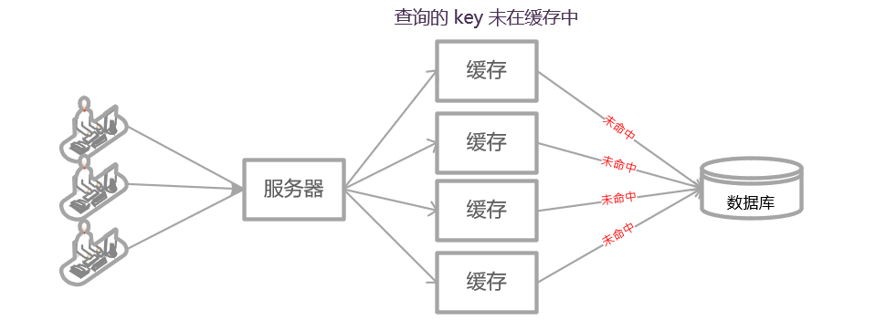

**缓存穿透：** 指查询一个一定不存在的数据，由于缓存是不命中时需要从数据库查询，查不到数据则不写入缓存，这将导致这个不存在的数据每次请求都要到数据库去查询，造成缓存穿透。

**缓存穿透几种解决办法：**

* 缓存空值，在从 DB 查询对象为空时，也要将空值存入缓存，具体的值需要使用特殊的标识， 能和真正缓存的数据区分开，另外将其过期时间设为较短时间。
* 使用布隆过滤器，布隆过滤器能判断一个 key 一定不存在（不保证一定存在，因为布隆过滤器结构原因，不能删除，但是旧值可能被新值替换，而将旧值删除后它可能依旧判断其可能存在），在缓存的基础上，构建布隆过滤器数据结构，在布隆过滤器中存储对应的 key，如果存在，则说明 key 对应的值为空。

## （2）缓存击穿
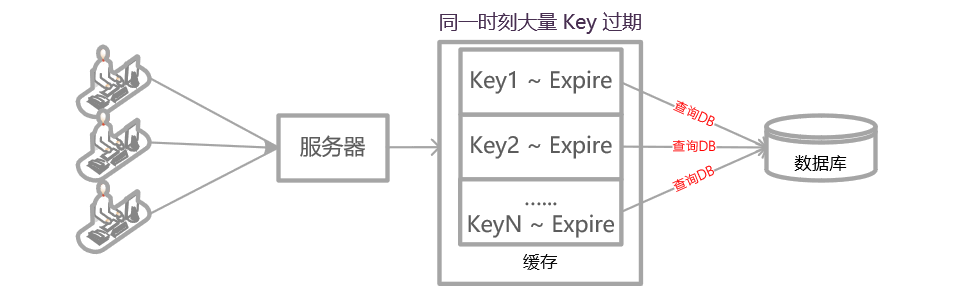

**缓存击穿几种解决办法：**

* 设置二级缓存，或者设置热点缓存永不过期，需要根据实际情况进行配置。
* 使用互斥锁，在执行过程中，如果缓存过期，那么先获取分布式锁，在执行从数据库中加载数据，如果找到数据就存入缓存，没有就继续该有的动作，在这个过程中能保证只有一个线程操作数据库，避免了对数据库的大量请求。

## （3）缓存雪崩
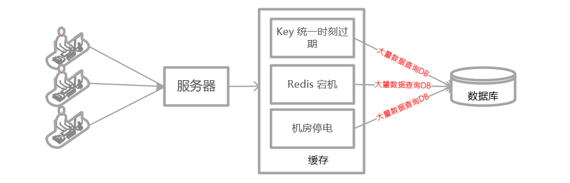

**缓存雪崩：** 当缓存服务器重启、或者大量缓存集中在某一个时间段失效，这样在失效的时候，也会给后端系统(比如DB)带来很大压力，造成数据库后端故障，从而引起应用服务器雪崩。

**缓存雪崩几种解决办法：**

* 缓存组件设计高可用，缓存高可用是指，存储缓存的组件的高可用，能够防止单点故障、机器故障、机房宕机等一系列问题。例如 Redis sentinel 和 Redis Cluster，都实现了高可用。
* 请求限流与服务熔断降级机制，限制服务请求次数，当服务不可用时快速熔断降级。
* 设置缓存过期时间一定的随机分布，避免集中在同一时间缓存失效。
* 定时更新缓存策略，对于实时性要求不高的数据，定时进行更新。

## （4）缓存一致性
使用缓存很大可能导致数据不一致问题，如下：

* 更熟数据库成功 -> 更新缓存失败 -> 数据不一致
* 更新缓存成功 -> 更新数据库失败 -> 数据不一致
* 更新数据库成功 -> 淘汰缓存失败 -> 数据不一致
* 淘汰缓存成功 -> 更新数据库失败 -> 查询缓存mis

所以使用缓存时候，应该结合实际情况，考虑缓存的数据是否有一致性需求。