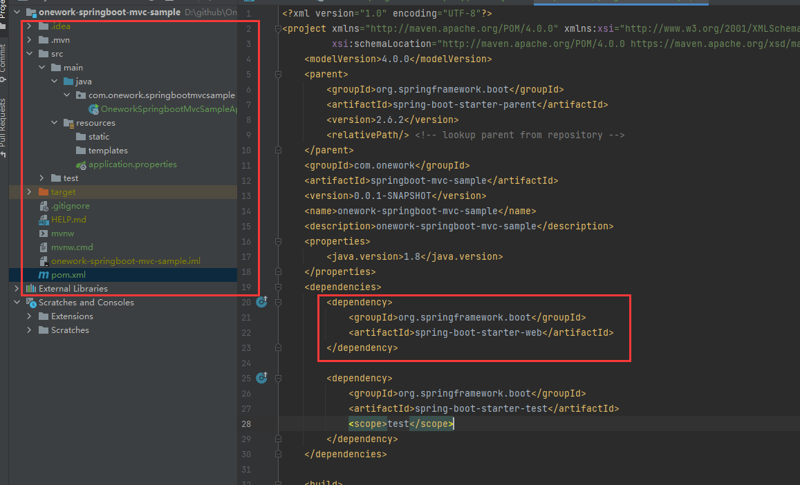

# Spring Boot中的Web应用说明和使用
# 一、Spring MVC简介
SpringMVC 是一种基于 Java 的实现 MVC 设计模型的请求驱动类型的轻量级 Web 框架，属于 Spring FrameWork 的后续产品，已经融合在 Spring Web Flow 里面。Spring 框架提供了构建 Web

应用程序的全功能 MVC 模块。使用 Spring 可插入的 MVC 架构，从而在使用 Spring 进行 WEB 开发时，可以选择使用 Spring 的 Spring MVC 框架或集成其他 MVC 开发框架。

文档介绍：

[https://docs.spring.io/spring-framework/docs/3.2.x/spring-framework-reference/html/mvc.html](https://docs.spring.io/spring-framework/docs/3.2.x/spring-framework-reference/html/mvc.html)

[https://docs.spring.io/spring-framework/docs/current/reference/html/web.html](https://docs.spring.io/spring-framework/docs/current/reference/html/web.html)


# 二、构建Spring MVC项目
## （1）基于spring boot构建Spring MVC
第一步骤：创建项目，填写项目基本信息和maven坐标


第二步骤：选择项目类型，自动POM加入相关依赖


查看文件目录与POM文件



# 三、Spring MVC配置
## （一）属性配置
**文档介绍：****spring boot Web properties**

### a）配置日志输出
```Plain Text
logging.level.root=debug
```
### b）配置服务端口
```java
server.port=8081
```
### c）配置日期格式
```java
spring.jackson.date-format=yyyy-MM-dd HH:mm:ss
spring.jackson.time-zone=GMT+8
```
## （二）WebMvcConfigurer接口
**文档介绍：****Interface WebMvcConfigurer**

**其他：**

SpringBoot---WebMvcConfigurer详解：

[https://www.cnblogs.com/891288436xiaoyu/p/14043910.html](https://www.cnblogs.com/891288436xiaoyu/p/14043910.html)

Spring boot MVC配置详解：

[https://blog.csdn.net/icarusliu/article/details/79477343](https://blog.csdn.net/icarusliu/article/details/79477343)

WebMvcConfigurer配置类其实是`Spring`内部的一种配置方式，采用`JavaBean`的形式来代替传统的`xml`配置文件形式进行针对框架个性化定制，可以自定义一些Handler，Interceptor，ViewResolver，MessageConverter。基于java-based方式的spring mvc配置，需要创建一个**配置**类并实现。

```java
public interface WebMvcConfigurer {
    /* 拦截器配置 */
    default void addInterceptors(InterceptorRegistry registry){}
    /* 跨域设置 */
    default void addCorsMappings(CorsRegistry registry){}
    /* 映射静态资源 */
    default void addResourceHandlers(ResourceHandlerRegistry registry){}
    /* 信息转换器 */
    default void configureMessageConverters(List<HttpMessageConverter<?>> converters) {}
    /* 格式化数据 */
    default void addFormatters(FormatterRegistry registry){}
    /* 视图解析器 */
    default void configureViewResolvers(ViewResolverRegistry registry) {}
    /* 视图解析器 */
    default void addViewControllers(ViewControllerRegistry registry) {}
    /* 匹配路由请求规则 */
    default void configurePathMatch(PathMatchConfigurer configurer) {}
    /* 异步处理的配置*/
    void configureAsyncSupport(AsyncSupportConfigurer var1);
    /* 配置内容裁决的一些参数*/
    void configureContentNegotiation(ContentNegotiationConfigurer var1);
    /* 配置是否需要以下功能：如果一个请求没有被任何Handler处理，那是否使用DefaultServletHttpRequestHandler来进行处理？ */
    void configureDefaultServletHandling(DefaultServletHandlerConfigurer var1); 
   /* 添加支持个性化配置Controller的方法参数类型的Resolver */
    void addArgumentResolvers(List<HandlerMethodArgumentResolver> var1);
    /* 添加支持个性化处理Controller返回数据类型的处理器 */
    void addReturnValueHandlers(List<HandlerMethodReturnValueHandler> var1); 
    /* 扩展消息转换器 */
    void extendMessageConverters(List<HttpMessageConverter<?>> var1);
    /* 配置异常处理器 */ 
    void configureHandlerExceptionResolvers(List<HandlerExceptionResolver> var1);
    /* 扩展异常处理器*/
    void extendHandlerExceptionResolvers(List<HandlerExceptionResolver> var1);
    Validator getValidator();
    MessageCodesResolver getMessageCodesResolver();
}
```
### a）addInterceptors（ 拦截器）
Spring Boot拦截器示例及源码原理分析：

[https://blog.csdn.net/icarusliu/article/details/78833520](https://blog.csdn.net/icarusliu/article/details/78833520)

拦载器一般用于做登录效验，权限认证等统一操作，自定义拦载器继承 HandlerInterceptor 接口。

```java
@Override
public void addInterceptors(InterceptorRegistry registry) {
    registry.addInterceptor(自定义拦载器)
            .addPathPatterns(拦载的路径);
}
```
**HandlerInterceptor拦截器常见的用途有：**

* 日志记录：记录请求信息的日志，以便进行信息监控、信息统计、计算PV（Page View）等。
* 权限检查：如登录检测，进入处理器检测检测是否登录，如果没有直接返回到登录页面。
* 性能监控：有时候系统在某段时间莫名其妙的慢，可以通过拦截器在进入处理器之前记录开始时间，在处理完后记录结束时间，从而得到该请求的处理时间（如果有反向代理，如apache可以自动记录）。
* 通用行为：读取cookie得到用户信息并将用户对象放入请求，从而方便后续流程使用，还有如提取Locale、Theme信息等，只要是多个处理器都需要的即可使用拦截器实现。
* OpenSessionInView：如Hibernate，在进入处理器打开Session，在完成后关闭Session。

```java
public interface HandlerInterceptor {

   /**
     * 预处理回调方法，实现处理器的预处理（如检查登陆），第三个参数为响应的处理器，自定义Controller
     * 返回值：true表示继续流程（如调用下一个拦截器或处理器）；　　　*       false表示流程中断（如登录检查失败），不会继续调用其他的拦截器或处理器，此时我们需要通过response来产生响应；
   */
    boolean preHandle(HttpServletRequest request, HttpServletResponse response, Object handler)
            throws Exception;
   /**
     * 后处理回调方法，实现处理器的后处理（但在渲染视图之前），此时我们可以通过modelAndView（模型和视图对象）对模型数据进行处理或对视图进行处理，modelAndView也可能为null。
   */
    void postHandle(
            HttpServletRequest request, HttpServletResponse response, Object handler, ModelAndView modelAndView)
            throws Exception;
   /**
    * 整个请求处理完毕回调方法，即在视图渲染完毕时回调，如性能监控中我们可以在此记录结束时间并输出消耗时间，还可以进行一些资源清理，类似于try-catch-finally中的finall
　　 * 但仅调用处理器执行链中preHandle返回true的拦截器的afterCompletion。
   */
    void afterCompletion(
            HttpServletRequest request, HttpServletResponse response, Object handler, Exception ex)
            throws Exception;
}
```
**HandlerInterceptor与WebRequestInterceptor的异同：**

* WebRequestInterceptor的入参WebRequest是包装了HttpServletRequest 和HttpServletResponse的，通过WebRequest获取Request中的信息更简便。
* WebRequestInterceptor的preHandle是没有返回值的，说明该方法中的逻辑并不影响后续的方法执行，所以这个接口实现就是为了获取Request中的信息，或者预设一些参数供后续流程使用。
* HandlerInterceptor的功能更强大也更基础，可以在preHandle方法中就直接拒绝请求进入controller方法。

### b）addCorsMappings（跨域设置）
```java
@Override
public void addCorsMappings(CorsRegistry registry) {
    registry.addMapping("/**") // 允许跨域访问的路径
            .allowedOrigins("*")// 允许跨域访问的源
            .allowedMethods("POST", "GET", "PUT", "OPTIONS", "DELETE") // 允许请求方法
            .maxAge(86400) // 预检间隔时间
            .allowedHeaders("*") // 允许头部设置
            .allowCredentials(true); // 是否发送cookie
}
```
> tip：如果在拦截器的request中设置跨域，此处不生效。

### c）addResourceHandlers（映射静态资源）
用于映射如图片，js，css文件等资源，访问这些静态资源不经过拦截器。

```java
@Override
protected void addResourceHandlers(ResourceHandlerRegistry registry) {
    registry.addResourceHandler("/**").addResourceLocations("classpath:/statics/");
    super.addResourceHandlers(registry);
}
```
### d）configureMessageConverters（信息转换器）
Spring MVC序列化与反序列化时调用，多用于参数转换。比如自定义日期格式，用 gson 替换默认的 jackson 实现json转换。

```java
/**
* 消息内容转换配置
 * 配置fastJson返回json转换
 * @param converters
 */
@Override
public void configureMessageConverters(List<HttpMessageConverter<?>> converters) {
    //调用父类的配置
    super.configureMessageConverters(converters);
    //创建fastJson消息转换器
    FastJsonHttpMessageConverter fastConverter = new FastJsonHttpMessageConverter();
    //创建配置类
    FastJsonConfig fastJsonConfig = new FastJsonConfig();
    //修改配置返回内容的过滤
    fastJsonConfig.setSerializerFeatures(
            SerializerFeature.DisableCircularReferenceDetect,
            SerializerFeature.WriteMapNullValue,
            SerializerFeature.WriteNullStringAsEmpty
    );
    fastConverter.setFastJsonConfig(fastJsonConfig);
    //将fastjson添加到视图消息转换器列表内
    converters.add(fastConverter);
 
}
```
### e）addFormatters（格式转换器）
在认识这个方法时，以前日期格式化都用的Converter，用它可以专门处理数据格式。需要实现 Formatter 接口。

```java
@Override
public void addFormatters(FormatterRegistry registry) {
     
}
```
### f）configureViewResolvers（参数解析器）
视图解析器决定Controller返回数据的类型和型式，可以配置多个，order值越小越优先。

```java
@Override
public void configureViewResolvers(ViewResolverRegistry registry) {

    // jsp视图解析器
    InternalResourceViewResolver jspView = new InternalResourceViewResolver();
    jspView.setOrder(1);
    jspView.setPrefix("/WEB-INFO");
    jspView.setSuffix(".jsp");
    registry.viewResolver(jspView);

    // xml
    XmlViewResolver xmlView = new XmlViewResolver();
    xmlView.setOrder(2);
    registry.viewResolver(xmlView);
}
```
### g）addViewControllers（视图解析器）
某些单纯页面跳，比如登录页面。无需写在 Controller 里，可以在这里添加。

```java
@Override
public void addViewControllers(ViewControllerRegistry registry) {
    registry.addViewController("/hello").setViewName("/hello");
    //可以添加更多
}
```
### h）configurePathMatch（匹配路由请求规则）
配置RequestMapping注解中指定的路径模式与实际访问路径之间映射的处理规则

```java
/**
 * 配置RequestMapping注解中指定的路径模式与实际访问路径之间映射的处理规则
 * @param configurer
 */
@Override
public void configurePathMatch(PathMatchConfigurer configurer) {
    logger.info("Begin to configure pathMatches!");

    /**
     * 是否包含.*来映射请求
     * 假设RequestMapping注解中指定的路径是/test
     * 如果设置成True，那么对于/test.do,/test.a等任何包含.的请求都会映射到/test上去；
     * 如果设置成False，那么对于这种请求不会进行映射。
     *
     */
    configurer.setUseSuffixPatternMatch(true);

    /**
     * 设置路径后是否包含/
     * 假设RequestMapping注解中指addViewControllers定的路径是/test
     * 设置成True时，会同时处理/test/和/test的请求
     * 设置成False时，只会处理/test的请求
     * 默认是True
     */
    configurer.setUseTrailingSlashMatch(false);

    /**
     * 配置后置模式匹配是否仅在配置内容协商中明确指定的路径扩展名称时生效
     * 举个例子：假设WebMvcConfigurer中覆盖了configureContentNegotiation方法进行以下处理：
     * @Override
     * public void configureContentNegotiation(ContentNegotiationConfigurer configurer) {
     *     configurer.mediaType("pdf", MediaType.APPLICATION_PDF);
     *}
     * 当setUseRegisteredSuffixPatternMatch配置成TRUE时，即使setUseSuffixPatternMatch设置成True，
     * 在访问/test.do时也不会命中被RequestMapping注解值为/test的Controller； 
     * 只有在访问/test.pdf时才能正常访问，其它任何的/test.txt或者/test.doc等均会报404； 
     * 默认情况下该值是False
     */
    configurer.setUseRegisteredSuffixPatternMatch(true);
}
```
# 四、SpringMVC中的常用注解
文档地址：

其他：

[SpringMVC中常用注解与使用方法](https://blog.csdn.net/promsing/article/details/116304995)

## （一）配置注解
### @EnableWebMvc
> 在Spring Boot中使用@EnableWebMvc也可能遇到类似的问题，@EnableWebMvc是使用注解方式快捷配置Spring Webmvc的一个注解。在使用时你可能会遇到以下问题：

> Spring Boot在application文件中的配置失效

> 在Spring Boot的自定义配置类加上@EnableWebMvc后，发现自动配置的静态资源路径（classpath:/META/resources/，classpath:/resources/，classpath:/static/，classpath:/public/）资源无法访问。

通过查看`@EnableWebMvc`的源码，可以发现该注解就是为了引入一个`DelegatingWebMvcConfiguration `配置类，而`DelegatingWebMvcConfiguration`又继承于`WebMvcConfigurationSupport`。也就是说，如果我们使用`@EnableWebMvc`就相当于导入了`WebMvcConfigurationSupport`类，这个时候，Spring Boot的自动装配就不会发生了，我们能用的，只有`WebMvcConfigurationSupport`提供的若干个配置。其实不使用`@EnableWebMvc`注解也是可以实现配置Webmvc，只需要将配置类继承于`WebMvcConfigurationSupport`类即可。

当使用`@EnableWebMvc`时，加载的是`WebMvcConfigurationSupport`中的配置项。

当不使用`@EnableWebMvc`时，使用的是`WebMvcAutoConfiguration`引入的配置项。

### @Controller
控制器Controller 负责处理由DispatcherServlet 分发的请求，它把用户请求的数据经过业务处理层处理之后封装成一个Model ，然后再把该Model 返回给对应的View 进行展示。在SpringMVC 中使用@Controller ，就无需继承特定的类或实现特定的接口，只需使用@Controller 标记一个类是Controller，然后使用@RequestMapping 和@RequestParam 等一些注解用以定义URL 请求和Controller 方法之间的映射，这样的Controller 就能被外界访问到。

### @RestController
@RestController 是 @Controller 和 @ResponseBody 两个注解的结合体。

### @ControllerAdvice
在Spring 3.2中，新增了@ControllerAdvice、@RestControllerAdvice 注解，可以用于定义@ExceptionHandler、@InitBinder、@ModelAttribute，并应用到所有@RequestMapping、@PostMapping， @GetMapping注解中。

## （二）路由注解
### @RequestMapping
|示例|说明|
| ----- | ----- |
|@RequestMapping("/index")|默认为 GET 方法的路由 /index|
|@RequestMapping(value="/index",method = RequestMethod.GET)|同上面一条|
|@RequestMapping(value="/add",method = RequestMethod.POST)|路由为 /add 的 POST 请求|
|@RequestMapping(value="/add",method = RequestMethod.POST),consumes="application/json"|路由为 /add 的 POST 请求，但仅仅处理 application/json 的请求|
|@RequestMapping(value="/add",method = RequestMethod.POST),produces="application/json"|路由为 /add 的 POST 请求，强调返回为 JSON 格式|
|@RequestMapping(value="/add",method = RequestMethod.POST),params="myParam=xyz"|路由为 /add 的 POST 请求，但仅仅处理头部包括 myParam=xyz 的请求|
|@RequestMapping(value="/add",method = RequestMethod.POST),headers="Referer=http://www.xyz.com/"|路由为 /add 的 POST 请求，但仅仅处理 来源为 www.xyz.com 的请求|

@RequestMapping 源码

```java
@Target({ElementType.TYPE, ElementType.METHOD})
@Retention(RetentionPolicy.RUNTIME)
@Documented
@Mapping
public @interface RequestMapping {
    String name() default "";

    //指定请求的实际地址
    @AliasFor("path")
    String[] value() default {};
    @AliasFor("value")
    String[] path() default {};
    //指定请求的method类型， GET、POST、PUT、DELETE等
    RequestMethod[] method() default {};
    //指定request中必须包含某些参数值是，才让该方法处理。
    String[] params() default {};
    //指定request中必须包含某些指定的header值，才能让该方法处理请求。
    String[] headers() default {};
    //指定处理请求的提交内容类型（Content-Type），例如application/json, text/html;
    String[] consumes() default {};
    //指定返回的内容类型，仅当request请求头中的(Accept)类型中包含该指定类型才返回；
    String[] produces() default {};
}
```
### @GetMapping
@GetMapping("users") 等价于@RequestMapping(value="/users",method=RequestMethod.GET)

```java
@GetMapping("/users")
public ResponseEntity> getAllUsers(){
    return userRepository.findAll();
}
```
### @PostMapping
@PostMapping("users") 等价于@RequestMapping(value="/users",method=RequestMethod.POST)

```java
@PostMapping("/users")
public ResponseEntity createUser(@Valid @RequestBody UserCreateRequest userCreateRequest){    return userRespository.save(user);
}
```
### @PutMapping
@PutMapping("/users/{userId}") 等价于@RequestMapping(value="/users/{userId}",method=RequestMethod.PUT)

```java
@PutMapping("/users/{userId}")
public ResponseEntity updateUser(@PathVariable(value="userId") Long userid,@Valid @RequestBody UserUpdateRequest userUpdateRequest){  
}
```
### @DeleteMapping
@DeleteMapping("/users/{userId}")等价于@RequestMapping(value="/users/{userId}",method=RequestMethod.DELETE)

```java
@DeleteMapping("/users/{userId}")
public ResponseEntity deleteUser(@PathVariable(value="userId") Long userid){    
}
```
## （三）参数注解
### @RequestParam
**作用：把请求中指定名称的参数给控制器中的形参赋值**

> value：请求参数的名称

> required：请求参数中必须提供此参数。默认值：true，表示必须提供，如果不提供就报错。

```java

      @RequestMapping("/testRequestParam")
         //RequestParam --更名 
         // 属性 value=别名 required=必须含有的参数
         public String testRequestParam(@RequestParam(value = "username") String name){
              System.out.printf(name);
              System.out.println("testRequestParam执行了~~~");
             return "success";
          }
  
```
### @RequestBody
**作用：用于获取请求体内容。直接使用得到key=value&key=vaule...结构的数据。get请求方式不适用**

> required：是否必须有请求体。当取值为true时，get请求会报错。如果取值为false，get请求得到是null。

```java
      @RequestMapping("/testRequestBody")
         //RequestBody 获取请求体中的内容 如：username=benshan&password=98989&money=200
         public String testRequestBody(@RequestBody String body){
              System.out.println("testRequestBody执行了~~~");
              System.out.println(body);
             return "success";
          }
  
```
### @PathVariable
**作用：用于绑定URL中的占位符。url中有/delete/{id},{id}就是占位符。**

```java
       @RequestMapping("/testPathVariable/{id}")
         //PathVariable使用Restful风格，结构清晰，拓展方便
         public String testPathVariable(@PathVariable(value = "id") String id){
              System.out.println("testPathVariable~~~");
              System.out.println(id);
             return "success";
          }
  
```
### @RequestHeader
**作用：用于绑定URL中的占位符。url中有/delete/{id},{id}就是占位符。**

```java

       @RequestMapping("/testRequestHeader")
         //testRequestHeader获取请求头的值
         public String testRequestHeader(@RequestHeader(value = "Accept") String header){
              System.out.println("testRequestHeader~~~");
              System.out.println(header);
             return "success";
          }
  
```
### @CookieValue
**作用：用于把指定cookie名称的值传入控制器方法参数**

>      value：指定cookie的名称

>      required：是否必须有此cookie

```java
      @RequestMapping("/testCookieValue")
         //testRequestHeader获取请求头的值
         public String testCookieValue(@CookieValue(value = "JSESSIONID") String cookie){
              System.out.println("testCookieValue~~~");
              System.out.println(cookie);
             return "success";
          }
  
```
### @SessionAttributes
**作用：用于多次执行控制器方法间的参数共享**

>    value 用于指定存入的属性名称

>    type：用于指定存入的数据类型

### @ModelAttribute
标注在方法上的@ModelAttribute说明方法是用于添加一个或多个属性到model上。这样的方法能接受与@RequestMapping标注相同的参数类型，只不过不能直接被映射到具体的请求上。

在同一个控制器中，标注了@ModelAttribute的方法实际上会在@RequestMapping方法之前被调用。

@ModelAttribute标注方法有两种风格：

* 在第一种写法中，方法通过返回值的方式默认地将添加一个属性；
* 在第二种写法中，方法接收一个Model对象，然后可以向其中添加任意数量的属性。

# 五、Spring MVC参数处理
## （1）参数绑定
[https://www.cnblogs.com/ysocean/p/7425861.html](https://www.cnblogs.com/ysocean/p/7425861.html)

[https://www.cnblogs.com/harrychinese/p/springboot\_mvc\_view\_function.html](https://www.cnblogs.com/harrychinese/p/springboot_mvc_view_function.html)

SpringMVC 有支持的默认参数类型，我们直接在形参上给出这些默认类型的声明，就能直接使用了。如下：

* **HttpServletRequest 对象**
* **HttpServletResponse 对象**
* **HttpSession 对象**
* **Model/ModelMap 对象**

## （2）参数验证
Spring Boot 支持JSR303/JSR349验证框架，通过注解实现对参数的校验，并将校验结果封装成BindingResult对象。

```Plain Text
空类型检查
  @Null验证对象必须为空
  @NotNull验证对象不能为空
  @NotBlank 验证对象不能为空字符串
  @NotEmpty 验证对象不能为空，集合类型不能为空
长度检查
  @Size(min= ,max=) 验证对象长度，支持字符串和集合
  @Length  验证字符串长度
数值检查
  @Max 验证数字大小是否小于某个数值
  @Min  验证数字大小是否大于某个数值
  @Digits 验证数字是否符合某个格式例如：整数3为，小数2位
  @Range  验证数值是否在某个范围之内
其他检查
  @Email  验证是否位邮件格式，若为null则不做校验
  @Pattern  验证是否符合正则表达式规则
```
# 六、关键类或接口
## （1）DispatcherServlet
参考文档：[https://docs.spring.io/spring-framework/docs/3.2.x/spring-framework-reference/html/mvc.html#mvc-container-config](https://docs.spring.io/spring-framework/docs/3.2.x/spring-framework-reference/html/mvc.html#mvc-container-config)

Spring MVC的核心组件就是DispatcherServlet，它是SpringWeb请求的调度中心，它的主要功能如下所示：

* 在Spring容器启动阶段读取映射规则，如RequestMapping；
* 在请求到来的时候，按照加载的请求映射规则找到合适的处理方法；
* 当处理请求的过程中出现了异常，对异常进行处理，如返回合适的界面或状态码；
* 解析返回View的主题、时区等信息；
* 渲染返回的视图。


## （2）WebMvcConfigurationSupport
## （3）RequestMappingHandlerAdapter
## （4）HandlerMethodReturnValueHandler
## （5）WebMvcConfigurerAdapter 
Spring 5.0后，WebMvcConfigurerAdapter被废弃，取代的方法有两种：

* implements WebMvcConfigurer（官方推荐）
* extends WebMvcConfigurationSupport

## （6）ResponseBodyAdvice
`ResponseBodyAdvice`接口和之前记录的`RequestBodyAdvice`接口类似, `RequestBodyAdvice`是请求到Controller之前拦截,做相应的处理操作, 而`ResponseBodyAdvice`是对Controller返回的`{@code @ResponseBody}or a {@code ResponseEntity}` 后,`{@code HttpMessageConverter}` 类型转换之前拦截, 进行相应的处理操作后,再将结果返回给客户端.

```java
/**   数据的处理顺序向下
 * Allows customizing the response after the execution of an {@code @ResponseBody}
 * or a {@code ResponseEntity} controller method but before the body is written
 * with an {@code HttpMessageConverter}.
 *
 * <p>Implementations may be registered directly with
 * {@code RequestMappingHandlerAdapter} and {@code ExceptionHandlerExceptionResolver}
 * or more likely annotated with {@code @ControllerAdvice} in which case they
 * will be auto-detected by both.
 *
 * @author Rossen Stoyanchev
 * @since 4.1
 * @param <T> the body type
 */
public interface ResponseBodyAdvice<T> {

	/**
	 * Whether this component supports the given controller method return type
	 * and the selected {@code HttpMessageConverter} type.
	 * @param returnType the return type   方法返回的类型
	 * @param converterType the selected converter type   参数类型装换
	 * @return {@code true} if {@link #beforeBodyWrite} should be invoked;
	 * {@code false} otherwise
	 * 返回 true 则下面 beforeBodyWrite方法被调用, 否则就不调用下述方法
	 */
	boolean supports(MethodParameter returnType, Class<? extends HttpMessageConverter<?>> converterType);

	/**
	 * Invoked after an {@code HttpMessageConverter} is selected and just before
	 * its write method is invoked.
	 * @param body the body to be written
	 * @param returnType the return type of the controller method
	 * @param selectedContentType the content type selected through content negotiation
	 * @param selectedConverterType the converter type selected to write to the response
	 * @param request the current request
	 * @param response the current response
	 * @return the body that was passed in or a modified (possibly new) instance
	 */
	@Nullable
	T beforeBodyWrite(@Nullable T body, MethodParameter returnType, MediaType selectedContentType,
			Class<? extends HttpMessageConverter<?>> selectedConverterType,
			ServerHttpRequest request, ServerHttpResponse response);

}
```
说明:

* supports方法: 判断是否要执行beforeBodyWrite方法,true为执行,false不执行. 通过该方法可以选择哪些类或那些方法的response要进行处理, 其他的不进行处理.
* beforeBodyWrite方法: 对response方法进行具体操作处理

> {@code @ResponseBody} 返回响应体, 例如List集合

> {@code ResponseEntity} 返回响应实体对象,例如User对象

## （7）WebSecurityConfigurerAdapter
# 七、Spring MVC常规处理
## （1）响应结果
* 创建响应结果统一类

```java
@Getter
@Setter
public class R<T> implements Serializable {
    private static final long serialVersionUID = 1L;

    private int code;
    private String message;
    private T data;

    public R<T> code(int code) {
        this.code = code;
        return this;
    }

    public R<T> code(HttpStatus status) {
        code = status.value();
        return this;
    }

    public R<T> message(String message) {
        this.message = message;
        return this;
    }

    public R<T> data(T data) {
        this.data = data;
        return this;
    }

    public R<T> success() {
        code(0);
        message(HttpStatus.OK.getReasonPhrase());
        return this;
    }
}
```
* 创建ResponseBodyAdvice的子类，继承`ResponseBodyAdvice`类，加上`@ControllerAdvice`注解

```java
@ControllerAdvice
public class ApiResponseBodyAdvice implements ResponseBodyAdvice<Object> {

    @Override
    public boolean supports(MethodParameter returnType, Class<? extends HttpMessageConverter<?>> converterType) {
        Class<?> classes = returnType.getDeclaringClass();
        return classes.getTypeName() != "com.onework.springbootmvcsample.config.GlobalExceptionHandle";
    }

    @Override
    public Object beforeBodyWrite(Object body, MethodParameter returnType, MediaType selectedContentType,
        Class<? extends HttpMessageConverter<?>> selectedConverterType, ServerHttpRequest request,
        ServerHttpResponse response) {
        return new R().data(body).success();
    }
}
```
## （2）会话状态
### a）HttpSession
```Plain Text
HttpSession原理
当用户第一次访问Servlet时,服务器端会给用户创建一个独立的Session
并且生成一个SessionID,这个SessionID在响应浏览器的时候会被装进cookie中,从而被保存到浏览器中
当用户再一次访问Servlet时,请求中会携带着cookie中的SessionID去访问
服务器会根据这个SessionID去查看是否有对应的Session对象
有就拿出来使用;没有就创建一个Session(相当于用户第一次访问)

域的范围:
    Context域 > Session域 > Request域
    Session域 只要会话不结束就会存在 但是Session有默认的存活时间(30分钟)
```
### b）HttpSessionListener
**sessionCreated**：新建一个会话时候触发也可以说是客户端第一次和服务器交互时候触发

**sessionDestroyed**：销毁会话的时候  一般来说只有某个按钮触发进行销毁 或者配置定时销毁 （ 很多文献中提到说浏览器关闭时候会销毁 但是楼主通过各种现行主流浏览器测试效果不尽如人意）

### c）HttpSessionAttributeListener
**attributeAdded**：在session中添加对象时触发此操作 笼统的说就是调用setAttribute这个方法时候会触发的  

**attributeRemoved**：修改、删除session中添加对象时触发此操作  笼统的说就是调用 removeAttribute这个方法时候会触发的  

**attributeReplaced**：在Session属性被重新设置时

## （3）静态资源
Spring boot默认对/\*\*的访问可以直接访问四个目录下的文件：

* classpath:/public/
* classpath:/resources/
* classpath:/static/
* classpath:/META-INFO/resouces/

我们现在就在资源文件resources目录下建立如下四个目录：


```java
<dependency>
            <groupId>org.springframework.boot</groupId>
            <artifactId>spring-boot-starter-thymeleaf</artifactId>
 </dependency>
```
## （4）上传文件
```java
@RestController
public class FileController {

    @PostMapping(value = "/upload")
    public String Upload(@RequestParam("file") MultipartFile file) {
        return file.getOriginalFilename();
    }
}
```
## （5）全局异常
* 创建全局处理异常类，加上@ControllerAdvice注解
* 新增方法加上@ExceptionHandler和@ResponseBody注解

```java
@ControllerAdvice
public class GlobalExceptionHandle {

    @ResponseBody
    @ExceptionHandler({Exception.class})
    public Object handleException(Exception e) {
        return new R().unauthorized(e.getMessage());
    }
}
```
# 八、扩展知识
## （1）Thymeleaf
中文文档：[https://www.docs4dev.com/docs/zh/thymeleaf/3.0/reference/](https://www.docs4dev.com/docs/zh/thymeleaf/3.0/reference/)

html模板：[layui](http://layui.org.cn/index.html)

**POM：**

```xml
<dependency>
    <groupId>org.springframework.boot</groupId>
    <artifactId>spring-boot-starter-thymeleaf</artifactId>
</dependency>
```
**Controller**：

```xml
@Controller
@RequestMapping("/home")
public class HomeController {

    @GetMapping("index")
    public String Index(Model model, HttpServletRequest request) {
        model.addAttribute("name", "test");

        return "index";
    }
}
```
**html模板：**

```html
<!DOCTYPE html>
<html lang="en" xmlns:th="http://www.thymeleaf.org">
<head>
    <meta charset="UTF-8">
    <title>Title</title>
</head>
<body>
<p th:text="${name}">name</p>
</body>
</html>
```
## （2）spring-boot-starter-actuator
Spring Boot Actuator 模块提供了生产级别的功能，比如健康检查，审计，指标收集，HTTP 跟踪等，帮助我们监控和管理Spring Boot 应用。

这个模块是一个采集应用内部信息暴露给外部的模块，上述的功能都可以通过HTTP 和 JMX 访问。

因为暴露内部信息的特性，Actuator 也可以和一些外部的应用监控系统整合（[Prometheus](https://link.segmentfault.com/?enc=b7COqzayHFIwe2cpSIS8Zg%3D%3D.8tU5F6ltNWPdUCptrI1ghc0tbip6jNn0csCOfYWZo2w%3D), [Graphite](https://link.segmentfault.com/?enc=4YIf8DiSVDawyqatzaD%2F%2Fg%3D%3D.a679%2BKFmDPB3tidP81kvIHDhAC4Li0sK7TXlhaaZDiE%3D), [DataDog](https://link.segmentfault.com/?enc=8qPJbVEIDR8id6rsJ%2BEB4A%3D%3D.jFXlQmZSk%2Fqke4Yw02iKBhGtBIMtm8oG3JJIeFpwmrw%3D), [Influx](https://link.segmentfault.com/?enc=U%2B9n2py%2FdxijWcScHbowCw%3D%3D.oMsCN54Iv%2BA9SJ4D4IQJJkjp31sT%2FroM6OH245IDQMY%3D), [Wavefront](https://link.segmentfault.com/?enc=822MjQbEhuKdfDolI%2Bgcpw%3D%3D.%2BeAylpCO8HCIWaxvre3FY9%2BLLlicHodpwtl7qUytfd4%3D), [New Relic](https://link.segmentfault.com/?enc=36f%2FbL2rmnBvrPaZ735pIw%3D%3D.Dal1RTzGUSuq2YOaFEXjTOxXULQvXYxRSz7Nk%2BCPz%2FU%3D)等）。

这些监控系统提供了出色的仪表板，图形，分析和警报，可帮助你通过一个统一友好的界面，监视和管理你的应用程序。

Actuator使用[Micrometer](https://link.segmentfault.com/?enc=R9FEuPO%2FMrUzRPf3ztgR2Q%3D%3D.sUQHri1QsamNPHRJFLf77AqYn0RmCIvAargQLSh7CkI%3D)与这些外部应用程序监视系统集成。这样一来，只需很少的配置即可轻松集成外部的监控系统。

```Plain Text
Micrometer 为 Java 平台上的性能数据收集提供了一个通用的 API，应用程序只需要使用 Micrometer 的通用 API 来收集性能指标即可。
Micrometer 会负责完成与不同监控系统的适配工作。这就使得切换监控系统变得很容易。
```
## （3）如何设置请求URL忽略大小写
新建一个 WebMvcConfig 类继承 WebMvcConfigurationSupport  设置RUL匹配规则

*tip：确认WebMvcConfig 类型是否已注入到容器中*

WebMvcConfigurationSupport 与 springdoc-openapi  冲突，导致 swagger-ui/index.html 无法访问

```Plain Text
springdoc-openapi 
```
```java
@Configuration
public class WebMvcConfig extends WebMvcConfigurationSupport {
    /**
     * 接口地址忽略大小写
     * @param configurer
     */
    @Override
    public void configurePathMatch(PathMatchConfigurer configurer) {
        AntPathMatcher matcher = new AntPathMatcher();
        matcher.setCaseSensitive(false);
        configurer.setPathMatcher(matcher);
    }
}
```
## （4）集成 OpenApi
springfox：[https://springfox.github.io/springfox/docs/snapshot/#springfox-spring-mvc-and-spring-boot](https://springfox.github.io/springfox/docs/snapshot/#springfox-spring-mvc-and-spring-boot)

OpenApi规范：[https://openapi.apifox.cn/](https://openapi.apifox.cn/)

springdoc-openapi：[https://github.com/springdoc/springdoc-openapi](https://github.com/springdoc/springdoc-openapi)

## （5）拦截器（Interceptor）与过滤器（Filter）
### **过滤器（Filter）**
Servlet中的过滤器Filter是实现了javax.servlet.Filter接口的服务器端程序，主要的用途是设置字符集、控制权限、控制转向、做一些业务逻辑判断等。其工作原理是，只要你在web.xml文件配置好要拦截的客户端请求，它都会帮你拦截到请求，此时你就可以对请求或响应(Request、Response)统一设置编码，简化操作；同时还可进行逻辑判断，如用户是否已经登陆、有没有权限访问该页面等等工作。它是随你的web应用启动而启动的，只初始化一次，以后就可以拦截相关请求，只有当你的web应用停止或重新部署的时候才销毁。

Filter可以认为是Servlet的一种“加强版”，它主要用于对用户请求进行预处理，也可以对HttpServletResponse进行后处理，是个典型的处理链。Filter也可以对用户请求生成响应，这一点与Servlet相同，但实际上很少会使用Filter向用户请求生成响应。使用Filter完整的流程是：Filter对用户请求进行预处理，接着将请求交给Servlet进行处理并生成响应，最后Filter再对服务器响应进行后处理。

      Filter有如下几个用处。

* 在HttpServletRequest到达Servlet之前，拦截客户的HttpServletRequest。
* 根据需要检查HttpServletRequest，也可以修改HttpServletRequest头和数据。
* 在HttpServletResponse到达客户端之前，拦截HttpServletResponse。
* 根据需要检查HttpServletResponse，也可以修改HttpServletResponse头和数据。

     Filter有如下几个种类。

* 用户授权的Filter：Filter负责检查用户请求，根据请求过滤用户非法请求。
* 日志Filter：详细记录某些特殊的用户请求。
* 负责解码的Filter:包括对非标准编码的请求解码。
* 能改变XML内容的XSLT Filter等。
* Filter可以负责拦截多个请求或响应；一个请求或响应也可以被多个Filter拦截。

### **拦截器（Interceptor）**
拦截器是在面向切面编程中应用的，就是在你的service或者一个方法前调用一个方法，或者在方法后调用一个方法。是基于JAVA的反射机制。拦截器不是在web.xml，比如struts在struts.xml中配置。

拦截器，在AOP(Aspect-Oriented Programming)中用于在某个方法或字段被访问之前，进行拦截，然后在之前或之后加入某些操作。拦截是AOP的一种实现策略。

     在WebWork的中文文档的解释为—拦截器是动态拦截Action调用的对象。它提供了一种机制使开发者可以定义在一个Action执行的前后执行的代码，也可以在一个Action执行前阻止其执行。同时也提供了一种可以提取Action中可重用的部分的方式。

     拦截器将Action共用的行为独立出来，在Action执行前后执行。这也就是我们所说的AOP，它是分散关注的编程方法，它将通用需求功能从不相关类之中分离出来；同时，能够共享一个行为，一旦行为发生变化，不必修改很多类，只要修改这个行为就可以。

     拦截器将很多功能从我们的Action中独立出来，大量减少了我们Action的代码，独立出来的行为就有很好的重用性。

     当你提交对Action(默认是.action结尾的url)的请求时，ServletDispatcher会根据你的请求，去调度并执行相应的Action。在Action执行之前，调用被Interceptor截取，Interceptor在Action执行前后执行。

     SpringMVC 中的Interceptor 拦截请求是通过HandlerInterceptor 来实现的。在SpringMVC 中定义一个Interceptor 非常简单，主要有两种方式，第一种方式是要定义的Interceptor类要实现了Spring 的HandlerInterceptor 接口，或者是这个类继承实现了HandlerInterceptor 接口的类，比如Spring 已经提供的实现了HandlerInterceptor 接口的抽象类HandlerInterceptorAdapter ；第二种方式是实现Spring的WebRequestInterceptor接口，或者是继承实现了WebRequestInterceptor的类。

### **两者之间区别**
Spring的Interceptor(拦截器)与Servlet的Filter有相似之处，比如二者都是AOP编程思想的体现，都能实现权限检查、日志记录等。不同的是：

|Filter|Interceptor|Summary|
| ----- | ----- | ----- |
|Filter 接口定义在 javax.servlet 包中|接口 HandlerInterceptor 定义在org.springframework.web.servlet 包中| |
|Filter 定义在 web.xml 中| | |
|Filter在只在 Servlet 前后起作用。Filters 通常将 请求和响应（request/response） 当做黑盒子，Filter 通常不考虑servlet 的实现。|拦截器能够深入到方法前后、异常抛出前后等，因此拦截器的使用具有更大的弹性。允许用户介入（hook into）请求的生命周期，在请求过程中获取信息，Interceptor 通常和请求更加耦合。|在Spring构架的程序中，要优先使用拦截器。几乎所有 Filter 能够做的事情， interceptor 都能够轻松的实现[  ](http://einverne.github.io/post/2017/08/spring-interceptor-vs-filter.html#fn:top)|
|Filter 是 Servlet 规范规定的。|而拦截器既可以用于Web程序，也可以用于Application、Swing程序中。|使用范围不同|
|Filter 是在 Servlet 规范中定义的，是 Servlet 容器支持的。|而拦截器是在 Spring容器内的，是Spring框架支持的。|规范不同|
|Filter 不能够使用 Spring 容器资源|拦截器是一个Spring的组件，归Spring管理，配置在Spring文件中，因此能使用Spring里的任何资源、对象，例如 Service对象、数据源、事务管理等，通过IoC注入到拦截器即可|Spring 中使用 interceptor 更容易|
|Filter 是被 Server(like Tomcat) 调用|Interceptor 是被 Spring 调用|因此 Filter 总是优先于 Interceptor 执行|

## （6）Servlet Web容器
### a）Tomcat
### b）Jetty
### c）Undertow
# 九、常见问题
## （1）springboot全局配置Jackson未生效
> 项目使用mvc拦截器，通过`WebMvcConfigurationSupport`配置，导致Jackson配置失效。

> 或者在继承WebMvcConfigurer的子类启用`@EnableWebMvc`注解，导致自动装配失效

## （2）return语句下面有波浪线提示Cannot resolve MVC View ‘index’
POM文件中加入thymeleaf

```java
<dependency>
            <groupId>org.springframework.boot</groupId>
            <artifactId>spring-boot-starter-thymeleaf</artifactId>
 </dependency>

```
