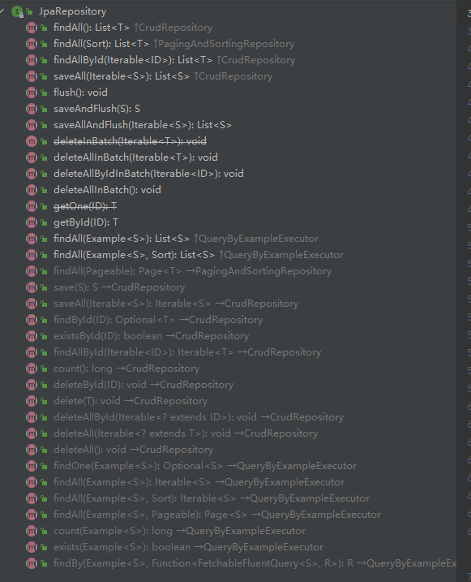

# Spring Data 简要说明与使用总结
# 一、参考资料


# 二、Spring Data JDBC


# 三、Spring Data JPA
## （1）概括
JPA的全称是 Java Persistence API , 中文的字面意思就是**Java 的持久层 API** , JPA 就是定义了一系列标准，让实体类和数据库中的表建立一个对应的关系，当我们在使用Java 操作实体类的时候能达到操作数据库中表的效果(不用写SQL,就可以达到效果），JPA 的实现思想即是 ORM （Object Relation Mapping），对象关系映射，用于在关系型数据库和业务实体对象之间作一个映射。

[https://zhuanlan.zhihu.com/p/110024146](https://zhuanlan.zhihu.com/p/110024146)

## （2）注解
### a）基本注解
* **@Entity**：标识实体类是JPA实体，告诉JPA在程序运行时生成实体类对应表
* **@Table**：设置实体类在数据库所对应的表名
* **@Id**：标识类里所在变量为主键
* **@IdClass**
* **@GeneratedValue**：设置主键生成策略，此方式依赖于具体的数据库
* **@Basic**：表示一个简单的属性到数据库表的字段的映射,对于没有任何标注的getXxxx()方法,默认 即为 @Basic fetch: 表示该属性的读取策略,有EAGER和LAZY两种,分别表示主支抓取和延迟加载,默认为EAGER.
* **@Column**（name = "自定义字段名"，length = "自定义长度"，nullable = "是否可以空"，unique = "是否唯一"，columnDefinition = "自定义该字段的类型和长度"）表示对这个变量所对应的字段名进行一些个性化的设置，例如字段的名字，字段的长度，是否为空和是否唯一等等设置。
* **@Lob**：将属性映射成数据库支持的大对象类型
* **@Transient**：表示属性并非数据库表字段的映射,ORM框架将忽略该属性
* **@Temporal**：（很重要）

　　当我们使用到java.util包中的时间日期类型，则需要此注释来说明转化成java.util包中的类型。

　　注入数据库的类型有三种：

　　　　TemporalType.DATE（2008-08-08）

　　　　TemporalType.TIME（20:00:00）

　　　　TemporalType.TIMESTAMP（2008-08-08 20:00:00.000000001）

* **@Enumerated**：（很重要）

　　使用此注解映射枚举字段，以String类型存入数据库

　　注入数据库的类型有两种：EnumType.ORDINAL（Interger）、EnumType.STRING（String）

* **@Embedded**、**@Embeddable**

　　当一个实体类要在多个不同的实体类中进行使用，而其不需要生成数据库表

　　**@Embeddable**：注解在类上，表示此类是可以被其他类嵌套

　**　@Embedded**：注解在属性上，表示嵌套被@Embeddable注解的同类型类

* **@ElementCollection**：集合映射
* **@CreatedDate**、**@CreatedBy、@LastModifiedDate、@LastModifiedBy**：（很重要）

　　表示字段为创建时间字段（insert自动设置）、创建用户字段（insert自动设置）、最后修改时间字段（update自定设置）、最后修改用户字段（update自定设置）

　　用法：

　　　　1、`@EntityListeners(AuditingEntityListener.class)：申明实体类并加注解`

　　　　2、@EnableJpaAuditing：在启动类中加此注解

　　　　3、在实体类中属性中加上面四种注解

　　　　4、自定义添加用户

```Plain Text
import org.springframework.context.annotation.Configuration;
import org.springframework.data.domain.AuditorAware;
import org.springframework.security.core.context.SecurityContext;
import org.springframework.security.core.context.SecurityContextHolder;

@Configuration
public class UserIDAuditorBean implements AuditorAware<Long> {
    @Override
    public Long getCurrentAuditor() {
        SecurityContext ctx = SecurityContextHolder.getContext();
        if (ctx == null) {
            return null;
        }
        if (ctx.getAuthentication() == null) {
            return null;
        }
        if (ctx.getAuthentication().getPrincipal() == null) {
            return null;
        }
        Object principal = ctx.getAuthentication().getPrincipal();
        if (principal.getClass().isAssignableFrom(Long.class)) {
            return (Long) principal;
        } else {
            return null;
        }
    }
}
```
* **@MappedSuperclass**：（很重要）

　　实现将实体类的多个属性分别封装到不同的非实体类中

　　注解的类将不是完整的实体类，不会映射到数据库表，但其属性将映射到子类的数据库字段
　　注解的类不能再标注@Entity或@Table注解，也无需实现序列化接口

　　注解的类继承另一个实体类 或 标注@MappedSuperclass类，他可使用@AttributeOverride 或 @AttributeOverrides注解重定义其父类属性映射到数据库表中字段。

### c）查询注解
* @Query
* @NamedQuery
* @Param
* @Modifying
* @QueryHints
有很多数据库支持Hint Query的语法，不过这种查询支持比较老 旧，感觉应该会慢慢被淘汰，工作中很少有人使用。
* @Procedure
* @NamedQueries

### b）关联关系注解
* @JoinColumn
* @OneToOne
* @OrderBy
* @JoinTable
* @ManyToMany
* @EntityGraph

## （3）Repository
### a）Repository接口
* Repository
* CrudRepository 
* PagingAndSortingRepository
* QueryByExampleExecutor
* JpaRepository

```java
public interface JpaRepository<T, ID> extends PagingAndSortingRepository<T, ID>, QueryByExampleExecutor<T> {
    ...
}
```
`JpaRepository`继承了接口`PagingAndSortingRepository`和`QueryByExampleExecutor`。而`PagingAndSortingRepository`又继承`CrudRepository`。

因此，JpaRepository接口同时拥有了基本CRUD功能以及分页功能。

`JpaRepository`所有方法**：**



* JpaSpecificationExecutor
* QueryDslPredicateExecutor

### b）Repository实现类
* SimpleJpaRepository
* QueryDslJpaRepository
## （4）属性配置
```Plain Text
#项目端口的常用配置
server.port=8081

# 数据库连接的配置
spring.datasource.url=jdbc:mysql:///jpa?useSSL=false
spring.datasource.username=root
spring.datasource.password=zempty123
spring.datasource.driver-class-name=com.mysql.cj.jdbc.Driver

#数据库连接池的配置，hikari 连接池的配置
spring.datasource.hikari.idle-timeout=30000
spring.datasource.hikari.connection-timeout=10000
spring.datasource.hikari.maximum-pool-size=15
spring.datasource.hikari.minimum-idle=5
spring.datasource.hikari.auto-commit=true


#通过 jpa 自动生成数据库中的表
spring.jpa.hibernate.ddl-auto=update
spring.jpa.show-sql=true
spring.jpa.properties.hibernate.dialect=org.hibernate.dialect.MySQL5InnoDBDialect
```
## （5）常用示例
# 四、Spring Data Redis、
## （1）参考资料
Spring Data Redis 介绍：[https://juejin.cn/post/6997698626323480590](https://juejin.cn/post/6997698626323480590)

“8个步骤”手把手带你用SpringBoot操作Redis，实现数据缓存！：[https://cloud.tencent.com/developer/article/1824707](https://cloud.tencent.com/developer/article/1824707)

## （2）基本介绍
`Spring Data Redis`提供了两个模板工具类：`RedisTemplate`和`StringRedisTemplate`。这两个类封装了常用了Redis命令，只需要调用相应的方法就可完成对Redis的访问。同时这两个类还提供了回调方法，以便完成特殊的访问需求。

`RedisTemplate`和`StringRedisTemplate`提供了同样的功能，区别在于序列化的方式不同。`RedisTemplate`支持多种序列化方式，而`StringRedisTemplate`只支持`StringRedisSerializer`

