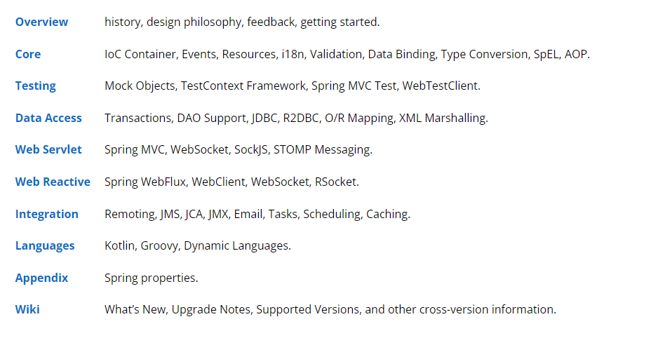

# Spring Framework 概要汇总
# 一、参考资料
文档：[https://docs.spring.io/spring-framework/docs/current/reference/html/](https://docs.spring.io/spring-framework/docs/current/reference/html/)



官网示例：[https://spring.io/guides](https://spring.io/guides)

中文文档：[http://geekdoc.top/docs/languages/java/spring-framework/5.3.11/reference/html/index.html](http://geekdoc.top/docs/languages/java/spring-framework/5.3.11/reference/html/index.html)

中文示例：[https://github.com/SpringForAll/spring-guides-translation](https://github.com/SpringForAll/spring-guides-translation)

---
[https://github.com/fuzhengwei/small-spring#bookmark-%E5%AD%A6%E4%B9%A0%E8%AF%B4%E6%98%8E](https://github.com/fuzhengwei/small-spring#bookmark-%E5%AD%A6%E4%B9%A0%E8%AF%B4%E6%98%8E)

[https://github.com/dunwu/spring-tutorial](https://github.com/dunwu/spring-tutorial)

Spring Validation：[https://www.cnblogs.com/sanye613/p/15027448.html](https://www.cnblogs.com/sanye613/p/15027448.html)

Spring i18n：[https://www.cnblogs.com/myitnews/p/14029345.html](https://www.cnblogs.com/myitnews/p/14029345.html)

Spring Resource：[https://blog.csdn.net/liu20111590/article/details/89180320](https://blog.csdn.net/liu20111590/article/details/89180320)

Sping MVC https://www.cnblogs.com/gupaoedu-tom/p/15719119.html

# 二、总体架构图
核心技术：依赖注入、事件、资源、i18n、验证、数据绑定、类型转换、SpEL、AOP。

测试：模拟对象、TestContext 框架、Spring MVC 测试、WebTestClient.

数据访问：事务、DAO 支持、JDBC、ORM、Marshalling XML。

Spring MVC和 Spring WebFlux Web 框架。

集成：远程处理、JMS、JCA、JMX、电子邮件、任务、调度、缓存。

语言：Kotlin、Groovy、动态语言。


# 三、Spring IOC
IoC 容器是 Spring 框架的核心。spring 容器使用依赖注入管理构成应用的组件，它会创建相互协作的组件之间的关联。毫无疑问，这些对象更简单干净，更容易理解，也更容易重用和测试。 Spring 自带了几种容器的实现，可归纳为两种类型：

* **BeanFactory**

由 org.springframework.beans.factory.BeanFactory 接口定义。 它是最简单的容器，提供基本的 DI 支持。

* **ApplicationContext**

由 org.springframework.context.ApplicationContext 接口定义。 它是基于 BeanFactory 之上构建，并提供面向应用的服务，例如从属性文件解析文本信息的能力，以及发布应用事件给感兴趣的事件监听者的能力。 ***注：Bean 工厂对于大多数应用来说往往太低级了，所以应用上下文使用更广泛。推荐在开发中使用应用上下文容器。***

Spring 自带了多种应用上下文，最可能遇到的有以下几种： 

`ClassPathXmlApplicationContext`：从类路径下的 XML 配置文件中加载上下文定义，把应用上下文定义文件当做类资源。 `FileSystemXmlApplicationContext`：读取文件系统下的 XML 配置文件并加载上下文定义。 `XmlWebApplicationContext`：读取 Web 应用下的 XML 配置文件并装载上下文定义。

***范例***

```java
ApplicationContext context = new FileSystemXmlApplicationContext("D:\Temp\build.xml");
ApplicationContext context2 = new ClassPathXmlApplicationContext("build.xml");
```
可以看到，加载 `FileSystemXmlApplicationContext` 和 `ClassPathXmlApplicationContext` 十分相似。 差异在于：前者在指定文件系统路径下查找 build.xml 文件；而后在所有类路径（包含 JAR 文件）下查找 build.xml 文件。 通过引用应用上下文，可以很方便的调用 getBean() 方法从 Spring 容器中获取 Bean。

**相关 jar 包**

* `spring-core`, `spring-beans`, 提供框架的基础部分，包括 IoC 和依赖注入特性。
* `spring-context`, 在`spring-core`, `spring-beans`基础上构建。它提供一种框架式的访问对象的方法。它也支持类似 Java EE 特性，例如：EJB，JMX 和基本 remoting。ApplicationContext 接口是它的聚焦点。
* `springcontext-support`, 集成第三方库到 Spring application context。
* `spring-expression`，提供一种强有力的表达语言在运行时来查询和操纵一个对象图。

# 四、Spring AOP
Spring 框架的一个关键组件是**面向方面的程序设计（AOP）**框架。一个程序中跨越多个点的功能被称为**横切关注点**，这些横切关注点在概念上独立于应用程序的业务逻辑。有各种各样常见的很好的关于方面的例子，比如日志记录、声明性事务、安全性，和缓存等等。

在 OOP 中模块化的关键单元是类，而在 AOP 中模块化的关键单元是方面。AOP 帮助你将横切关注点从它们所影响的对象中分离出来，然而依赖注入帮助你将你的应用程序对象从彼此中分离出来。

Spring 框架的 AOP 模块提供了面向方面的程序设计实现，允许你定义拦截器方法和切入点，可以实现将应该被分开的代码干净的分开功能。我将在一个独立的章节中讨论更多关于 Spring AOP 的概念。

**相关 jar 包**

* `spring-aop`，提供了对面向切面编程的丰富支持。
* `spring-aspects`，提供了对 AspectJ 的集成。
* `spring-instrument`，提供了对类 instrumentation 的支持和类加载器。
* `spring-instrument-tomcat`，包含了 Spring 对 Tomcat 的 instrumentation 代理。

# 五、Spring Data
Spring Data的主要任务是为数据访问提供一个相似的、一致的、基于Spring的编程模型，同时又保留着下面各个数据存储的特征。它使得使用数据访问技术非常的简单，包括关系型和非关系型数据库、map-reduce框架、云数据服务等。这是一个伞项目，它包含许多指定数据库的子项目。这个项目是许多公司和开发者一起开发而成的，他们是这项令人兴奋的技术的幕后作者。

* 主要的模块
* Spring Data Commons 每一个Spring Data项目的核心基础概念
* Spring Data Gemfire 提供了从Spring应用的简单的配置和访问Gemfire
* Spring Data JPA 提供了非常简单的基于JPA仓库的实现
* Spring Data JDBC 基于JDBC的仓库
* Spring Data KeyValue 基于Map的仓库和非常简单的创建键-值存储的模块
* Spring Data LDAP 为Spring LDAP提供仓库支持
* Spring Data MongoDB 为MongoDB提供基于Spring的文档实体和存储
* Spring Data REST 作为超媒体RESTful资源输出Spring Data存储
* Spring Data Redis 提供简单的配置和从Spring应用到redis的访问
* Spring Data for Apache Cassandra ——Apache Cassandra的Spring Data模块
* Spring Data for Apache Solr ——Apache Solr 的Spring Data模块

社区模块

* Spring Data Aerospike
* Spring Data ArangoDB
* Spring Data Couchbase
* Spring Data Azure DocumentDB
* Spring Data DynamoDB
* Spring Data Elasticsearch
* Spring Data Hazelcast
* Spring Data Jest
* Spring Data Neo4j
* Spring Data Vault

相关模块

* Spring Data JDBC Extensions 在Spring框架内提供了JDBC的扩展
* Spring for Apache Hadoop 提供统一的配置模型、为HDFS, MapReduce, Pig,和 Hive提供API，简化了Hadoop。
* Spring Content 使内容和你的Spring Data实体发生联系，存储在不同的存储介质中，File-system, S3, Database 或者MongoDB

# 五、Spring MVC
Spring MVC 是 Spring 提供的一个基于 MVC 设计模式的轻量级 Web 开发框架，本质上相当于 Servlet。Spring MVC 角色划分清晰，分工明细。由于 Spring MVC 本身就是 Spring 框架的一部分，可以说和 Spring 框架是无缝集成。性能方面具有先天的优越性，是当今业界最主流的 Web 开发框架，最热门的开发技能。

**SpringMVC九大组件**

|序号|组件名|解释|
| ----- | ----- | ----- |
|1|MultipartResolver|用于处理多文件上传请求。|
|2|LocaleResolver|用于从请求中解析出 Locale，是i18n的基础。|
|3|ThemeResolver|用来解析样式、图片及它们所形成的显示效果的集合。|
|4|HandlerMapping|保存Url和逻辑处理的映射关系，|
|5|HandlerAdapter|动态参数适配器，让固定的Servlet处理方法调用Handler来进行处理|
|6|HandlerExceptionResolver|用来处理Handler产生的异常情况的组件。|
|7|RequestToViewNameTranslator|从请求中获取ViewName|
|8|ViewResolvers|主要作用是将String类型的视图名和Locale解析为View类型的视图|
|9|FlashMapManager|用于重定向时的参数传递。|

# 五、Spring Event
Spring的事件通知机制是一项很有用的功能，使用事件机制我们可以将相互耦合的代码解耦，从而方便功能的修改与添加

```java
// 定义一个事件
public class EventDemo extends ApplicationEvent {
    private String message;
    public EventDemo(Object source, String message) {
        super(source);
        this.message = message;
    }
    public String getMessage() {
        return message;
    }
}

// 定义一个事件监听者
@Component
public class EventDemoListener implements ApplicationListener<EventDemo> {
    @Override
    public void onApplicationEvent(EventDemo event) {
        System.out.println("receiver " + event.getMessage());
    }
}

// 事件发布
@Component
public class EventDemoPublish {
    @Autowired
    private ApplicationEventPublisher applicationEventPublisher;
    public void publish(String message) {
        EventDemo demo = new EventDemo(this, message);
        applicationEventPublisher.publishEvent(demo);
    }
}
```
调用`EventDemoPublish.publish`方法来发布消息，`EventDemoListener`监听器接收到消息后对消息进行处理，打印出消息的内容：

```java
receiver hello
```
# 六、Spring Resource
Spring把其资源做了一个抽象，底层使用统一的资源访问接口来访问Spring的所有资源。也就是说，不管什么格式的文件，也不管文件在哪里，到Spring 底层，都只有一个访问接口，Resource。


# 七、Spring i18n
spring使用MessageSource接口实现国际化。两个实现类为： 

* ResourceBundleMessageSource：基于java的ResourceBundle实现了国际化，配置文件必须放在classpath下。
* ReloadableResourceBundleMessageSource：直接使用读取文件的方式实现国际化，规则跟java的相同，支持动态修改后刷新配置，避免在业务不能中断的情况下重启进程。配置文件可以放在任意目录下，指定目录后，该类会去指定目录中加载配置文件。

# 八、Spring Validation
`JSR303` 定义了 `Bean Validation`（校验）的标准 `validation-api`，但并没有提供实现。`Hibernate Validation`是对这个规范的实现 ，并且增加了 `@Email`、`@Length`、`@Range` 等注解。`Spring Validation` 底层依赖的就是`Hibernate Validation`。

* **JSR303**：JSR303是一项标准，只提供规范不提供实现。定义了校验规范即校验注解如：@Null、@NotNull、@Pattern。位于：`javax.validation.constraints`包下。
* **hibernate validation**：是对 JSR303 规范的实现并且进行了增强和扩展。并增加了注解：@Email、@Length、@Range等。
* **spring Validation**：是对Hibernate Validation的二次封装。在SpringMvc模块中添加了自动校验。并将校验信息封装到特定的类中。

**JSR 提供的校验注解：**

* `@Null` 被注释的元素必须为 null
* `@NotNull` 被注释的元素必须不为 null
* `@AssertTrue` 被注释的元素必须为 true
* `@AssertFalse` 被注释的元素必须为 false
* `@Min(value)` 被注释的元素必须是一个数字，其值必须大于等于指定的最小值
* `@Max(value)` 被注释的元素必须是一个数字，其值必须小于等于指定的最大值
* `@DecimalMin(value)` 被注释的元素必须是一个数字，其值必须大于等于指定的最小值
* `@DecimalMax(value)` 被注释的元素必须是一个数字，其值必须小于等于指定的最大值
* `@Size(max=, min=)` 被注释的元素的大小必须在指定的范围内
* `@Digits (integer, fraction)` 被注释的元素必须是一个数字，其值必须在可接受的范围内
* `@Past` 被注释的元素必须是一个过去的日期
* `@Future` 被注释的元素必须是一个将来的日期
* `@Pattern(regex=,flag=)` 被注释的元素必须符合指定的正则表达式

**Hibernate Validator提供的校验注解：**

* `@NotBlank(message =)` 验证字符串非 null，且长度必须大于 0
* `@Email` 被注释的元素必须是电子邮箱地址
* `@Length(min=,max=)` 被注释的字符串的大小必须在指定的范围内
* `@NotEmpty` 被注释的字符串的必须非空
* `@Range(min=,max=,message=)` 被注释的元素必须在合适的范围内