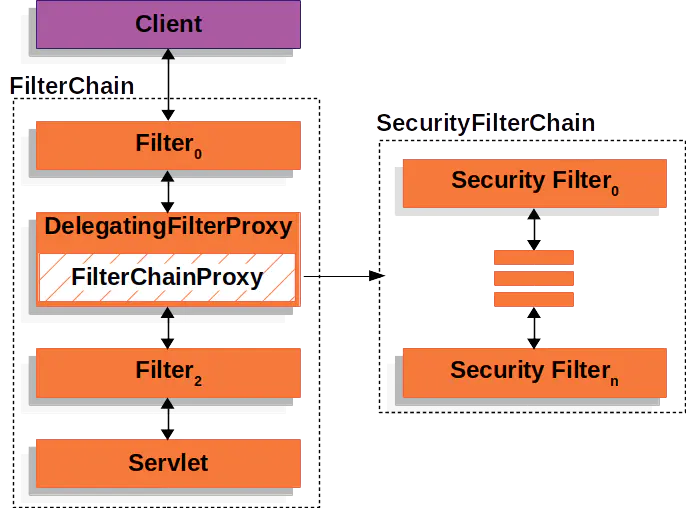

# Spring Security 简要说明与使用总结
# 一、参考资料
官方介绍：[https://spring.io/projects/spring-security#learn](https://spring.io/projects/spring-security#learn)

官方文档：[https://docs.spring.io/spring-security/reference/index.html](https://docs.spring.io/spring-security/reference/index.html)

视频教程：

[https://www.bilibili.com/video/BV15a411A7kP?from=search&seid=17101560721424929815&spm\_id\_from=333.337.0.0](https://www.bilibili.com/video/BV15a411A7kP?from=search&seid=17101560721424929815&spm_id_from=333.337.0.0)

[https://www.bilibili.com/video/BV1R54y1a7Cv](https://www.bilibili.com/video/BV1R54y1a7Cv)

文章推荐：

[http://www.tianshouzhi.com/api/tutorials/spring\_security\_4/250](http://www.tianshouzhi.com/api/tutorials/spring_security_4/250)

[https://zhuanlan.zhihu.com/p/349962352](https://zhuanlan.zhihu.com/p/349962352)

[https://www.cnblogs.com/yurunmiao/p/15787846.html](https://www.cnblogs.com/yurunmiao/p/15787846.html)

# 二、Spring Security 是什么？
Spring Security是Spring家族推出一款用于认证和授权的安全框架。该框架采用责任链的设计模式，由多个过滤器组成过滤器链来完成认证和授权的功能。框架的整体结构如图1所示。



图1中SecurityFilterChain中的N个过滤器就是Spring Security的核心部分。对于每个客户端的请求，在到达Controller之前，除了应用本身定义的过滤器之外，还需要通过Spring Security过滤器链的处理。认证和授权的实现，都隐藏在这条过滤器链中。下面是过滤器链中的部分过滤器以及它们处理请求的顺序。

|Filter|Duty|
| ----- | ----- |
|...| |
|LogoutFilter|用于处理退出登录请求|
|UsernamePasswordAuthenticationFilter|使用用户名和密码来进行登录认证|
|DefaultLoginPageGeneratingFilter| |
|DefaultLogoutPageGeneratingFilter| |
|...| |
|RememberMeAuthenticationFilter|记住我认证处理过滤器|
|AnonymousAuthenticationFilter|匿名认证处理过滤器|
|SessionManagementFilter|Session管理过滤器，用户管理session信息|
|ExceptionTranslationFilter|异常处理过滤器，用于处理认证过程中抛出的异常|
|FilterSecurityInterceptor|最后一个filter, 用于权限的判断|

上述过滤器中，最重要的是`UsernamePasswordAuthenticationFilter`过滤器。该过滤器会根据Post请求的用户名和密码产生一个token信息，然后调用`AuthenticationManager.authenticate(token)`来完成认证。

# 三、Spring Security 模块与依赖
## （1）Core - spring-security-core.jar
该模块包含核心身份验证和访问控制类和接口、远程支持和基本配置 API。任何使用 Spring Security 的应用程序都需要它。它支持独立应用程序、远程客户端、方法（服务层）安全性和 JDBC 用户配置。它包含以下顶级包：

* org.springframework.security.core（核心）
* org.springframework.security.access（访问）
* org.springframework.security.authentication（验证）
* org.springframework.security.provisioning（配置）

## （2）Remoting - spring-security-remoting.jar  
提供与Spring Remoting整合的支持，你并不需要这个除非你需要使用Spring Remoting写一个远程客户端。主包为： `org.springframework.security.remoting`.

## （3）Web - spring-security-web.jar
包含filters和相关web安全的基础代码。如果我们需要使用 Spring Security 进行web安全验证和基于URL的访问控制。主包为： `org.springframework.security.web`.

## （4）Config - spring-security-config.jar
包含security namespace的解析代码，如果你使用Spring Security XML进行安全配置，你需要引入这个jar。主包为： `org.springframework.security.config`。我们不应该在代码中直接使用这个jar中的类。

## （5）LDAP - spring-security-ldap.jar
LDAP验证和配置代码。如果你需要进行LDAP验证或者管理LDAP user entries。top package为： `org.springframework.security.ldap`.

## （6）ACL - spring-security-acl.jar
特定domain对象的ACL(访问控制列表)实现。使用其可以对特定对象的实例进行一些安全配置。顶级包为： `org.springframework.security.acls`.

## （7）CAS - spring-security-cas.jar
Spring Security CAS客户端集成。如果你需要使用一个single sign on服务器进行Spring Security web安全验证，需要引入。顶级包为： `org.springframework.security.cas`.

## （8）OpenID - spring-security-openid.jar
OpenId web验证支持。基于一个外部OpenId服务器对用户进行验证。顶级包为： `org.springframework.security.openid`，需要使用 OpenID4Java.

> 一般情况下，spring-securit-core和spring-securit-config都会引入，在web开发中，我们通常还会引入spring-security-web。

# 四、Spring Security 关键接口与抽象类
* **AuthenticationManager**: Spring Security默认的一个认证接口，定义了Spring Security认证的方法。默认的情况下，会在该方法中验证用户提交的信息，验证成功后将返回的`Authentication`对象保存到上下文中。在`UsernamePasswordAuthenticationFilter`会调用`AuthenticationManager`的`authenticate`方法进行认证。
* **ProviderManager**: `AuthenticationManager`最常用的实现。用于管理一个由`AuthenticationProvider`组成的链表。根据需要调用`AuthenticationProvider`提供的认证方式，如果全部都认证失败，则会抛出认证异常信息。
* **AuthenticationProvider**： 每个`AuthenticationProvider`代表了一种特定的认证方式。比如常用的`DAOAuthenticationProvider`会根据开发的需要加载`username`和`password`来进行认证。
* **DAOAuthenticationProvider**: 调用`UserDetailsService.loadUserByUsername()`方法得到用户信息，以供后续认证需要。
* **UserDetailsService**: 要完成用户的认证，必不可少的一部分就是验证用户的`username`和`password`是否正确。Spring Security提供In-Memory和配置文件保存用户名和密码，然而在真实的系统中，用户的信息通常保存在数据库中。加载用户信息的逻辑，通常需要实现Spring Security的`UserDetailsService`接口，并在对应的方法中返回一个`UserDetails`以供后续的认证和授权。
* **UserDetails**: `UserDetailsService.loadUserByUsername()`放回的类型，内部包含用户名、密码、权限等用户信息。`Authentication`中`Principal`通常也是一个`UserDetails`。
* **PassowrdEncoder**: 用户密码不可能明文保存，Spring Security提供了一些`PasswordEncoder`用于encode password。官方推荐使用的是`BCryptPasswordEncoder`。

## （1）Bean-springSecurityFilterChain
## （1）WebSecurityConfigurerAdapter类
## （2）HttpSecurity类
## （3）UserDetailsService类


## （4）POM文件依赖配置
```xml
<dependency>
    <groupId>org.springframework.boot</groupId>
    <artifactId>spring-boot-starter-security</artifactId>
</dependency>
```


