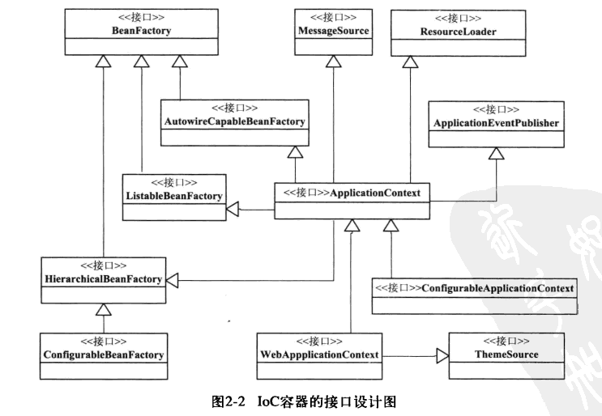
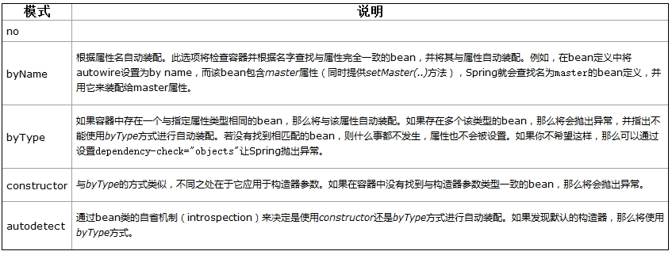

# SpringFramework之IOC
# 一、基本概要
IoC 容器是 Spring 的核心，也可以称为 Spring 容器。Spring 通过 IoC 容器来管理对象的实例化和初始化，以及对象从创建到销毁的整个生命周期。  

Spring 中使用的对象都由 IoC 容器管理，不需要我们手动使用 new 运算符创建对象。由 IoC 容器管理的对象称为 Spring Bean，Spring Bean 就是 Java 对象，和使用 new 运算符创建的对象没有区别。  

Spring 通过读取 XML 或 Java 注解中的信息来获取哪些对象需要实例化。  

Spring 提供 2 种不同类型的 IoC 容器，即 BeanFactory 和 ApplicationContext 容器。



参考资料：

IOC定义：[https://www.cnblogs.com/xdp-gacl/p/4249939.html](https://www.cnblogs.com/xdp-gacl/p/4249939.html)

Spring IOC：[http://c.biancheng.net/spring/ioc.html](http://c.biancheng.net/spring/ioc.html)

Spring Bean：[https://blog.csdn.net/riemann\_/article/details/118500805](https://blog.csdn.net/riemann_/article/details/118500805)

Spring 基于注解的配置：[https://www.w3cschool.cn/wkspring/rw2h1mmj.html](https://www.w3cschool.cn/wkspring/rw2h1mmj.html)

spring xml配置 bean beans标签：[https://blog.csdn.net/dgh112233/article/details/102865981](https://blog.csdn.net/dgh112233/article/details/102865981)

# 二、BeanFactory 容器
这是一个最简单的容器，它主要的功能是为依赖注入 （DI） 提供支持，这个容器接口在 org.springframework.beans.factory.BeanFactory中被定义。BeanFactory 和相关的接口，比如BeanFactoryAware、DisposableBean、InitializingBean，仍旧保留在 Spring 中，主要目的是向后兼容已经存在的和那些 Spring 整合在一起的第三方框架。

## （1）方法列表
* boolean containsBean(String beanName) 判断工厂中是否包含给定名称的bean定义，若有则返回true
* Object getBean(String) 返回给定名称注册的bean实例。根据bean的配置情况，如果是singleton模式将返回一个共享实例，否则将返回一个新建的实例，如果没有找到指定bean,该方法可能会抛出异常
* Object getBean(String, Class) 返回以给定名称注册的bean实例，并转换为给定class类型
* Class getType(String name) 返回给定名称的bean的Class,如果没有找到指定的bean实例，则排除NoSuchBeanDefinitionException异常
* boolean isSingleton(String) 判断给定名称的bean定义是否为单例模式
* String\[\] getAliases(String name) 返回给定bean名称的所有别名

## （2）源码
```java
package org.springframework.beans.factory;  
import org.springframework.beans.BeansException;  
public interface BeanFactory {  
    String FACTORY_BEAN_PREFIX = "&";  
    Object getBean(String name) throws BeansException;  
    <T> T getBean(String name, Class<T> requiredType) throws BeansException;  
    <T> T getBean(Class<T> requiredType) throws BeansException;  
    Object getBean(String name, Object... args) throws BeansException;  
    boolean containsBean(String name);  
    boolean isSingleton(String name) throws NoSuchBeanDefinitionException;  
    boolean isPrototype(String name) throws NoSuchBeanDefinitionException;  
    boolean isTypeMatch(String name, Class<?> targetType) throws NoSuchBeanDefinitionException;  
    Class<?> getType(String name) throws NoSuchBeanDefinitionException;  
    String[] getAliases(String name);  
}
```
# 三、ApplicationContext 容器（上下文）
`org.springframework.context.ApplicationContext` 接口代表 Spring IoC 容器，负责实例化、配置和组装 bean。 容器通过读取配置元数据来获取有关要实例化、配置和组装哪些对象的指令。 配置元数据以 XML、Java 注解或 Java 代码表示。 它可以让您表达组成应用程序的对象以及这些对象之间丰富的相互依赖关系。

`ApplicationContext` 接口的几个实现由 Spring 提供。 在单机应用中，创建`ClassPathXmlApplicationContext` 或 `FileSystemXmlApplicationContext`。 虽然 XML 一直是定义配置元数据的传统格式，但您可以通过提供少量 XML 配置来声明性地启用对这些附加元数据格式的支持，从而指示容器使用 Java 注解或代码作为元数据格式。

在大多数应用场景中，不需要显式的用户代码来实例化一个或多个 Spring IoC 容器实例。

## （1）FileSystemXmlApplicationContext
FileSystemXmlApplicationContext 类位于 org.springframework.context.support 包中，它同样是 ApplicationContext 接口的实现类，与 ClassPathXmlApplicationContext 类的区别在于读取 Spring 配置文件的方式。它不再从类路径中获取配置文件，而是通过参数指定配置文件的位置，可以获取类路径之外的资源。

```java
public static void main(String[] args){
  FileSystemXmlApplicationContext context = 
  new FileSystemXmlApplicationContext("d:\\appContext.xml");  //加载配置文件
}
```
## （2）ClassPathXmlApplicationContext
ClassPathXmlApplicationContext 类位于 org.springframework.context.support 包中，它是 ApplicationContext 接口的实现类之一，从当前类路径中检索配置文件并装载它来创建容器的示例。

```java
public static void main(String[] args){
  String[] locations = {"appContext.xml","daoConfig.xml","viewConfig"};  //定义保存配置文件的字符串数组
  ClassPathXmlApplicationContext context = 
  new ClassPathXmlApplicationContext(locations);  //加载配置文件
}
```
## （3）WebXmlApplicationContext
WebApplicationContext是专门为web应用准备的,他允许从相对于web根目录的路劲中装载配置文件完成初始化工作，从WebApplicationContext中可以获得ServletContext的引用，整个Web应用上下文对象将作为属性放置在ServletContext中，以便web应用可以访问spring上下文。

## （4）AnnotationConfigApplicationContext


# 四、Bean的定义
## （1）Bean命名
每个 bean 都有一个或多个标识符。 这些标识符在承载 bean 的容器中必须是唯一的。 一个 bean 通常只有一个标识符。 但是，如果需要多个，则可以将多余的视为别名。

在基于 XML 的配置元数据中，您可以使用 `id` 属性、`name` 属性或两者来指定 bean 标识符。 `id` 属性允许您指定一个 id。 通常，这些名称是字母数字（'myBean'、'someService' 等），但它们也可以包含特殊字符。 

您不需要为 bean 提供 `name` 或 `id`。 如果您没有明确提供 `name` 或 `id`，容器将为该 bean 生成一个唯一的名称。 但是，如果您想通过名称引用该 bean，通过使用 `ref` 元素或服务定位器样式查找，您必须提供名称。

> 约定是在命名 bean 时对实例字段名称使用标准 Java 约定。 也就是说，bean 名称以小写字母开头，并从那里开始使用驼峰式大小写。 此类名称的示例包括 `accountManager`、`accountService`、`userDao`、`loginController` 等。


# 五、Spring Bean配置方式
Spring IoC 容器使用一种形式的配置元数据。 此配置元数据表示您作为应用程序开发人员如何告诉 Spring 容器实例化、配置和组装应用程序中的对象。
## （1）基于注解的配置
### @Autowired
@Autowired是用在JavaBean中的注解，通过byType形式，用来给指定的字段或方法注入所需的外部资源。

两者的功能是一样的，就是能**减少或者消除属性或构造器参数的设置**，只是配置地方不一样而已。

autowire四种模式的区别：



### @Required
注解应用于 bean 属性的 setter 方法，它表明受影响的 bean 属性在配置时必须放在 XML 配置文件中，否则容器就会抛出一个 BeanInitializationException 异常。下面显示的是一个使用 @Required 注解的示例。

示例：

下面是 **Student.java** 文件的内容：

```Plain Text
package com.tutorialspoint;
import org.springframework.beans.factory.annotation.Required;
public class Student {
   private Integer age;
   private String name;
   @Required
   public void setAge(Integer age) {
      this.age = age;
   }
   public Integer getAge() {
      return age;
   }
   @Required
   public void setName(String name) {
      this.name = name;
   }
   public String getName() {
      return name;
   }
}
```
下面是 **MainApp.java** 文件的内容：

```Plain Text
package com.tutorialspoint;
import org.springframework.context.ApplicationContext;
import org.springframework.context.support.ClassPathXmlApplicationContext;
public class MainApp {
   public static void main(String[] args) {
      ApplicationContext context = new ClassPathXmlApplicationContext("Beans.xml");
      Student student = (Student) context.getBean("student");
      System.out.println("Name : " + student.getName() );
      System.out.println("Age : " + student.getAge() );
   }
}
```
下面是配置文件 **Beans.xml:** 文件的内容：

```Plain Text
<?xml version="1.0" encoding="UTF-8"?>

<beans xmlns="http://www.springframework.org/schema/beans"
    xmlns:xsi="http://www.w3.org/2001/XMLSchema-instance"
    xmlns:context="http://www.springframework.org/schema/context"
    xsi:schemaLocation="http://www.springframework.org/schema/beans
    http://www.springframework.org/schema/beans/spring-beans-3.0.xsd
    http://www.springframework.org/schema/context
    http://www.springframework.org/schema/context/spring-context-3.0.xsd">

   <context:annotation-config/>

   <!-- Definition for student bean -->
   <bean id="student" class="com.tutorialspoint.Student">
      <property name="name"  value="Zara" />
   </bean>

</beans>

```
一旦你已经完成的创建了源文件和 bean 配置文件，让我们运行一下应用程序。如果你的应用程序一切都正常的话，这将引起 *BeanInitializationException* 异常，并且会输出一下错误信息和其他日志消息：

```Plain Text
Property 'age' is required for bean 'student'
```
下一步，在你按照如下所示从 “age” 属性中删除了注解，你可以尝试运行上面的示例：

```Plain Text
<?xml version="1.0" encoding="UTF-8"?>

<beans xmlns="http://www.springframework.org/schema/beans"
    xmlns:xsi="http://www.w3.org/2001/XMLSchema-instance"
    xmlns:context="http://www.springframework.org/schema/context"
    xsi:schemaLocation="http://www.springframework.org/schema/beans
    http://www.springframework.org/schema/beans/spring-beans-3.0.xsd
    http://www.springframework.org/schema/context
    http://www.springframework.org/schema/context/spring-context-3.0.xsd">

   <context:annotation-config/>

   <!-- Definition for student bean -->
   <bean id="student" class="com.tutorialspoint.Student">
      <property name="name"  value="Zara" />
      <property name="age"  value="11"/>
   </bean>

</beans>

```
现在上面的示例将产生如下结果：

```Plain Text
Name : Zara
Age : 11
```
### **@Primary**
由于按类型自动装配可能会导致多个候选对象，因此通常需要对选择过程进行更多控制。 实现此目的的一种方法是使用 Spring 的 `@Primary` 注解。 `@Primary` 表示当多个 bean 是自动装配到单值依赖项的候选者时，应优先考虑特定 bean。 如果候选中恰好存在一个主要 bean，则它成为自动装配的值。

```java
  @Component
     @Primary
     public class FooFormatter implements Formatter {
         public String format() {
             return "foo";
         }
     }
 
     @Component
     public class BarFormatter implements Formatter {
         public String format() {
             return "bar";
         }
     }
```
在这种情况下，`@Primary` 注解指定了默认注入的是 `FooFormatter`，消除了场景中的注入歧义。

### **@Qualifier**
如果我们尝试将 `FooService` 加载到我们的上下文中，**Spring** 框架将抛出 `NoUniqueBeanDefinitionException`。这是因为 **Spring** 不知道要注入哪个 **bean**。为了避免这个问题，有几种解决方案。那么我们本文要讲解的 `@Qualifier` 注解就是其中之一。

```java
    @Component("fooFormatter")
    public class FooFormatter implements Formatter {
        public String format() {
            return "foo";
        }
    }

    @Component("barFormatter")
    public class BarFormatter implements Formatter {
        public String format() {
            return "bar";
        }
    }

    @Component
    public class FooService {
        @Autowired
        private Formatter formatter;
        
        //todo 
    }
```
通过将 `@Qualifier` 注解与我们想要使用的特定 **Spring bean** 的名称一起进行装配，**Spring** 框架就能从多个相同类型并满足装配要求的 **bean** 中找到我们想要的，避免让Spring脑裂。

### **@Resource**
全称`javax.annotation.Resource`,它属于JSR-250规范的一个注解，包含Jakarta EE（J2EE）中。Spring提供了对该注解的支持。

该注解使用在成员属性和setter方法上。默认情况下`@Resource`按照名称注入，如果没有显式声明名称则按照变量名称或者方法中对应的参数名称进行注入。

@Resource装配顺序：

①如果同时指定了name和type，则从Spring上下文中找到唯一匹配的bean进行装配，找不到则抛出异常。

②如果指定了name，则从上下文中查找名称（id）匹配的bean进行装配，找不到则抛出异常。

③如果指定了type，则从上下文中找到类似匹配的唯一bean进行装配，找不到或是找到多个，都会抛出异常。

④如果既没有指定name，又没有指定type，则自动按照byName方式进行装配；如果没有匹配，则回退为一个原始类型进行匹配，如果匹配则自动装配。

@Resource的作用相当于@Autowired，只不过@Autowired按照byType自动注入。

### **@Value**
不通过配置文件的注入属性的情况
通过@Value将外部的值动态注入到Bean中，使用的情况有：

```java
@Value("normal")
    private String normal; // 注入普通字符串

    @Value("#{systemProperties['os.name']}")
    private String systemPropertiesName; // 注入操作系统属性

    @Value("#{ T(java.lang.Math).random() * 100.0 }")
    private double randomNumber; //注入表达式结果

    @Value("#{beanInject.another}")
    private String fromAnotherBean; // 注入其他Bean属性：注入beanInject对象的属性another，类具体定义见下面

    @Value("classpath:com/hry/spring/configinject/config.txt")
    private Resource resourceFile; // 注入文件资源

    @Value("http://www.baidu.com")
    private Resource testUrl; // 注入URL资源
```
### **@PostConstruct**
@PostConstruct注解好多人以为是Spring提供的。其实是Java自己的注解。

Java中该注解的说明：@PostConstruct该注解被用来修饰一个非静态的void（）方法。被@PostConstruct修饰的方法会在服务器加载Servlet的时候运行，并且只会被服务器执行一次。PostConstruct在构造函数之后执行，init（）方法之前执行。

通常我们会是在Spring框架中使用到@PostConstruct注解 该注解的方法在整个Bean初始化中的执行顺序：

Constructor(构造方法) -> @Autowired(依赖注入) -> @PostConstruct(注释的方法)

```java
package com.example.studySpringBoot.util;
 
import com.example.studySpringBoot.service.MyMethorClassService;
import org.springframework.beans.factory.annotation.Autowired;
import org.springframework.stereotype.Component;
 
import javax.annotation.PostConstruct;
 
@Component
public class MyUtils {
 
    private static MyUtils          staticInstance = new MyUtils();
 
    @Autowired
    private MyMethorClassService    myService;
 
    @PostConstruct
    public void init(){
        staticInstance.myService = myService;
    }
 
    public static Integer invokeBean(){
        return staticInstance.myService.add(10,20);
    }
}
```
* **@PreDestroy**

被@PreDestroy修饰的方法会在服务器卸载Servlet的时候运行，并且只会被服务器调用一次，类似于Servlet的destroy()方法。被@PreDestroy修饰的方法会在destroy()方法之后运行，在Servlet被彻底卸载之前。执行顺序如下所示。
## （2）类路径扫描和托管组件
#### **@Component**** 和进一步的定型注解**
Spring 提供了更多构造型注解：`@Component`、`@Service` 和 `@Controller`。 `@Component` 是任何 Spring 管理的组件的通用构造型。 `@Repository`、`@Service` 和 `@Controller` 是 `@Component` 的特化，用于更具体的用例（在分别为持久层、服务层和表示层）。因此，您可以使用 `@Component` 注解您的组件类，但是，通过使用 `@Repository`、`@Service` 或 `@ 注解它们Controller` 相反，您的类更适合由工具处理或与切面相关联。例如，这些构造型注解是切入点的理想目标。 `@Repository`、`@Service` 和 `@Controller` 还可以在 Spring Framework 的未来版本中携带额外的语义。因此，如果您在服务层使用 `@Component` 或 `@Service` 之间做出选择，`@Service` 显然是更好的选择。同样，如前所述，`@Repository` 已经被支持作为持久层中自动异常转换的标记。

#### **使用过滤器自定义扫描**
|Filter Type|Example Expression|Description|
| ----- | ----- | ----- |
|annotation (default)|org.example.SomeAnnotation|An annotation to be *present* or *meta-present* at the type level in target components.|
|assignable|org.example.SomeClass|A class (or interface) that the target components are assignable to (extend or implement).|
|aspectj|org.example..*Service+|An AspectJ type expression to be matched by the target components.|
|regex|org\.example\.Default.*|A regex expression to be matched by the target components' class names.|
|custom|org.example.MyTypeFilter|A custom implementation of the `org.springframework.core.type.TypeFilter` interface.|

示例：

```java
@Configuration
@ComponentScan(basePackages = "org.example",
        includeFilters = @Filter(type = FilterType.REGEX, pattern = ".*Stub.*Repository"),
        excludeFilters = @Filter(Repository.class))
public class AppConfig {
    // ...
}
```
## （3）基于 Java 的容器配置
### **基本概念：****@Bean**** 和 ****@Configuration**
Spring 的新 Java 配置支持中的核心工件是 `@Configuration` 注解类和 `@Bean` 注解方法。

`@Bean` 注解用于指示一个方法实例化、配置和初始化一个由 Spring IoC 容器管理的新对象。 对于熟悉 Spring 的 XML 配置的人来说，`@Bean` 注解与 元素扮演着相同的角色。 您可以将带有 `@Bean` 注解的方法与任何 Spring `@Component` 一起使用。 然而，它们最常与 `@Configuration` bean 一起使用。

用 `@Configuration` 注解一个类表明它的主要目的是作为 bean 定义的来源。 此外，`@Configuration` 类允许通过调用同一类中的其他 `@Bean` 方法来定义 bean 间的依赖关系。 最简单的 `@Configuration` 类如下：

```java
@Configuration
public class AppConfig {

    @Bean
    public MyService myService() {
        return new MyServiceImpl();
    }
}
```
### **使用 ****AnnotationConfigApplicationContext**** 实例化 Spring 容器**
以下部分记录了 Spring 3.0 中引入的 Spring `AnnotationConfigApplicationContext`。 这个多功能的 `ApplicationContext` 实现不仅能够接受 `@Configuration` 类作为输入，还能够接受普通的 `@Component` 类和用 JSR-330 元数据注解的类 .

当 `@Configuration` 类作为输入提供时，`@Configuration` 类本身被注册为 bean 定义和类中所有声明的 `@Bean` 方法 也注册为 bean 定义。

当 `@Component` 和 JSR-330 类被提供时，它们被注册为 bean 定义，并且假设 DI 元数据如 `@Autowired` 或 `@Inject< /code> 在必要时在这些类中使用。`

```java
public static void main(String[] args) {
    ApplicationContext ctx = new AnnotationConfigApplicationContext(AppConfig.class);
    MyService myService = ctx.getBean(MyService.class);
    myService.doStuff();
}
```
### **使用****register(Class… )****以编程方式构建容器**
您可以使用无参数构造函数实例化 `AnnotationConfigApplicationContext`，然后使用 `register()` 方法对其进行配置。 这种方法在以编程方式构建 `AnnotationConfigApplicationContext` 时特别有用。 以下示例显示了如何执行此操作：

```java
public static void main(String[] args) {
    AnnotationConfigApplicationContext ctx = new AnnotationConfigApplicationContext();
    ctx.register(AppConfig.class, OtherConfig.class);
    ctx.register(AdditionalConfig.class);
    ctx.refresh();
    MyService myService = ctx.getBean(MyService.class);
    myService.doStuff();
}
```
### **使用 ****scan(String… )**** 启用组件扫描**
要启用组件扫描，您可以按如下方式注解 `@Configuration` 类：

```java
@Configuration
@ComponentScan(basePackages = "com.acme") 
public class AppConfig  {
    // ...
}
```
#  六、Spring Bean 依赖注入
## （1）基于构造函数的依赖注入
**代码示例：**

```java
public class AccountServiceImpl implements IAccountService {

    //如果是经常变化的数据，并不适用于注入的方式
    private String name;
    private Integer age;
    private Date birthday;

    public AccountServiceImpl(String name,Integer age,Date birthday){
        this.name = name;
        this.age = age;
        this.birthday = birthday;
    }

    public void  saveAccount(){
        System.out.println("service中的saveAccount方法执行了。。。"+name+","+age+","+birthday);
    }
}

```
**xml配置：**

```xml
   <!--构造函数注入：
        使用的标签:constructor-arg
        标签出现的位置：bean标签的内部
        标签中的属性
            type：用于指定要注入的数据的数据类型，该数据类型也是构造函数中某个或某些参数的类型
            index：用于指定要注入的数据给构造函数中指定索引位置的参数赋值。索引的位置是从0开始
            name：用于指定给构造函数中指定名称的参数赋值                                        常用的
            =============以上三个用于指定给构造函数中哪个参数赋值===============================
            value：用于提供基本类型和String类型的数据
            ref：用于指定其他的bean类型数据。它指的就是在spring的Ioc核心容器中出现过的bean对象

        优势：
            在获取bean对象时，注入数据是必须的操作，否则对象无法创建成功。
        弊端：
            改变了bean对象的实例化方式，使我们在创建对象时，如果用不到这些数据，也必须提供。
    -->
    <bean id="accountService" class="com.lp.service.impl.AccountServiceImpl">
        <constructor-arg name="name" value="泰斯特"></constructor-arg>
        <constructor-arg name="age" value="18"></constructor-arg>
        <constructor-arg name="birthday" ref="now"></constructor-arg>
    </bean>

    <!-- 配置一个日期对象 -->
    <bean id="now" class="java.util.Date"></bean>
```
## （2）setter注入
**代码示例：**

```java
public class AccountServiceImpl3 implements IAccountService {

    private String[] myStrs;
    private List<String> myList;
    private Set<String> mySet;
    private Map<String,String> myMap;
    private Properties myProps;
    public void setMyStrs(String[] myStrs) {
        this.myStrs = myStrs;
    }
    public void setMyList(List<String> myList) {
        this.myList = myList;
    }
    public void setMySet(Set<String> mySet) {
        this.mySet = mySet;
    }
    public void setMyMap(Map<String, String> myMap) {
        this.myMap = myMap;
    }
    public void setMyProps(Properties myProps) {
        this.myProps = myProps;
    }
    public void  saveAccount(){
        System.out.println(Arrays.toString(myStrs));
        System.out.println(myList);
        System.out.println(mySet);
        System.out.println(myMap);
        System.out.println(myProps);
    }

}
```
**xml配置：**

```xml
 <!-- 配置一个日期对象 -->
    <bean id="now" class="java.util.Date"></bean>

    <!-- set方法注入                更常用的方式
        涉及的标签：property
        出现的位置：bean标签的内部
        标签的属性
            name：用于指定注入时所调用的set方法名称
            value：用于提供基本类型和String类型的数据
            ref：用于指定其他的bean类型数据。它指的就是在spring的Ioc核心容器中出现过的bean对象
        优势：
            创建对象时没有明确的限制，可以直接使用默认构造函数
        弊端：
            如果有某个成员必须有值，则获取对象是有可能set方法没有执行。
    -->
    <bean id="accountService2" class="com.lp.service.impl.AccountServiceImpl2">
        <property name="name" value="TEST" ></property>
        <property name="age" value="21"></property>
        <property name="birthday" ref="now"></property>
    </bean>
```
# 七、Spring Bean生命周期
|类别|说明|
| ----- | ----- |
|singleton|在Spring IoC容器中仅存在一个Bean实例，Bean以单例方式存在，默认值|
|prototype|每次从容器中调用Bean时，都返回一个新的实例，即每次调用getBean()时，相当于执行new XxxBean()|
|request|每次HTTP请求都会创建一个新的Bean，该该作用域仅适用于WebApplicationContext环境|
|session|同一个HTTP Session共享一个Bean，不同Session使用不同Bean，仅适用于WebApplicationContext环境|
|globalSession|一般用于Portlet应用环境，该作用域仅适用于WebApplicationContext环境|

五种作用域中，**request、session** 和 **global session** 三种作用域仅在基于web的应用中使用（不必关心你所采用的是什么web应用框架），只能用在基于 web 的 Spring ApplicationContext 环境。