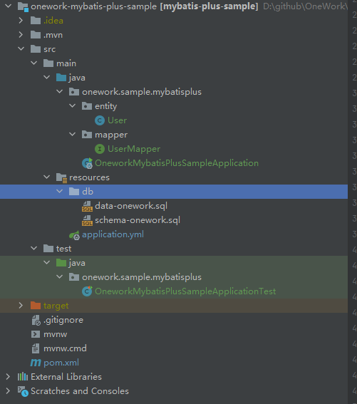
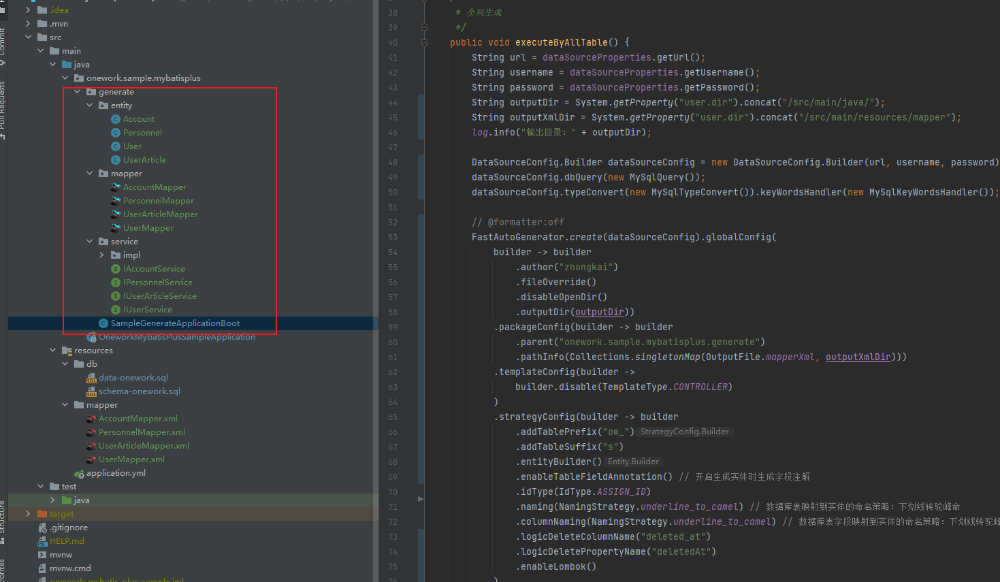
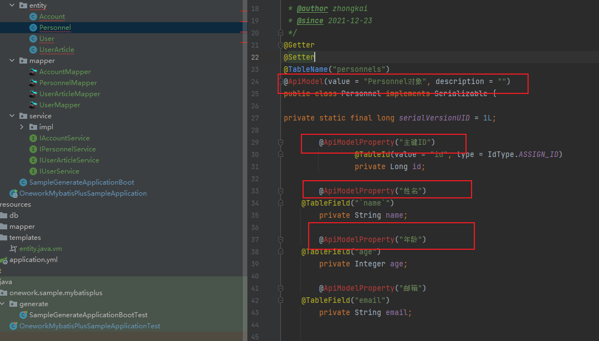
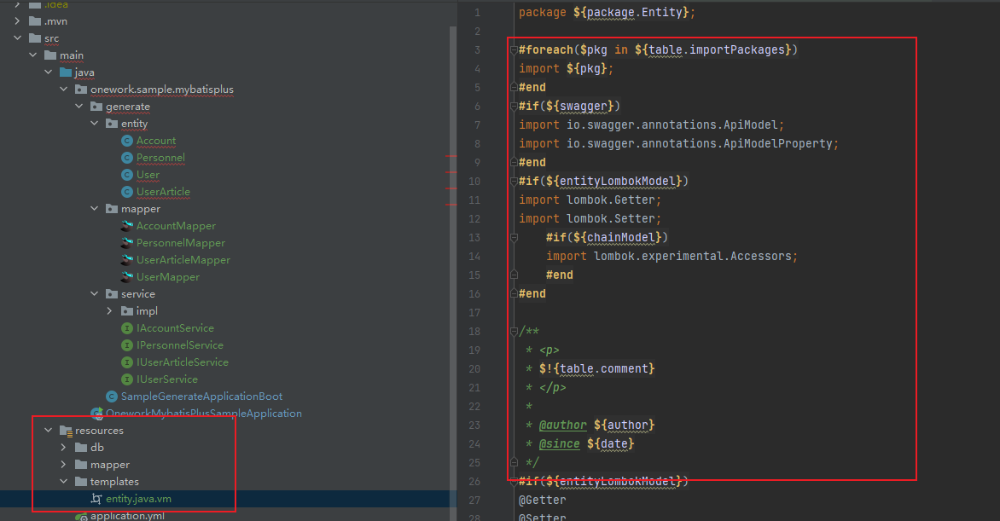
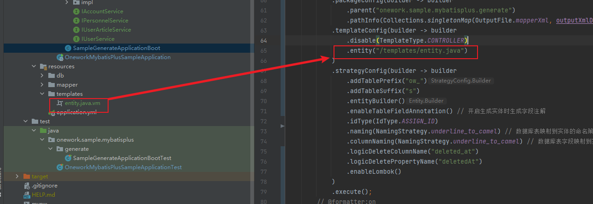
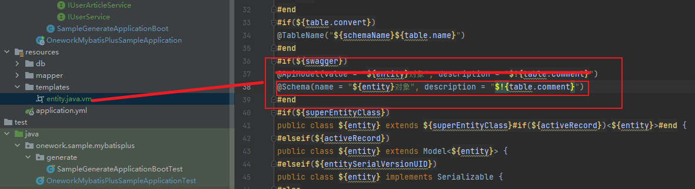
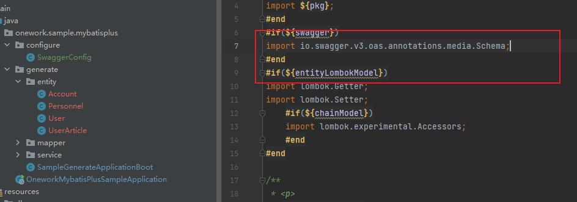
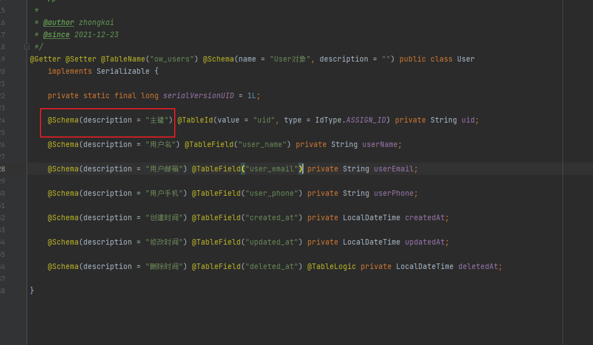
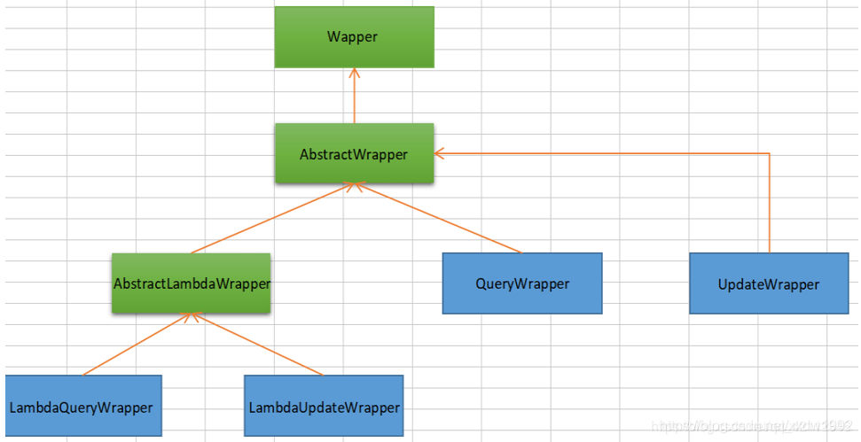

# mybaits plus的使用与代码生成器扩展
# 一、简要说明
MyBatis-Plus (opens new window)（简称 MP）是一个 MyBatis (opens new window)的增强工具，在 MyBatis 的基础上只做增强不做改变，为简化开发、提高效率而生。

## （1）特性
* **无侵入**：只做增强不做改变，引入它不会对现有工程产生影响，如丝般顺滑
* **损耗小**：启动即会自动注入基本 CURD，性能基本无损耗，直接面向对象操作
* **强大的 CRUD 操作**：内置通用 Mapper、通用 Service，仅仅通过少量配置即可实现单表大部分 CRUD 操作，更有强大的条件构造器，满足各类使用需求
* **支持 Lambda 形式调用**：通过 Lambda 表达式，方便的编写各类查询条件，无需再担心字段写错
* **支持主键自动生成**：支持多达 4 种主键策略（内含分布式唯一 ID 生成器 - Sequence），可自由配置，完美解决主键问题
* **支持 ActiveRecord 模式**：支持 ActiveRecord 形式调用，实体类只需继承 Model 类即可进行强大的 CRUD 操作
* **支持自定义全局通用操作**：支持全局通用方法注入（ Write once, use anywhere ）
* **内置代码生成器**：采用代码或者 Maven 插件可快速生成 Mapper 、 Model 、 Service 、 Controller 层代码，支持模板引擎，更有超多自定义配置等您来使用
* **内置分页插件**：基于 MyBatis 物理分页，开发者无需关心具体操作，配置好插件之后，写分页等同于普通 List 查询
* **分页插件支持多种数据库**：支持 MySQL、MariaDB、Oracle、DB2、H2、HSQL、SQLite、Postgre、SQLServer 等多种数据库
* **内置性能分析插件**：可输出 SQL 语句以及其执行时间，建议开发测试时启用该功能，能快速揪出慢查询
* **内置全局拦截插件**：提供全表 delete 、 update 操作智能分析阻断，也可自定义拦截规则，预防误操作

## （2）参考资料
文档：[https://baomidou.com/](https://baomidou.com/)

代码：[https://github.com/baomidou/mybatis-plus](https://github.com/baomidou/mybatis-plus)

# 二、构建CRUD操作示例
**完整目录结构：**



## （1）引入MyBaits-Plus的Sping boot的启动器
* 在pom.xml文件中加入`mybatis-plus-boot-starter`，同时加入lombok、mysql-connector-java、便于后续的示例

```xml
<dependencies>
        <dependency>
            <groupId>org.springframework.boot</groupId>
            <artifactId>spring-boot-starter</artifactId>
        </dependency>
        <dependency>
            <groupId>com.baomidou</groupId>
            <artifactId>mybatis-plus-boot-starter</artifactId>
            <version>3.4.3.4</version>
        </dependency>
        <dependency>
            <groupId>mysql</groupId>
            <artifactId>mysql-connector-java</artifactId>
            <version>8.0.27</version>
        </dependency>
        <dependency>
            <groupId>org.projectlombok</groupId>
            <artifactId>lombok</artifactId>
            <optional>true</optional>
        </dependency>
        <dependency>
            <groupId>org.springframework.boot</groupId>
            <artifactId>spring-boot-starter-test</artifactId>
            <scope>test</scope>
        </dependency>
  </dependencies>
```
* 在`application.yml` 加入数据库连接配置参数

```yaml
spring:
  datasource:
    username: root
    password: 123456
    driver-class-name: com.mysql.cj.jdbc.Driver
    url: jdbc:mysql://127.0.0.1:3306/onework-test?useUnicode=true&characterEncoding=UTF8&serverTimezone=Asia/Shanghai
  sql:
    init:
      schema-locations: classpath:db/schema-onework.sql
      data-locations: classpath:db/data-onework.sql
      mode: always
mybatis-plus:
  configuration:
    log-impl: org.apache.ibatis.logging.stdout.StdOutImpl
```
## （2）准备初始数据库脚本示例
在运行程序后，会自动执行以下脚本，`spring.datasource.schema`、`spring.datasource.data`

Sping Boot 数据库初始化资料：[https://docs.spring.io/spring-boot/docs/current/reference/html/howto.html#howto.data-initialization.using-basic-sql-scripts](https://docs.spring.io/spring-boot/docs/current/reference/html/howto.html#howto.data-initialization.using-basic-sql-scripts)

* 创建表结构：classpath:db/schema-onework.sql 

```sql
DROP TABLE IF EXISTS personnels;

CREATE TABLE personnels
(
    id    BIGINT(20)  NOT NULL COMMENT '主键ID',
    name  VARCHAR(30) NULL DEFAULT NULL COMMENT '姓名',
    age   INT(11)     NULL DEFAULT NULL COMMENT '年龄',
    email VARCHAR(50) NULL DEFAULT NULL COMMENT '邮箱',
    PRIMARY KEY (id)
);
```
* 初始化数据：classpath:db/data-onework.sql

```sql
DELETE
FROM personnels;

INSERT INTO personnels (id, name, age, email)
VALUES (1, 'Jone', 18, 'test1@baomidou.com'),
       (2, 'Jack', 20, 'test2@baomidou.com'),
       (3, 'Tom', 28, 'test3@baomidou.com'),
       (4, 'Sandy', 21, 'test4@baomidou.com'),
       (5, 'Billie', 24, 'test5@baomidou.com');
```
## （3）构建数据库表对应Mapper类
* 创建数据库表对应实体类
 引入lombok，在类文件上加入`@Data` 注释，[[附属二、Lombok 功能介绍 id=&#39;8bd7bf05-2f05-438b-acfa-a7d6a31b1ff0&#39;]]

```java
@Data
public class Personnel {
    private Long id;
    private String name;
    private Integer age;
    private String email;
}
```
* 构建实体对应的Mapper接口类
创建实体对应的接口类，继承`BaseMapper<Personnel>` ，`Personnel`为对于的实体类

```java
public interface PersonnelMapper extends BaseMapper<Personnel> {
}
```
## （4）在Sping Boot 启动类加上Mapper扫描注解
```java
@SpringBootApplication()
@MapperScan("onework.sample.mybatisplus.mapper")
public class OneworkMybatisPlusSampleApplication {

    public static void main(String[] args) {
        SpringApplication.run(OneworkMybatisPlusSampleApplication.class, args);
    }
}
```
## （5）编写CRUD的测试方法
* **查询**

```java
    @Test
    void test1() {
        System.out.println(("----- selectAll method test ------"));
        List<Personnel> personnelList = personnelMapper.selectList(null);
        Assertions.assertEquals(5, personnelList.size());
        personnelList.forEach(System.out::println);
    }
```
输出结果：

```Plain Text
==>  Preparing: SELECT id,name,age,email FROM personnel 
==> Parameters: 
<==    Columns: id, name, age, email
<==        Row: 1, Jone, 18, test1@baomidou.com
<==        Row: 2, Jack, 20, test2@baomidou.com
<==        Row: 3, Tom, 28, test3@baomidou.com
<==        Row: 4, Sandy, 21, test4@baomidou.com
<==        Row: 5, Billie, 24, test5@baomidou.com
<==      Total: 5
```
* **新增**

```java
    @Test void test2() {
        System.out.println(("----- insert method test ------"));
        Personnel personnel = new Personnel();
        personnel.setId(6L);
        personnel.setName("test");
        personnel.setAge(30);
        personnel.setEmail("zhongkai1010@163.com");
        int count = personnelMapper.insert(personnel);
        Assertions.assertEquals(1, count);
    }
```
输出结果：

```Plain Text
----- insert method test ------
Creating a new SqlSession
SqlSession [org.apache.ibatis.session.defaults.DefaultSqlSession@5b3a7ef5] was not registered for synchronization because synchronization is not active
JDBC Connection [HikariProxyConnection@1706655559 wrapping com.mysql.cj.jdbc.ConnectionImpl@255eaa6b] will not be managed by Spring
==>  Preparing: INSERT INTO personnels ( id, name, age, email ) VALUES ( ?, ?, ?, ? )
==> Parameters: 6(Long), test(String), 30(Integer), zhongkai1010@163.com(String)
<==    Updates: 1
Closing non transactional SqlSession [org.apache.ibatis.session.defaults.DefaultSqlSession@5b3a7ef5]
personnel{id=6, name='test', age=30, email='zhongkai1010@163.com'}
```
* **修改**

```java
    @Test void test3() {
        System.out.println(("----- update method test ------"));
        Personnel personnel = new Personnel();
        personnel.setId(5L);
        personnel.setName("update");
        personnel.setAge(30);
        personnel.setEmail("zhongkai1010@163.com");
        int count = personnelMapper.updateById(personnel);
        Assertions.assertEquals(1, count);
    }
```
输出结果：

```Plain Text
----- update method test ------
Creating a new SqlSession
SqlSession [org.apache.ibatis.session.defaults.DefaultSqlSession@8851ce1] was not registered for synchronization because synchronization is not active
JDBC Connection [HikariProxyConnection@2058127492 wrapping com.mysql.cj.jdbc.ConnectionImpl@a66e580] will not be managed by Spring
==>  Preparing: UPDATE personnels SET name=?, age=?, email=? WHERE id=?
==> Parameters: update(String), 30(Integer), zhongkai1010@163.com(String), 5(Long)
<==    Updates: 1
Closing non transactional SqlSession [org.apache.ibatis.session.defaults.DefaultSqlSession@8851ce1]
personnel{id=5, name='update', age=30, email='zhongkai1010@163.com'}
```
* **删除**

```java
    @Test void test4() {
        System.out.println(("----- delete method test ------"));
        int count = personnelMapper.deleteById(5L);
        Assertions.assertEquals(1, count);
    }
```
输出结果：

```Plain Text
----- delete method test ------
Creating a new SqlSession
SqlSession [org.apache.ibatis.session.defaults.DefaultSqlSession@14b789f6] was not registered for synchronization because synchronization is not active
JDBC Connection [HikariProxyConnection@1213367860 wrapping com.mysql.cj.jdbc.ConnectionImpl@5e1d03d7] will not be managed by Spring
==>  Preparing: DELETE FROM personnel WHERE id=?
==> Parameters: 5(Long)
<==    Updates: 1
```
# 三、代码生成器
## （1）准备数据库示例脚本
* **表结构sql脚本**

```sql
DROP TABLE IF EXISTS `ow_accounts`;
CREATE TABLE `ow_accounts`
(
    `uid`        char(32)     NOT NULL COMMENT '主键',
    `user_id`    char(32)     NOT NULL COMMENT '用户Id',
    `type`       char(50)     NOT NULL COMMENT '账户类型，密码、微信、QQ',
    `data`       varchar(255) NULL DEFAULT NULL COMMENT '数据',
    `created_at` datetime     NOT NULL COMMENT '创建时间',
    `updated_at` datetime     NULL DEFAULT NULL COMMENT '修改时间',
    `deleted_at` datetime     NULL DEFAULT NULL COMMENT '删除时间',
    PRIMARY KEY (`uid`) USING BTREE
);

DROP TABLE IF EXISTS `ow_user_articles`;
CREATE TABLE `ow_user_articles`
(
    `uid`        char(32)     NOT NULL COMMENT '主键',
    `user_id`    char(32)     NOT NULL COMMENT '用户id',
    `title`      varchar(200) NOT NULL COMMENT '标题',
    `content`    longtext     NOT NULL COMMENT '内容',
    `created_at` datetime     NOT NULL COMMENT '创建时间',
    `updated_at` datetime     NULL DEFAULT NULL COMMENT '修改时间',
    `deleted_at` datetime     NULL DEFAULT NULL COMMENT '删除时间',
    PRIMARY KEY (`uid`) USING BTREE
);

DROP TABLE IF EXISTS `ow_users`;
CREATE TABLE `ow_users`
(
    `uid`        char(32)     NOT NULL COMMENT '主键',
    `user_name`  varchar(200) NOT NULL COMMENT '用户名',
    `user_email` varchar(255) NULL DEFAULT NULL COMMENT '用户邮箱',
    `user_phone` char(20)     NULL DEFAULT NULL COMMENT '用户手机',
    `created_at` datetime     NOT NULL COMMENT '创建时间',
    `updated_at` datetime     NULL DEFAULT NULL COMMENT '修改时间',
    `deleted_at` datetime     NULL DEFAULT NULL COMMENT '删除时间',
    PRIMARY KEY (`uid`) USING BTREE
);
```
* **示例数据脚本**

```sql
DELETE
FROM `ow_accounts`;

INSERT INTO `ow_accounts`
VALUES ('1', '1', 'password', '{\"password\":\"123456\"}', '2021-12-23 14:40:35', NULL, NULL);

DELETE
FROM `ow_user_articles`;
INSERT INTO `ow_user_articles`
VALUES ('1', '1', '第一篇', '我是内容', '2021-12-23 14:42:25', NULL, NULL);

DELETE
FROM `ow_users`;
INSERT INTO `ow_users`
VALUES ('1', 'zhongkai1010', 'zhongkai1010@163.com', '00000000000', '2021-12-23 14:39:55', NULL, NULL);
```
## （2）添加依赖包 
请注意生成的代码后，代码依赖的其他包，请手动添加

```xml
<dependency>
    <groupId>com.baomidou</groupId>
    <artifactId>mybatis-plus-generator</artifactId>
    <version>3.5.1</version>
</dependency>
```
## （2）配置参数
详细参数文档：[https://baomidou.com/pages/981406/](https://baomidou.com/pages/981406/)

以下代码功能描述：

* 设置所有文件的父类包名 `.parent("onework.sample.mybatisplus.generate")`
* 增加过滤表前缀 `.addTablePrefix("ow_")`
* 增加过滤表后缀 `.addTableSuffix("s")`
* 逻辑删除字段名(数据库) `.logicDeleteColumnName("deleted_at")`

```java
        // @formatter:off
        FastAutoGenerator.create(dataSourceConfig).globalConfig(
            builder -> builder
                .author("zhongkai")
                .fileOverride()
                .disableOpenDir()
                .outputDir(outputDir))
            .packageConfig(builder -> builder
                .parent("onework.sample.mybatisplus.generate")
                .pathInfo(Collections.singletonMap(OutputFile.mapperXml, outputXmlDir)))
            .templateConfig(builder ->
                builder.disable(TemplateType.CONTROLLER)
            )
            .strategyConfig(builder -> builder
                .addTablePrefix("ow_")
                .addTableSuffix("s")
                .entityBuilder()
                .enableTableFieldAnnotation() // 开启生成实体时生成字段注解
                .idType(IdType.ASSIGN_ID)
                .naming(NamingStrategy.underline_to_camel) // 数据库表映射到实体的命名策略：下划线转驼峰命
                .columnNaming(NamingStrategy.underline_to_camel) // 数据库表字段映射到实体的命名策略：下划线转驼峰命
                .logicDeleteColumnName("deleted_at")
                .logicDeletePropertyName("deletedAt")
                .enableLombok()
            )
            .execute();
        // @formatter:on
```
## （3）运行生成代码


## （5）自定义模板
由于代码生成器未提供通用CRUD功能的Controller的，同时生成swagger注解只支持open api2，需要对模板进行修改

**未修改模板前生成的实体代码：**



### **第一步 将集成的模板拷贝项目resources 目录**
将集成的模板拷贝到项目的 resources 目录下，下载地址：[https://github.com/baomidou/generator/tree/develop/mybatis-plus-generator/src/main/resources/templates](https://github.com/baomidou/generator/tree/develop/mybatis-plus-generator/src/main/resources/templates)



### **第二步 配置自定义模板**
配置过程中不需要加`.vm`文件后缀



### **第三步 修改模板内容**
删除 @ApiModel 的注解，替换 @Schema 注解，同时修改导入的包名



修改包名模板



### **第三步 查看修改模板是否成功**


# 四、条件构造器


## （1）AbstractWrapper
**AbstractWrapper**：用于查询条件封装，生成 sql 的 where 条件

详细参数说明：[https://baomidou.com/pages/10c804/#abstractwrapper](https://baomidou.com/pages/10c804/#abstractwrapper)

|**查询方式**|**说明**|
| :-----: | :-----: |
|or|或条件语句|
|and|且条件语句|
|like|模糊查询 like|
|notLike|模糊查询 not Like|
|exists|exists 条件语句|
|notExists|not Exists 条件语句|
|isNull|null 值查询|
|isNotNull|is Not Null 查询|
|in|in 查询|
|notIn|not in 查询|
|groupBy|分组查询|
|orderBy|排序查询|
|having|分组后筛选|
|eq|等于 =|
|ne|不等于 <>|
|between|between 条件语句|

## （2）QueryWrapper
 **QueryWrapper**：Entity 对象封装操作类，不是用lambda语法

```java
select(String... sqlSelect)
select(Predicate<TableFieldInfo> predicate)
select(Class<T> entityClass, Predicate<TableFieldInfo> predicate)
```
## （3）LambdaQueryWrapper
**LambdaQueryWrapper**：Lambda 语法使用 Wrapper统一处理解析 lambda 获取 column。

```java
        final LambdaQueryWrapper<Personnel> lambdaQueryWrapper = new LambdaQueryWrapper<Personnel>();
        lambdaQueryWrapper.eq(Personnel::getAge, 20);

        final List<Personnel> personnels = this.personnelMapper.selectList(lambdaQueryWrapper);
        personnels.forEach(v -> System.out.println(v.toString()));
```
## （4）UpdateWrapper
** UpdateWrapper**：Update 条件封装，用于Entity对象更新操作

```java
 UpdateWrapper<Employee> updateWrapper=new UpdateWrapper<>();
  Employee employee=new Employee();
  employee.setEmail("1234@qq.com");
  employee.setPhoneNumber("1234567");
  updateWrapper.eq("id",6);
  employeeMapper.update(employee,updateWrapper);
```
# 五、扩展功能
## （1）分页插件
**新建****MybatisPlusConfig****类，注入****mybatisPlusInterceptor****方法**

```java
@Configuration public class MybatisPlusConfig {

    @Bean public MybatisPlusInterceptor mybatisPlusInterceptor() {
        MybatisPlusInterceptor interceptor = new MybatisPlusInterceptor();
        interceptor.addInnerInterceptor(new PaginationInnerInterceptor(DbType.MYSQL));
        return interceptor;
    }
}
```
编写示例程序：

```java
Page<Personnel> page = new Page<>().;
page.setSize(2);
page.setPages(2);
page.addOrder(new OrderItem("age", true));
QueryWrapper<Personnel> queryWrapper = new QueryWrapper<>();
Page<Personnel> personnelPage = personnelMapper.selectPage(page, queryWrapper);
System.out.println("总数：" + personnelPage.getTotal());
personnelPage.getRecords().forEach(v -> System.out.println(v.toString()));
```
输出结果：

```java
==>  Preparing: SELECT COUNT(*) AS total FROM personnels
==> Parameters: 
<==    Columns: total
<==        Row: 5
<==      Total: 1
==>  Preparing: SELECT id, `name`, age, email FROM personnels ORDER BY age ASC LIMIT ?
==> Parameters: 2(Long)
<==    Columns: id, name, age, email
<==        Row: 1, Jone, 18, test1@baomidou.com
<==        Row: 2, Jack, 20, test2@baomidou.com
<==      Total: 2
Closing non transactional SqlSession [org.apache.ibatis.session.defaults.DefaultSqlSession@7b222230]
总数：5
Personnel{id=1, name='Jone', age=18, email='test1@baomidou.com'}
Personnel{id=2, name='Jack', age=20, email='test2@baomidou.com'}
```
## （2）自动填充
* 注解填充字段 `@TableField(.. fill = FieldFill.INSERT)`

```java
    @Schema(description = "创建时间") 
    @TableField(value = "created_at", fill = FieldFill.INSERT) 
    private LocalDateTime createdAt;

    @Schema(description = "修改时间") 
    @TableField(value = "updated_at", fill = FieldFill.UPDATE) 
    private LocalDateTime updatedAt;
```
* 自定义实现类 MyMetaObjectHandler

**填充原理是直接给****entity****的属性设置值**

```java
@Component
public class MyMetaObjectHandler implements MetaObjectHandler {

    @Override public void insertFill(final MetaObject metaObject) {
        fillStrategy(metaObject, "createdAt", LocalDateTime.now());
        fillStrategy(metaObject, "updatedAt", LocalDateTime.now());
    }

    @Override public void updateFill(final MetaObject metaObject) {
        fillStrategy(metaObject, "updatedAt", LocalDateTime.now());
    }
}
```
## （3）逻辑删除
**在application.yml中配置逻辑参数字段和默认值**

logic-delete-field：逻辑删除状态的字段名称

logic-not-delete-value：未删除前字段的值

logic-delete-value：删除后字段的值，*如果逻辑删除字段为时间类型，可以填写now()，自动填写当前时间*

```yaml
mybatis-plus:
  global-config:
    db-config:
      id-type: ASSIGN_ID
      logic-delete-field: deleted_at
      logic-not-delete-value: "null"
      logic-delete-value: now()
  configuration:
    log-impl: org.apache.ibatis.logging.stdout.StdOutImpl
```
**实体类字段上加上****@TableLogic****注解**

```java
@TableField("deleted_at") 
@TableLogic 
private LocalDateTime deletedAt;
```
## （4）SQL 注入器
自定义自己的通用方法可以实现接口 `ISqlInjector` 也可以继承抽象类 `AbstractSqlInjector` 注入通用方法 `SQL 语句` 然后继承 `BaseMapper` 添加自定义方法，全局配置 `sqlInjector` 注入 MP 会自动将类所有方法注入到 `mybatis` 容器中。

**示例功能说明：新增一个删除表中所有数据的方法**

* 第一步骤，创建`MyBatisInjector`类继承`DefaultSqlInjector`添加自定义的方法`DeleteAllMethod`

```java
@Component 
public class MyBatisInjector extends DefaultSqlInjector {
    @Override 
    public List<AbstractMethod> getMethodList(final Class<?> mapperClass, final TableInfo tableInfo) {
        final List<AbstractMethod> methodList = super.getMethodList(mapperClass, tableInfo);
        methodList.add(new DeleteAllMethod());
        return methodList;
    }
}

```
* 第二步骤，创建自定义方法`DeleteAllMethod`类继承`AbstractMethod`

```java
@Component 
public class DeleteAllMethod extends AbstractMethod {
    @Override 
    public MappedStatement injectMappedStatement(final Class<?> mapperClass, final Class<?> modelClass,
        final TableInfo tableInfo) {
        // 执行的sql
        final String sql = " delete from " + tableInfo.getTableName();
        // mapper 接口方法名
        final String method = "deleteAll";
        final SqlSource sqlSource = languageDriver.createSqlSource(configuration, sql, modelClass);
        return addDeleteMappedStatement(mapperClass, method, sqlSource);
    }
}
```
* 第三步骤，在基础`Mapper`类中加入自定义方法

```java
public interface UserArticleMapper extends BaseMapper<UserArticle> {
    /**
     * 删除所有记录
     *
     * @return 影响记录数
     */
    int deleteAll();
}
```
* 第四步骤，编写测试程序

```java
    @Test void test11() {
        userArticleMapper.deleteAll();
    }
```
输出结果：

```java
Creating a new SqlSession
SqlSession [org.apache.ibatis.session.defaults.DefaultSqlSession@50fdf44f] was not registered for synchronization because synchronization is not active
JDBC Connection [HikariProxyConnection@783682673 wrapping com.mysql.cj.jdbc.ConnectionImpl@87d9a01] will not be managed by Spring
==>  Preparing: delete from ow_user_articles
==> Parameters: 
<==    Updates: 1
Closing non transactional SqlSession [org.apache.ibatis.session.defaults.DefaultSqlSession@50fdf44f]
```
已经按照自定义DeleteAllMethod 方法的逻辑执行


