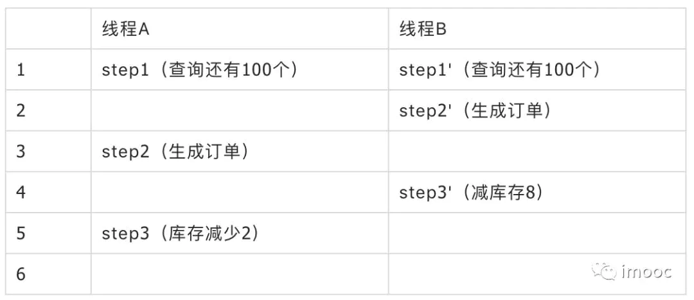

# 对mysql乐观锁、悲观锁、共享锁、排它锁、行锁、表锁概念的理解
# 乐观锁
乐观锁不是数据库自带的，需要我们自己去实现。乐观锁是指操作数据库时(更新操作)，想法很乐观，认为这次的操作不会导致冲突，在操作数据时，并不进行任何其他的特殊处理（也就是不加锁），而在进行更新后，再去判断是否有冲突了。

通常实现是这样的：在表中的数据进行操作时(更新)，先给数据表加一个版本(version)字段，每操作一次，将那条记录的版本号加1。也就是先查询出那条记录，获取出version字段,如果要对那条记录进行操作(更新),则先判断此刻version的值是否与刚刚查询出来时的version的值相等，如果相等，则说明这段期间，没有其他程序对其进行操作，则可以执行更新，将version字段的值加1；如果更新时发现此刻的version值与刚刚获取出来的version的值不相等，则说明这段期间已经有其他程序对其进行操作了，则不进行更新操作。

举例：

下单操作包括3步骤：

1.查询出商品信息

select (status,status,version) from t\_goods where id=#{id}

2.根据商品信息生成订单

3.修改商品status为2

update t\_goods 

set status=2,version=version+1

where id=#{id} and version=#{version};

除了自己手动实现乐观锁之外，现在网上许多框架已经封装好了乐观锁的实现，如hibernate，需要时，可能自行搜索"hiberate 乐观锁"试试看。

# 悲观锁
与乐观锁相对应的就是悲观锁了。悲观锁就是在操作数据时，认为此操作会出现数据冲突，所以在进行每次操作时都要通过获取锁才能进行对相同数据的操作，这点跟java中的synchronized很相似，所以悲观锁需要耗费较多的时间。另外与乐观锁相对应的，悲观锁是由数据库自己实现了的，要用的时候，我们直接调用数据库的相关语句就可以了。

说到这里，由悲观锁涉及到的另外两个锁概念就出来了，它们就是共享锁与排它锁。共享锁和排它锁是悲观锁的不同的实现，它俩都属于悲观锁的范畴。

# 共享锁
共享锁又称读锁，简称S锁，共享锁就是多个事务对于同一数据可以共享一把锁，都能访问的数据，但是**只能读不能修改**

# 排它锁
排他锁又称写锁，简称X锁，排他锁不能与其他锁并存，如果一个事务获取了一行数据的排他锁，其他事务就不能获取改行的其他锁，包括共享锁和排他锁。获取到排他锁的事务可以对数据进行读取和修改。

MySQL InnoDB引擎默认的update，delete，insert语句会自动给涉及到的数据加上排他锁，select语句默认不会加任何锁。加排他锁可以使用select ...for update语句，加共享锁可以使用select ... lock in share mode语句。所以加过排他锁的数据行在其他事务中是不能修改数据的，也不能通过for update和lock in share mode锁的方式查询数据，但可以直接通过select ...from...查询数据，因为**普通查询没有任何锁机制**。

