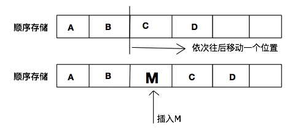

# 数据结构与算法基础
课程地址：[https://www.bilibili.com/video/BV1nJ411V7bd](https://www.bilibili.com/video/BV1nJ411V7bd)

---
**数据（**Data**）**：是描述客观事物的符号，是计算机中可以操作的对象，是能被计算机识别，并输入给计算机处理的符号集合。数据不仅仅包括整形、实型等数值类型，还包括字符及声音、图像、视频等非数值类型。

数据，也就是符号，必须具备两个前提：

a.可以输入到计算机中

b.能被计算机程序处理

对于整型、实型等数值类型，可以进行数值计算。

对于字符数据类型，就需要非数值的处理。而声音、图像、视频等其实是可以通过编码的手段变成字符数据来处理的

数据(学生表)->数据元素（个人记录）->数据项（学号、姓名）

**数据元素（**Data Element**）**：是组成数据的、有一定意义的基本单位，在计算机中通常作为整体处理。也被称为记录。
比如 畜类 牛、马、羊、鸡、猪、狗等动物当然就是畜类的数据元素。

**数据项（**Data Item**）**：是组成数据元素的、有独立含义的、不可分割的最小单位。例如，学生 基本信息表中的学号、姓名、性别等都是数据项。

**数据对象**：是性质相同的数据元素的集合，是数据的一个子集。例如：整数数 据对象是集合N= {O, 士1' 士2,…}, 字母字符数据对象是集合C= {'A','B', …，'Z','a','b', …， 'z'}, 学生基本信息表也可以是一个数据对象。

---
**数据结构**：相互之间存在一种或多种特定关系的数据元素集合。

**数据结构包括以下三个方面的内容：**

1. 数据元素之间的逻辑关系，也称为**逻辑结构**
2. 数据元素及其关系在计算和内存中的表示（又称为映），称为数据的**物理结构**或数据的**存储结构**。
3. 数据的**运算和实现**，即对数据元素可以施加的操作以及这些操作在相应的存储结构上的实现。

---
**逻辑结构**：所谓逻辑结构就是数据与数据之间的关联关系，准确的说是数据元素之间的关联关系。注：所有的数据都是由数据元素构成，数据元素是数据的基本构成单位。而数据元素由多个数据项构成。逻辑结构有四种基本类型：集合结构、线性结构、树状结构和网络结构。也可以统一的分为线性结构和非线性结构。

* **方式一**
   * **线性结构：**是一个有序数据元素的集合。 其中数据元素之间的关系是一对一的关系，即除了第一个和最后一个数据元素之外，其它数据元素都是首尾相接的。常用的线性结构有：**线性表，栈，队列，双队列，数组，串**。

   * **非线性结构：**各个数据元素不再保持在一个线性序列中，每个数据元素可能与零个或者多个其他数据元素发生联系。根据关系的不同，可分为层次结构和群结构。常见的非线性结构有：**二维数组，多维数组，广义表，树(二叉树等)**，

* **方式二**
   * **集合结构**
   * **线性结构**
   * **树形结构**
   * **图形结构**

---
**存储结构**是数据结构的一个重要内容。在计算机中，数据的存储结构可以采取如下四中方法来表现。

* **顺序存储结构：**简单的说，顺序存储方式就是在一块连续的存储区域
一个接着一个的存放数据。顺序存储方式把逻辑上相连的结点存储在物理位置上相邻的存储单元里，结点间的逻辑关系由存储单元的邻接挂安息来体现。顺序存储方式也称为顺序存储结构（sequentialstorage structure），一般采用数组或者结构数组来描述。
线性存储方式主要用于线性逻辑结构的数据存放，而对于图和树等非线性逻辑结构则不适用。

* **链接存储结构：**链接存储方式比较灵活，其不要求逻辑上相邻的结点
在物理位置上相邻，结点间的逻辑关系由附加的引用字段表示。一个结点的引用字段往往指导下一个结点的存放位置。
链接存储方式也称为链接式存储结构（LinkedStorage Structure），一般在原数据项中增加应用类型来表示结点之间的位置关系。

这里我们先看图，其实就是将想要插入的元素往链表的尾部插入，然后更新一下为节点tail的位置即可。

* **索引存储结构：**索引存储方式是采用附加索引表的方式来存储结点信息的一种存储方式。索引表由若干个索引项组成。索引存储方式中索引项的一般形式为：（关键字、地址）。其中，关键字是能够唯一标识一个结点的数据项。
索引存储方式还可以细分为如下两类：
\*稠密索引（Dense Index）:这种方式中每个结点在索引表中都有一个索引项。其中，索引项的地址指示结点所在的的存储位置；
\*稀疏索引（Spare Index）：这种方式中一组结点在索引表中只对应一个索引项。其中，索引项的地址指示一组结点的起始存储位置。

* **散列存储结构：**散列存储方式是根据结点的关键字直接计算出该结点的存储地址的一种存储的方式。
在实际应用中，往往需要根据具体数据结构来决定采用哪一种存储方式。同一逻辑结构采用不同额存储方法，可以得到不同的存储结构。而且这四种节本存储方法，既可以单独使用，也可以组合起来对数据结构进行存储描述。

---
**物理结构**：数据的物理结构就是数据存储在磁盘中的方式。官方语言为：数据结构在计算机中的表示（又称映像）称为数据的物理结构，或称存储结构。它所研究的是数据结构在计算机中的实现方法，包括数据结构中元素的表示及元素间关系的表示。而物理结构一般有四种：顺序存储，链式存储，散列，索引。

---
**逻辑结构的物理表示**：

线性表的顺序存储则可以分为静态和非静态：静态存储空间不可扩展，初始时就定义了存储空间的大小，故而容易造成内存问题。

线性表的链式存储：通过传递地址的方式存储数据。

单链表：节点存储下一个节点的地址-------------->单循环链表：尾节点存储头结点的地址

双链表：节点存储前一个和后一个节点的地址，存储两个地址。---------------->双循环链表：尾节点存储头结点的地址

---

