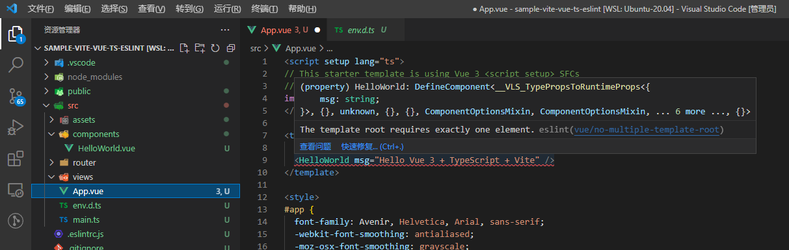

# 第六篇、Vite创建Vue3笔记
javascript：[https://developer.mozilla.org/zh-CN/docs/Web/JavaScript/Guide](https://developer.mozilla.org/zh-CN/docs/Web/JavaScript/Guide)

vue3：[https://staging-cn.vuejs.org/guide/introduction.html](https://staging-cn.vuejs.org/guide/introduction.html)

vue router：[https://router.vuejs.org/zh/installation.html](https://router.vuejs.org/zh/installation.html)

pinia：[https://pinia.web3doc.top/introduction.html](https://pinia.web3doc.top/introduction.html)

css3：

sass：

eslint：

[https://juejin.cn/post/6975442828386107400#heading-15](https://juejin.cn/post/6975442828386107400#heading-15)

prettier：

资源： [https://github.com/vitejs/awesome-vite#plugins](https://github.com/vitejs/awesome-vite#plugins)

插件：[https://juejin.cn/post/6998059092497399845](https://juejin.cn/post/6998059092497399845)

Vue Router Tab： [https://bhuh12.github.io/vue-router-tab/zh/guide/](https://bhuh12.github.io/vue-router-tab/zh/guide/)

参考资料：

体验vite + vue3 + ts搭建项目的全过程：[https://juejin.cn/post/6973288527802925092#heading-11](https://juejin.cn/post/6973288527802925092#heading-11)

Vite + Vue3 的 ESlint 和 Prettier 基礎配置：[https://stark920.github.io/2022/04/27/vue3-2-eslint/](https://stark920.github.io/2022/04/27/vue3-2-eslint/)

配置使用vite 脚手架创建的项目的eslint：[https://juejin.cn/post/7097565293995622414](https://juejin.cn/post/7097565293995622414)
> 兼容性注意

> Vite 需要 [Node.js](https://nodejs.org/en/) 版本 >= 12.0.0。然而，有些模板需要依赖更高的 Node 版本才能正常运行，当你的包管理器发出警告时，请注意升级你的 Node 版本。

线性进度条： **nprogress**


# （1）vite
中文：[https://cn.vitejs.dev/guide/](https://cn.vitejs.dev/guide/)

英文：[https://vitejs.dev/guide/](https://vitejs.dev/guide/)

中英文文档存在查看，例如：import.meta.globEager 介绍，中文文档就没有说明

**英文：**


**中文：**


# （1）iconify - 图标
iconify： [https://iconify.design/](https://iconify.design/)  

图标库：[https://icon-sets.iconify.design/](https://icon-sets.iconify.design/)，

安装：[https://docs.iconify.design/icon-components/vue/](https://docs.iconify.design/icon-components/vue/)

```html
pnpm add -D @iconify/vue
```
# （2）elment plus
elment plus：[https://element-plus.gitee.io/zh-CN/component/button.html](https://element-plus.gitee.io/zh-CN/component/button.html)


# 一、创建项目
可以通过附加的命令行选项直接指定项目名称和你想要使用的模板。例如，要构建一个 Vite + Vue 项目，运行:

```javascript
# npm 6.x
npm create vite@latest my-vue-app --template vue

# npm 7+, extra double-dash is needed:
npm create vite@latest my-vue-app -- --template vue

# yarn
yarn create vite my-vue-app --template vue

# pnpm
pnpm create vite my-vue-app -- --template vue
```
查看 [create-vite](https://github.com/vitejs/vite/tree/main/packages/create-vite) 以获取每个模板的更多细节：`vanilla`，`vanilla-ts`，`vue`，`vue-ts`，`react`，`react-ts`，`preact`，`preact-ts`，`lit`，`lit-ts`，`svelte`，`svelte-ts`。

**该示例使用pnpm 创建****vue-ts****模板**

```bash
pnpm create vite sample-vite-vue-ts-eslint -- --template vue-ts
cd sample-vite-vue-ts-eslint
pnpm install
pnpm run dev --运行项目
```
**目录结构：**

```bash
├── README.md
├── index.html
├── package.json
├── pnpm-lock.yaml
├── public
│   └── favicon.ico
├── src
│   ├── App.vue
│   ├── assets
│   │   └── logo.png
│   ├── components
│   │   └── HelloWorld.vue
│   ├── env.d.ts
│   ├── main.ts
│   ├── router
│   └── views
├── tsconfig.json
├── tsconfig.node.json
└── vite.config.ts
```
## （1）配置eslint和prettier 
配置 `eslint`，可以通过两种方式：

1. 通过官方的命令 `npm init @eslint/config`；
2. 手动编写 `.eslintrc.*` 配置文件并安装相关依赖。

```bash
npm init @eslint/config 
# 或者 yarn create @eslint/config
✔ How would you like to use ESLint? · style
✔ What type of modules does your project use? · esm
✔ Which framework does your project use? · vue
✔ Does your project use TypeScript? · No / Yes
✔ Where does your code run? · browser
✔ How would you like to define a style for your project? · guide
✔ Which style guide do you want to follow? · standard
✔ What format do you want your config file to be in? · JavaScript
```
安装后，提示如下错误



**解决方法** vue是使用 `eslint-plugin-vue` 这个插件对vue的格式进行校验的我们打开它的[文档](https://eslint.vuejs.org/user-guide/#installation)看一下

```javascript
yarn add -D eslint eslint-plugin-vue

```


可以看出来 `vue3` 推荐的是 `plugin:vue/vue3-recommended` 这个规则，而我们的 `eslintrc.js` 中使用的是 `plugin:vue/essential` 这个，我们修改代码如下，重新打开 `App.vue` 问题修复。

```javascript
module.exports = {
  extends: [
-    'plugin:vue/essential',
+    'plugin:vue/vue3-recommended',
     'airbnb-base',
  ]
}
```
 安装Prettier

```javascript
pnpm add prettier -D
```
创建 Prettier 配置文件 .prettierrc

```javascript
{
  "useTabs": false,
  "tabWidth": 2,
  "printWidth": 100,
  "singleQuote": true,
  "trailingComma": "none",
  "bracketSpacing": true,
  "semi": false
}

// 超过最大值换行
printWidth: 100, 
 // 缩进字节数
tabWidth: 4,
 // 缩进不使用tab, 使用空格
useTabs: false,
 // 句尾添加分号
semi: true,
// 使用单引号代替双引号
singleQuote: true, 
// 默认值。因为使用了一些折行敏感型的渲染器（如GitHub comment）而按照markdown文本样式进行折行
proseWrap: "preserve", 
//  (x) => {} 箭头函数参数只有一个时是否要有小括号。avoid: 省略括号
arrowParens: "avoid", 
 // 在对象，数组括号与文字之间加空格 "{ foo: bar }"
bracketSpacing: true,
 // 不格式化vue文件，vue文件的格式化单独设置
disableLanguages: ["vue"],
// 结尾是 \n \r \n\r auto
endOfLine: "auto", 
//不让prettier使用eslint的代码格式进行校验
eslintIntegration: false, 
htmlWhitespaceSensitivity: "ignore",
 // 不使用prettier格式化的文件填写在项目的.prettierignore文件中
ignorePath: ".prettierignore",
// 在jsx中把'>' 是否单独放一行
jsxBracketSameLine: false, 
// 在jsx中使用单引号代替双引号
jsxSingleQuote: false, 
 // 格式化的解析器，默认是babylon
parser: "babylon",
// Require a 'prettierconfig' to format prettier
requireConfig: false, 
 //不让prettier使用stylelint的代码格式进行校验
stylelintIntegration: false,
 // 在对象或数组最后一个元素后面是否加逗号（在ES5中加尾逗号）
trailingComma: "es5",
 // 不让prettier使用tslint的代码格式进行校验
tslintIntegration: false
```
## （2）解决 Prettier 和 ESLint 的冲突
冲突的本质在于 `eslint`既负责了代码质量检测，又负责了一部分的格式美化工作,格式化部分的部分规则和 `prettier`不兼容。 能不能让`eslint`只负责代码质量检测而让`prettier`负责美化呢? 好在社区有了非常好的成熟方案，即 `eslint-config-prettier` + `eslint-plugin-prettier`。

* `eslint-config-prettier` 的作用是关闭`eslint`中与`prettier`相互冲突的规则。
* `eslint-plugin-prettier` 的作用是赋予`eslint`用`prettier`格式化代码的能力。

安装依赖并修改`.eslintrc`文件

```javascript
// 安装依赖
yarn add eslint-config-prettier eslint-plugin-prettier -D
// .eslintrc
{
   // 其余的配置
 - "extends": ["eslint:recommended", "standard"]
 + "extends": ["eslint:recommended", "standard",  "plugin:prettier/recommended"]
  // 其余的配置
}
```
加入命令

```javascript
"lint": "eslint src",
"lint:fix": "eslint src --fix --ext .ts,.tsx"
```
## （3）配置TS
## （4）按需方式引入 element-plus 
```javascript
pnpm install element-plus
pnpm add -D unplugin-vue-components unplugin-auto-import
```
> 在Window的WSL中出现如下错误，改用管理员启用wsl


> 按需前需要先按照` pnpm install element-plus`

在vite.config.ts文件按照官网示例加入如下代码

```javascript
// vite.config.ts
import AutoImport from 'unplugin-auto-import/vite'
import Components from 'unplugin-vue-components/vite'
import { ElementPlusResolver } from 'unplugin-vue-components/resolvers'

export default {
  plugins: [
    // ...
    AutoImport({
      resolvers: [ElementPlusResolver()],
    }),
    Components({
      resolvers: [ElementPlusResolver()],
    }),
  ],
}
```
## （5）动态组件`<component>` 元素和特殊的 `is` attribute 实现
```javascript
<script setup>
import Home from './Home.vue'
import Posts from './Posts.vue'
import Archive from './Archive.vue'
import { ref } from 'vue'
 
const currentTab = ref('Home')

const tabs = {
  Home,
  Posts,
  Archive
}
</script>

<template>
  <div class="demo">
    <button
       v-for="(_, tab) in tabs"
       :key="tab"
       :class="['tab-button', { active: currentTab === tab }]"
       @click="currentTab = tab"
     >
      {{ tab }}
    </button>
	  <component :is="tabs[currentTab]" class="tab"></component>
  </div>
</template>
```
在上面的例子中，被传给 `:is` 的值可以是以下几种：

* 被注册的组件名
* 导入的组件对象

你也可以使用 `is` attribute 来创建一般的 HTML 元素。

当使用 `<component :is="...">` 来在多个组件间作切换时，组件会在被切换掉后卸载。我们可以通过 `<KeepAlive>`[ 组件](https://staging-cn.vuejs.org/guide/built-ins/keep-alive.html)强制不活跃的组件仍然保持“存活”的状态。
## （6）vue内置组件<Transition>
## （7）导入 Vue Router
```javascript
pnpm add vue-router@4
```


## （8）`import.meta.globEager`函数的介绍
# 二、插件
## （1）vite-plugin-theme-preprocessor
> 一个vite v2.0+插件，用于实现多个 less、sass 变量文件编译出多主题的 css，使得基于less、sass以及css modules的主题样式在线动态切换变得很简单。

[https://juejin.cn/post/7028578385265688613](https://juejin.cn/post/7028578385265688613)

## （2）vite-plugin-mock
中文文档：[https://github.com/vbenjs/vite-plugin-mock/blob/HEAD/README.zh\_CN.md](https://github.com/vbenjs/vite-plugin-mock/blob/HEAD/README.zh_CN.md)

提供本地和生产模拟服务。

vite 的数据模拟插件，是基于 vite.js 开发的。 并同时支持本地环境和生产环境。 Connect 服务中间件在本地使用，mockjs 在生产环境中使用。

### **安装**
mockjs

```bash
yarn add mockjs
# or
npm i  mockjs -S
```
vite-plugin-mock

```bash
yarn add vite-plugin-mock -D
# or
npm i vite-plugin-mock -D
```
### **配置**
vite.config.ts 

```javascript
import { UserConfigExport, ConfigEnv } from 'vite'

import { viteMockServe } from 'vite-plugin-mock'
import vue from '@vitejs/plugin-vue'

export default ({ command }: ConfigEnv): UserConfigExport => {
  return {
    plugins: [
      vue(),
      viteMockServe({
        // default
        mockPath: 'mock',
        localEnabled: command === 'serve',
      }),
    ],
  }
}
```
在项目src目录中创建 mockProdServer.ts 文件

```json
import { createProdMockServer } from "vite-plugin-mock/es/createProdMockServer";
// 读取mock文件夹下所有的ts文件
const modules = import.meta.globEager("../mock/*.ts");
const mockModules = [];

Object.keys(modules).forEach(key => {
  mockModules.push(...modules[key].default);
});

export function setupProdMockServer() {
  createProdMockServer(mockModules);
}

```
### **应用**
在项目根目录创建mock文件夹，创建\*.ts文件

```javascript
// test.ts

import { MockMethod } from 'vite-plugin-mock'
export default [
  {
    url: '/api/get',
    method: 'get',
    response: ({ query }) => {
      return {
        code: 0,
        data: {
          name: 'vben',
        },
      }
    },
  },
  {
    url: '/api/post',
    method: 'post',
    timeout: 2000,
    response: {
      code: 0,
      data: {
        name: 'vben',
      },
    },
  },
  {
    url: '/api/text',
    method: 'post',
    rawResponse: async (req, res) => {
      let reqbody = ''
      await new Promise((resolve) => {
        req.on('data', (chunk) => {
          reqbody += chunk
        })
        req.on('end', () => resolve(undefined))
      })
      res.setHeader('Content-Type', 'text/plain')
      res.statusCode = 200
      res.end(`hello, ${reqbody}`)
    },
  },
] as MockMethod[]
```
### viteMockServe 配置
```javascript

{
    mockPath?: string;
    supportTs?: boolean;
    ignore?: RegExp | ((fileName: string) => boolean);
    watchFiles?: boolean;
    localEnabled?: boolean;
    ignoreFiles?: string[];
    configPath?: string;
    prodEnabled?: boolean;
    injectFile?: string;
    injectCode?: string;
    logger?:boolean;
}
/**
mockPath
    type: string
    default: mock
        设置模拟.ts 文件的存储文件夹
        如果watchFiles：true，将监视文件夹中的文件更改。 并实时同步到请求结果
        如果 configPath 具有值，则无效
supportTs
    type: boolean
    default: true
        打开后，可以读取 ts 文件模块。 请注意，打开后将无法监视.js 文件。
ignore
    type: RegExp | ((fileName: string) => boolean);
    default: undefined
        自动读取模拟.ts 文件时，请忽略指定格式的文件
watchFiles
    type: boolean
    default: true
        设置是否监视mockPath对应的文件夹内文件中的更改
localEnabled
    type: boolean
    default: command === 'serve'
        设置是否启用本地 xxx.ts 文件，不要在生产环境中打开它.设置为 false 将禁用 mock 功能
prodEnabled
    type: boolean
    default: command !== 'serve'
        设置打包是否启用 mock 功能
injectCode
    type: string
    default: ''
        如果生产环境开启了 mock 功能,即prodEnabled=true.则该代码会被注入到injectFile对应的文件的底部。默认为main.{ts,js}
        这样做的好处是,可以动态控制生产环境是否开启 mock 且在没有开启的时候 mock.js 不会被打包。
        如果代码直接写在main.ts内，则不管有没有开启,最终的打包都会包含mock.js
injectFile
    type: string
    default: path.resolve(process.cwd(), 'src/main.{ts,js}')
    injectCode代码注入的文件,默认为项目根目录下src/main.{ts,js}
configPath
    type: string
    default: vite.mock.config.ts
        设置模拟读取的数据条目。 当文件存在并且位于项目根目录中时，将首先读取并使用该文件。 配置文件返回一个数组
logger
    type: boolean
    default: true
        是否在控制台显示请求日志
**/
```
### MockMethod 配置
```json
{
  // 请求地址
  url: string;
  // 请求方式
  method?: MethodType;
  // 设置超时时间
  timeout?: number;
  // 状态吗
  statusCode?:number;
  // 响应数据（JSON）
  response?: ((opt: { [key: string]: string; body: Record<string,any>; query:  Record<string,any>, headers: Record<string, any>; }) => any) | any;
  // 响应（非JSON）
  rawResponse?: (req: IncomingMessage, res: ServerResponse) => void;
}
```
## （3）vitejs/plugin-vue-jsx 
[https://github.com/vitejs/vite/tree/main/packages/plugin-vue-jsx](https://github.com/vitejs/vite/tree/main/packages/plugin-vue-jsx)

### 配置
```javascript
// vite.config.js
import vueJsx from '@vitejs/plugin-vue-jsx'

export default {
  plugins: [
    vueJsx({
      // options are passed on to @vue/babel-plugin-jsx
    })
  ]
}
```
# 三、其它问题
## （1）在 WSL Ubuntu 中创建出现项目执行` pnpm install` 出现 “EACCES: permission denied, rename”


重新执行 ` pnpm install `命令

## （2）Vite: img src别名不起作用
错误示例：

```javascript
<!-- this is ok -->

```
必须在脚本中使用`import`关键字手动解析资源URL：

```javascript
<script setup>
import imgSrcWithAlias from '@/assets/icon-1.svg'
</script>

<template>
  <component-a :img-src="imgSrcWithAlias" />
</template>
```
## （3）vite 中 mock 请求数据
[https://github.com/vbenjs/vite-plugin-mock/blob/main/README.zh\_CN.md](https://github.com/vbenjs/vite-plugin-mock/blob/main/README.zh_CN.md)

```javascript
npm i  mockjs -S
npm i vite-plugin-mock -D
```
# 四、扩展内容
## （1）pnpm 使用
|pnpm add sax|保存到 `dependencies` 配置项下|
| ----- | ----- |
|pnpm add -D sax|保存到 `devDependencies` 配置项下|
|pnpm add -O sax|保存到 `optionalDependencies` 配置项下|
|pnpm add -g sax|安装软件包到全局环境中|
|pnpm add sax@next|安装标记为 `next` 的版本|
|pnpm add sax@3.0.0|安装指定版本 `3.0.0`|

# 一、参考资料
Vue：[https://staging-cn.vuejs.org/](https://staging-cn.vuejs.org/)

Vue CLI： [https://cli.vuejs.org/zh/](https://cli.vuejs.org/zh/)

Vue Router：[https://router.vuejs.org/zh/](https://router.vuejs.org/zh/)

Vue Loader：[https://vue-loader.vuejs.org/zh/](https://vue-loader.vuejs.org/zh/)

 Ant Design Vue：[https://next.antdv.com/docs/vue/introduce-cn](https://next.antdv.com/docs/vue/introduce-cn)


风格指导：[https://staging-cn.vuejs.org/guide/introduction.html](https://staging-cn.vuejs.org/guide/introduction.html)

vuex：[https://next.vuex.vuejs.org/zh/index.html](https://next.vuex.vuejs.org/zh/index.html)

element：[https://element-plus.gitee.io/zh-CN/](https://element-plus.gitee.io/zh-CN/)

vue-element-admin：[https://panjiachen.github.io/vue-element-admin-site/zh/](https://panjiachen.github.io/vue-element-admin-site/zh/)

[https://github.com/RainManGO/vue3-composition-admin](https://github.com/RainManGO/vue3-composition-admin)


# 二、快速搭建示例项目
```bash
## 安装vue-cli
npm install -g @vue/cli
## 安装cli-service-global
npm install -g @vue/cli-service-global
## 创建示例项目
vue create vue-sample
## 启动项目
npm run serve 
```
**可能会遇到的问题**：

* 在window的wsl系统中无法热更新，请重新在宿主机上进行npm。
* vscode中执行npm run serve，提升vue : 无法加载文件 xxxx\\vue.ps1，因为在此系统上禁止运行脚本。有关详细信息，请参阅 https:/go.microsoft.com/fwlink/?LinkID=135170 中的 about\_Execution\_Policies。
**解决方法：**
      * 管理员身份运行 window.powershell
      * 执行：get-ExecutionPolicy，显示Restricted，表示状态是禁止的;
      * 执行：set-ExecutionPolicy
      * 会提示输入参数：RemoteSigned
      * 会提示进行 选择： 输入：Y
* 提示“'vue-cli-service' 不是内部或外部命令，也不是可运行的程序”，重新npm install

# 三、构建首页，引入ant-design-vue组件
使用 npm 或 yarn 安装

```bash
$ npm i --save ant-design-vue@next
```
完整引入

```javascript
import App from './App.vue'
import { createApp } from 'vue';
import Antd from 'ant-design-vue';
import 'ant-design-vue/dist/antd.css';

createApp(App).use(Antd).mount('#app');
```
---
# vue create中相关配置文件介绍与说明
# （1）babel.config.js
项目根目录中存在babel.config.js文件，即为Babel的配置文件，作用于整个项目。

# （2）package-lock.json
锁定安装时的包的版本号，并且需要上传到git，以保证其他人在npm install时大家的依赖能保证一致。

# （3）package.json
package.json 文件其实就是对项目或者模块包的描述，里面包含许多元信息。比如项目名称，项目版本，项目执行入口文件，项目贡献者等等。npm install 命令会根据这个文件下载所有依赖模块。

**属性说明：**

* `version` 表明了当前的版本。
* `name` 设置了应用程序/软件包的名称。
* `description` 是应用程序/软件包的简短描述。
* `main` 设置了应用程序的入口点。
* `private` 如果设置为 `true`，则可以防止应用程序/软件包被意外地发布到 `npm`。
* `scripts` 定义了一组可以运行的 node 脚本。
* `dependencies` 设置了作为依赖安装的 `npm` 软件包的列表。
* `devDependencies` 设置了作为开发依赖安装的 `npm` 软件包的列表。
* `engines` 设置了此软件包/应用程序在哪个版本的 Node.js 上运行。
* `browserslist` 用于告知要支持哪些浏览器（及其版本）。

# （4）tsconfig.json
如果一个目录下存在一个`tsconfig.json`文件，那么它意味着这个目录是TypeScript项目的根目录。 `tsconfig.json`文件中指定了用来编译这个项目的根文件和编译选项。 一个项目可以通过以下方式之一来编译：

参考地址：[https://www.tslang.cn/docs/handbook/tsconfig-json.html](https://www.tslang.cn/docs/handbook/tsconfig-json.html)

**compilerOptions 选项说明：**

```json
"incremental": true, // TS编译器在第一次编译之后会生成一个存储编译信息的文件，第二次编译会在第一次的基础上进行增量编译，可以提高编译的速度
"tsBuildInfoFile": "./buildFile", // 增量编译文件的存储位置
"diagnostics": true, // 打印诊断信息 
"target": "ES5", // 目标语言的版本
"module": "CommonJS", // 生成代码的模板标准 默认值 target === "es3" or "es5" ?"commonjs" : "es6"
"outFile": "./app.js", // 将多个相互依赖的文件生成一个文件，可以用在AMD模块中，即开启时应设置"module": "AMD",
"lib": [], // 编译时引入的 ES 功能库，包括：es5 、es6、es7、dom 等。// 如果未设置，则默认为： target 为 es5 时: ["dom", "es5", "scripthost"] 
//target 为 es6 时: ["dom", "es6", "dom.iterable", "scripthost"]
"allowJS": true, // 允许编译器编译JS，JSX文件
"checkJs": true, // 允许在JS文件中报错，通常与allowJS一起使用
"outDir": "./dist", // 指定输出目录
"rootDir": "./", // 指定输出文件目录(用于输出)，用于控制输出目录结构
"declaration": true, // 生成声明文件，开启后会自动生成声明文件
"declarationDir": "./file", // 指定生成声明文件存放目录
"emitDeclarationOnly": true, // 只生成声明文件，而不会生成js文件
"sourceMap": true, // 生成目标文件的sourceMap文件
"inlineSourceMap": true, // 生成目标文件的inline SourceMap，//inline SourceMap会包含在生成的js文件中
"declarationMap": true, // 为声明文件生成sourceMap
"typeRoots": [], // 声明文件目录，默认时node_modules/@types
"types": [], // 加载的声明文件包
              //如果指定了某个值， 她会在 typeRoots 下找这个包，找到了就只加载这个包
"removeComments":true, // 删除注释 
"noEmit": true, // 不输出文件,即编译后不会生成任何js文件
"noEmitOnError": true, // 发送错误时不输出任何文件
"noEmitHelpers": true, // 不生成helper函数，减小体积，需要额外安装，常配合importHelpers一起使用
"importHelpers": true, // 通过tslib引入helper函数，文件必须是模块
"downlevelIteration": true, // 降级遍历器实现，如果目标源是es3/5，那么遍历器会有降级的实现
"strict": true, // 开启所有严格的类型检查
"alwaysStrict": true, // 在代码中注入'use strict'
"noImplicitAny": true, // 不允许隐式的any类型
"strictNullChecks": true, // 不允许把null、undefined赋值给其他类型的变量
"strictFunctionTypes": true, // 不允许函数参数双向协变
"strictPropertyInitialization": true, // 类的实例属性必须初始化
"strictBindCallApply": true, // 严格的bind/call/apply检查
"noImplicitThis": true, // 不允许this有隐式的any类型
"noUnusedLocals": true, // 检查只声明、未使用的局部变量(只提示不报错)
"noUnusedParameters": true, // 检查未使用的函数参数(只提示不报错)
"noFallthroughCasesInSwitch": true, // 防止switch语句贯穿(即如果没有break语句后面不会执行)
"noImplicitReturns": true, //每个分支都会有返回值
"esModuleInterop": true, // 允许export=导出，由import from 导入
"allowUmdGlobalAccess": true, // 允许在模块中全局变量的方式访问umd模块
"moduleResolution": "node", // 模块解析策略，ts默认用node的解析策略，即相对的方式导入
"baseUrl": "./", // 解析非相对模块的基地址，默认是当前目录
"paths": { // 路径映射，相对于baseUrl
    // 如使用jq时不想使用默认版本，而需要手动指定版本，可进行如下配置
   "jquery": ["node_modules/jquery/dist/jquery.min.js"]
  },
"rootDirs": ["src","out"], // 将多个目录放在一个虚拟目录下，用于运行时，
                          //即编译后引入文件的位置可能发生变化，
                          //这也设置可以虚拟src和out在同一个目录下，不用再去改变路径也不会报错
"listEmittedFiles": true, // 打印输出文件
"listFiles": true , // 打印编译的文件(包括引用的声明文件)
"jsx":"Preserve"   //在 .tsx 中支持 JSX ：React 或 Preserve
"jsxFactory":""   //默认值 React.createElement	。  jsx 设置为 React 时使用的创建函数
```
---
# CSS 使用总结
一、盒模型

三、布局


[http://caibaojian.com/css3/](http://caibaojian.com/css3/)

---


# （1）npm设置国内源
```bash
## 查看当前源
npm config get registry
## 设置为淘宝源
npm config set registry https://registry.npm.taobao.org
## 临时使用设置淘宝源
npm --registry https://registry.npm.taobao.org install XXX（模块名）
## 取消ssl验证
npm config set strict-ssl false
```
windows下面安装node-sass

---


# webpack初探
```javascript
const path = require('path');
module.exports = {
  entry: "./app/entry", // string | object | array
  // Webpack打包的入口
  output: {  // 定义webpack如何输出的选项
    path: path.resolve(__dirname, "dist"), // string
    // 所有输出文件的目标路径
    filename: "[chunkhash].js", // string
    // 「入口(entry chunk)」文件命名模版
    publicPath: "/assets/", // string
    // 构建文件的输出目录
    /* 其它高级配置 */
  },
  module: {  // 模块相关配置
    rules: [ // 配置模块loaders，解析规则
      {
        test: /\.jsx?$/,  // RegExp | string
        include: [ // 和test一样，必须匹配选项
          path.resolve(__dirname, "app")
        ],
        exclude: [ // 必不匹配选项（优先级高于test和include）
          path.resolve(__dirname, "app/demo-files")
        ],
        loader: "babel-loader", // 模块上下文解析
        options: { // loader的可选项
          presets: ["es2015"]
        },
      },
  },
  resolve: { //  解析模块的可选项
    modules: [ // 模块的查找目录
      "node_modules",
      path.resolve(__dirname, "app")
    ],
    extensions: [".js", ".json", ".jsx", ".css"], // 用到的文件的扩展
    alias: { // 模块别名列表
      "module": "new-module"
	  },
  },
  devtool: "source-map", // enum
  // 为浏览器开发者工具添加元数据增强调试
  plugins: [ // 附加插件列表
    // ...
  ],
}
```


#  
# 二、目录结构
```Plain Text
├── build/               # Webpack 配置目录
├── dist/                # build 生成的生产环境下的项目
├── config/               # Vue基本配置文件，可以设置监听端口，打包输出等
├── node_modules/                # 依赖包，通常执行npm i会生成
├── src/                 # 源码目录（开发的项目文件都在此文件中写）
│   ├── assets/            # 放置需要经由 Webpack 处理的静态文件，通常为样式类文件，如css，sass以及一些外部的js
│   ├── components/        # 公共组件
│   ├── filters/           # 过滤器
│   ├── store/    　　　　 # 状态管理
│   ├── routes/            # 路由，此处配置项目路由
│   ├── services/          # 服务（统一管理 XHR 请求）
│   ├── utils/             # 工具类
│   ├── views/             # 路由页面组件
│   ├── App.vue             # 根组件
│   ├── main.js             # 入口文件
├── index.html         # 主页，打开网页后最先访问的页面
├── static/              # 放置无需经由 Webpack 处理的静态文件，通常放置图片类资源
├── .babelrc             # Babel 转码配置
├── .editorconfig             # 代码格式
├── .eslintignore        # （配置）ESLint 检查中需忽略的文件（夹）
├── .eslintrc            # ESLint 配置
├── .gitignore           # （配置）在上传中需被 Git 忽略的文件（夹）
├── package.json         # 本项目的配置信息，启动方式
├── package-lock.json         # 记录当前状态下实际安装的各个npm package的具体来源和版本号
├── README.md         # 项目说明（很重要，便于其他人看懂）
```
# 三、文件或参数定义规范
## （1）单文件组件文件的大小写
单文件组件的文件名应该要么始终是单词大写开头 (PascalCase)，要么始终是横线连接 (kebab-case)。

```Plain Text
## 反面教材
components/
|- mycomponent.vue
components/
|- myComponent.vue

## 正确示例
components/
|- MyComponent.vue
components/
|- my-component.vue
```
# 
```json

```
# 
# 六、组件插件
## （1）chokidar
监听的文件或者文件夹的路径

## （2）chalk 
`chalk` 是一个可以修改终端输出字符样式的 `npm` 包。

# 七、后端模板
## （1）vue-element-admin
基础模板：[vue-admin-template](https://github.com/PanJiaChen/vue-admin-template)

## （2）vue3-admin-template
# 八、遇到的问题
## （1）Vue.js not detected
## （2）Vue 导入文件import、路径@和.的区别


# Eslint
你可以使用 npm 安装 ESLint：

```Plain Text
$ npm install eslint --save-dev

```
紧接着你应该设置一个配置文件：

```Plain Text
$ ./node_modules/.bin/eslint --init
```
# Vite
[https://www.bilibili.com/video/BV1p3411J7CE?p=3&spm\_id\_from=333.880.my\_history.page.click](https://www.bilibili.com/video/BV1p3411J7CE?p=3&spm_id_from=333.880.my_history.page.click)


# 解决vite在wsl环境下[热更新](https://so.csdn.net/so/search?q=%E7%83%AD%E6%9B%B4%E6%96%B0&spm=1001.2101.3001.7020)失效问题
解决热更新失效的方法主要有两种：

1.文件存储到WSL系统环境中
2.配置vite.config.js的`server.watch`

```java
export default defineConfig({
  server: {
    watch: {
      { usePolling: true }
    }
  }
})

```
vite 构建项目：[https://cn.vitejs.dev/guide/#scaffolding-your-first-vite-project](https://cn.vitejs.dev/guide/#scaffolding-your-first-vite-project)

```bash
pnpm create vite my-vue-app -- --template vue-ts
```
ESlint安装步骤：[http://eslint.cn/docs/user-guide/command-line-interface](http://eslint.cn/docs/user-guide/command-line-interface)

```bash
npm i -g eslint
pnpm add eslint --save-dev
eslint --init
```


> * WindiCSS IntelliSense WindiCSS 自动完成、语法突出显示、代码折叠和构建等高级功能
> * TypeScript Vue Plugin (Volar) 用于 TypeScript 服务器的 Vue 插件
> * Vue Language Features (Volar) Vue3.0 语法支持
> * Iconify IntelliSense Iconify 预览和搜索
> * i18n Ally 国际化智能提示
> * Stylelint css 格式化
> * DotENV .env 文件高亮
> * Prettier 代码格式化
> * ESLint 脚本代码检查

element-plus：[https://element-plus.org/zh-CN/component/button.html](https://element-plus.org/zh-CN/component/button.html)

---
# 如何引入全局样式文件
在main.ts文件通过`import './style/index.scss' `直接导入即可

# Sass 知识点
---
# Vue3  知识点
---
  h,

  reactive,

  computed,

  onMounted,

  defineComponent,

  getCurrentInstance


# Vue 中的 defineComponent
> defineComponent最重要的是：在TypeScript下，给予了组件 **正确的参数类型推断 。**

先上一段使用defineComponent对这个组件简单实现的源码：

```javascript
const DefineNumber = defineComponent({
    props: {
        modelValue: {type: Number}
    },
    emits: {
        'update:modelValue': (val?: number) => true,
        'add-num': (val: number) => true,
        'sub-num': (val: number) => true,
    },
    setup(props, ctx) {
        const handler = {
            onClickAdd: () => {
                const val = props.modelValue == null ? 1 : props.modelValue + 1
                ctx.emit('add-num', val)
                ctx.emit('update:modelValue', val)
            },
            onClickSub: () => {
                const val = props.modelValue == null ? 1 : props.modelValue - 1
                ctx.emit('sub-num', val)
                ctx.emit('update:modelValue', val)
            },
        }
        return () => (
            <div>
                <button onClick={handler.onClickSub}>-</button>
                <button>{props.modelValue == null ? 'N' : props.modelValue}</button>
                <button onClick={handler.onClickAdd}>+</button>
            </div>
        )
    },
})

```
在父组件中使用这个步进器组件：

```javascript
export const DemoPage = defineComponent(() => {

    const state = reactive({
        count: 123
    })

    return () => <>
        <h1>Hello world:{state.count}</h1>
        <DefineNumber
            v-model={state.count}
            onAdd-num={val => console.log('add', val)}
        />
    </>
})
```
---
# h()
h函数返回一个虚拟节点即虚拟DOM

```javascript
render() {
  return h('h1', {}, 'Some title')
}
```
接收 type,props,children 三个参数

**第一个参数：**
type：String | Object | Function （必填项） 
String：即html标签，‘button’，‘span’
Object：组件（比如使用第三方UI库）
Function：函数式组件

**第二个参数：**

props:Object

在函数式组件中，props又被分为Props和Context，组件中声明props值，才会被放到Props对象中，否则全部被放到context中， context又包括attr 标签属性，emits，slot

children：String | Array | Object

**第三个参数：**

children：String | Array | Object

