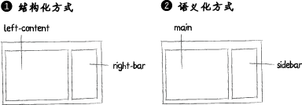
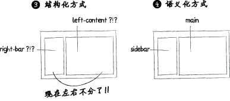
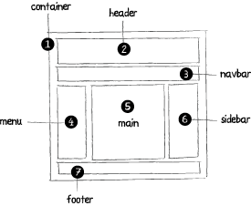

# 第四篇、CSS3、SCSS、SASS、命名规则规
## CSS命名规则规范整理
大家在写css的时候，经常会遇到关于命名的问题。页面上成百甚至上千的class或者id，我们就会越来越感到困扰。 所以，这样我们就很有必要整理自己的一套命名规范。这里我就说说我自己的命

      大家在写css的时候，经常会遇到关于命名的问题。页面上成百甚至上千的class或者id，我们就会越来越感到困扰。

所以，这样我们就很有必要整理自己的一套命名规范。这里我就说说我自己的命名规范。

### 类-class
类名，我通常用横线就像这样

.head-logo { … } /\*页面头部logo的类名\*/
.nav-li { … } /\*导航条上list的类名\*/
.link-panel-h2 { … } /\*链接模块的标题\*/

### ID
id,我通常用驼峰式命名。在我的理解里驼峰式命名专门用在独一无二的变量上。所以我也经常在javascrpt中采用这个方法来定义变量。

#navLastLi { … } /\*获取到导航条的最后一个list\*/
#panelContent { … } /\*模块的正文部分\*/
#sidebarFooter { … } /\*侧边栏底部模块\*/

那么，页面模块很多，我们可以这样整理

### 常用的CSS命名规则
头：header　　内容：content/container　　尾：footer　　导航：nav　　侧栏：sidebar

栏目：column　　页面外围控制整体布局宽度：wrapper　　左右中：left right center

登录条：loginbar　　标志：logo　　广告：banner　　页面主体：main　　热点：hot

新闻：news　　下载：download　　子导航：subnav　　菜单：menu

子菜单：submenu　　搜索：search　　友情链接：friendlink　　页脚：footer

版权：copyright　　滚动：scroll　　内容：content　　标签页：tab

文章列表：list　　提示信息：msg　　小技巧：tips　　栏目标题：title

加入：joinus　　指南：guild　　服务：service　　注册：regsiter

状态：status　　投票：vote　　合作伙伴：partner

#### (1)页面结构
容器: container　　页头：header　　内容：content/container

页面主体：main　　页尾：footer　　导航：nav

侧栏：sidebar　　栏目：column　　页面外围控制整体布局宽度：wrapper

左右中：left right center

#### (2)导航
导航：nav　　主导航：mainbav　　子导航：subnav

顶导航：topnav　　边导航：sidebar　　左导航：leftsidebar

右导航：rightsidebar　　菜单：menu　　子菜单：submenu

标题: title　　摘要: summary

#### (3)功能
标志：logo　　广告：banner　　登陆：login　　登录条：loginbar

注册：regsiter　　搜索：search　　功能区：shop

标题：title　　加入：joinus 　状态：status　　按钮：btn

滚动：scroll　　标签页：tab　　文章列表：list　　提示信息：msg

当前的: current　　小技巧：tips　　图标: icon　　注释：note

指南：guild　服务：service　　热点：hot　　新闻：news

下载：download　　投票：vote　　合作伙伴：partner

友情链接：link　　版权：copyright

**我们在使用脚本进行页面动态变换的时候，推荐的方法就是修改类名或者修改id名来修改显示样式，当然，常用的还是类名class。**

### 修改类名-取名规范
#### (1)颜色:使用颜色的名称或者16进制代码,如
.red { color: red; }

.f60 { color: #f60; }

.ff8600 { color: #ff8600; }

#### (2)字体大小,直接使用’font+字体大小’作为名称,如
.font12px { font-size: 12px; }

.font9pt {font-size: 9pt; }

#### (3)对齐样式,使用对齐目标的英文名称,如
.left { float:left; }

.bottom { float:bottom; }

#### (4)标题栏样式,使用’类别+功能’的方式命名,如
.barnews { }

.barproduct { }

### 注意事项::
1.一律小写;

2.尽量用英文;

3.不加中杠和下划线;

4.尽量不缩写，除非一看就明白的单词.

### 常用css文件名
主要的 master.css　　模块 module.css　　基本共用 base.css

布局，版面 layout.css　　主题 themes.css　　专栏 columns.css

文字 font.css　　表单 forms.css　　补丁 mend.css　　打印 print.css

### 根据页面分栏结构的命名
     CSS代码的命名惯例一直是大家热门讨论的话题。通过分析一个流行三栏布局中的必要元素，来为大家讲解关于使用语义化方法替代结构化方法来命名CSS类的建议和指导。

#### CSS类命名的语义化VS结构化方式
      一般而言，CSS类名的语义化声明方式应当考虑你的页面中某个相对元素的”用意”，独立于它的”定位”或确切的特性(结构化方式)。像left-bar, red-text, small-title…这些都属于结构化定义的例子。

让我们看看下面这个例子:

　　…而现在我们想把页面中的元素调换一下位置，如果你使用的是结构化方式\*\*(1)**，那么你就要把所有CSS类名重新进行定义，因为它们的位置变了。在布局**(3)\*\*中，我们看到元素都倒转了: right-bar 现在成了 “left-bar”，而 left-content 成了 “right-content”。如果你使用语义化方式则避免了此类问题。

　　换句话说，使用语义化方式的话，你在修改网站布局的时候可以仅仅修改相关CSS类的属性即可，而不用修改它们的类名了，如果网站的代码很庞大，这将节省大量的时间。

### 关于语义化的一些建议:
**在开始之前，我想推荐两种简单的编写较好的CSS代码的指导方针:**

1、为CSS类名定义的时候，尽量使用小写字母，如果有两个以上的单词，在每个单词之间使用”-”符或单词首字母大写(第一个单词除外)。如:”main-content”或”mainContent”。   

2、优化CSS代码，仅创建关键主要的CSS类并重新为子元素使用符合HTML标准的标签(h1, h2, p, ul, li, blockquote,…)，例如,不要使用这种哦你那个方式:

1.  
2.     … 
3.     … 

而要这样写:

1.  
2.     … 
3.     … 

### 三栏布局中使用语义化方式的例子
让我们来通过这个简单的例子讲解一下如何为经典的三栏布局使用语义化方式命名:

使用语义化方式为CSS命名可以像这样:

1. #container{…}  
2. /\*—- Top section —-\*/ 
3.     #header{…}  
4.     #navbar{…}  
5.     /\*—- Main —-\*/ 
6.     #menu{…}  
7.     #main{…}  
8.     #sidebar{…}  
9.     /\*—- Footer —-\*/ 
10.     #footer{…} 
11. \*\*Container
“\_#container\_“ 就是将你页面中的所有元素包在一起的部分，这部分你还可以命名为: ”\_wrapper\_“, “\_wrap\_“, “\_page\_“.  

\*\* 2. \*\*Header
\*\*“#header” 是网站页面的头部区域，一般来讲，它包含网站的logo和一些其他元素。这部分你还可以命名为:”\_top\_“, “\_logo\_“, “\_page-header\_” (或 pageHeader). 
 3. \*\*Navbar
\*\*“\_#navbar\_“等同于横向的导航栏，是最典型的网页元素。这部分你还可以命名为:*“nav”*, *“navigation”*, *“nav-wrapper”*. 
 4. \*\*Menu
\*\*“#Menu”区域包含一般的链接和菜单，这部分你还可以命名为: ”*sub-nav* ”, “\_links\_“. 
 5. \*\*Main
\*\*“#Main”是网站的主要区域，如果是博客的话它将包含你的日志。这部分你还可以命名为: ”\_content\_“, “\_main-content\_” (or “mainContent”)。 
 6. **Sidebar**
**“#Sidebar” 部分可以包含网站的次要内容，比如最近更新内容列表、关于网站的介绍或广告元素等…这部分你还可以命名为: ”\_sub-nav\_“, “\_side-panel\_“, “\_secondary-content\_“.** 
 7. \*\*Footer
\*\*“#Footer”包含网站的一些附加信息，这部分你还可以命名为: ”\_copyright\_“.

